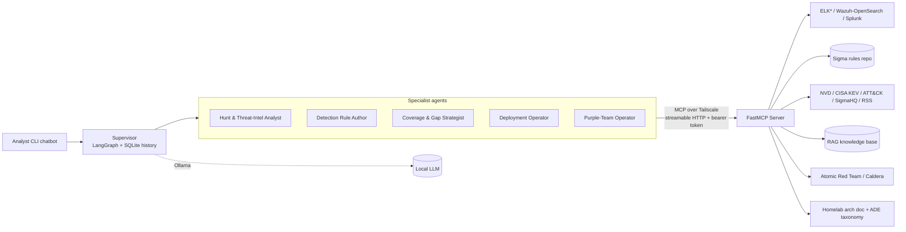
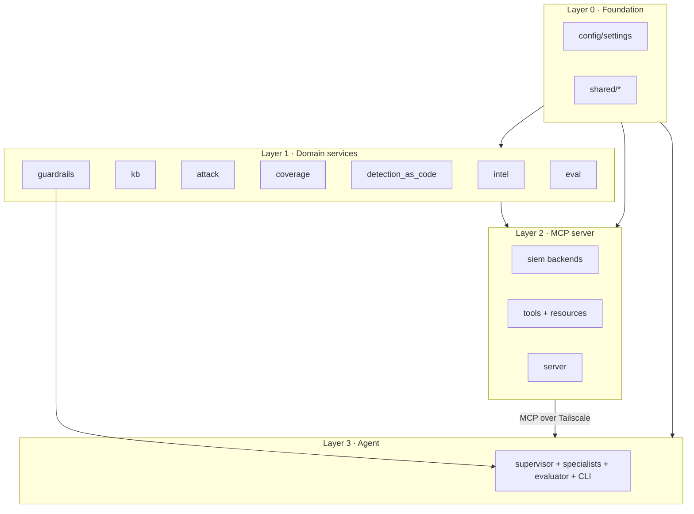
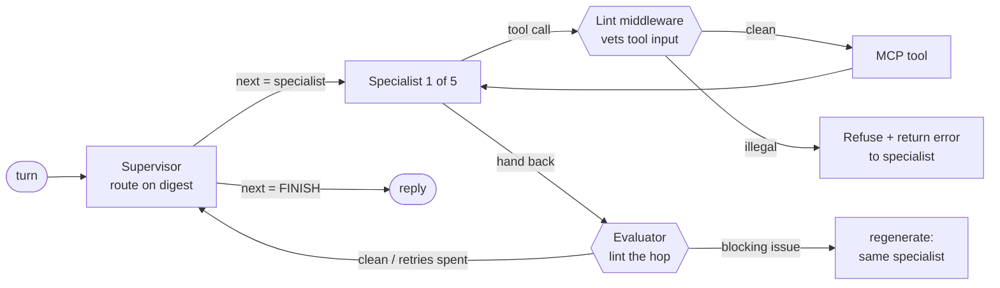
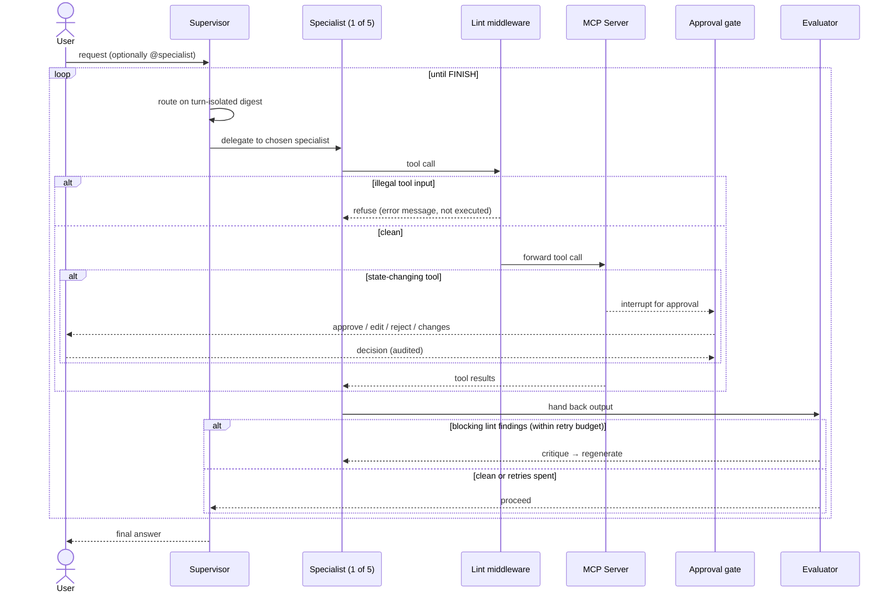
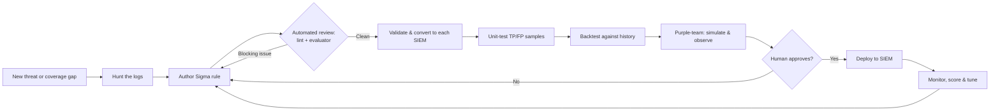
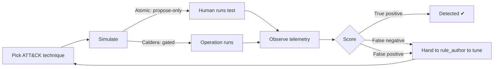
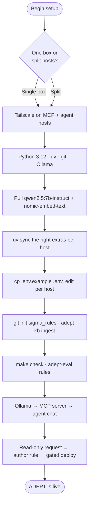
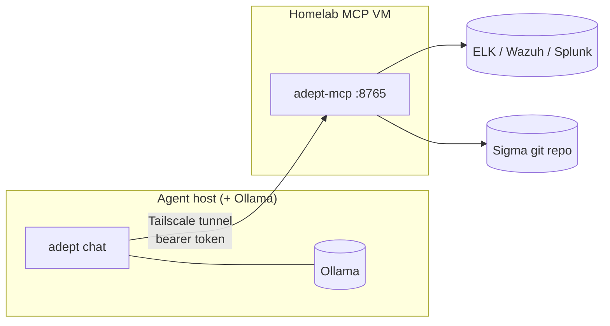

# ADEPT — Agentic Detection Engineering Orchestration Pipeline & Tuning

> A local, open-source **multi-agent AI Detection Engineer** for a homelab SOC.

ADEPT is a multi-agent system (LangGraph + Ollama) that connects over a
Tailscale/MCP tunnel to a Model Context Protocol (MCP) server. The MCP server
brokers controlled access to your SIEMs (Elasticsearch/ELK, Wazuh's OpenSearch
indexer, Splunk), a Sigma detection-rules git repository, threat-intelligence
sources, a retrieval knowledge base, and adversary-emulation tooling.

Given that context, a team of specialist agents **hunt through logs, author and
tune Sigma rules, convert them to your specific SIEMs (detection-as-code), build
an ATT&CK coverage matrix, and run a false-positive / false-negative review
loop** using Atomic Red Team, MITRE Caldera, and the Adversarial Detection
Engineering (ADE) framework. Every artifact an agent produces is vetted by
**deterministic output guardrails** and a **dedicated evaluator (critic) node**
that sends substandard work back for revision, and a human-in-the-loop approval
gate ensures **nothing is deployed or executed without your explicit
verification**.

Everything runs locally: inference is served by [Ollama](https://ollama.com/),
your logs and detections never leave the homelab, and the only outbound traffic
is an optional, allow-listed set of threat-intel fetches.

> **Maturity:** the ELK/Kibana path is the most exercised. The other SIEM
> backends (Wazuh/OpenSearch, Splunk) and the optional integrations are wired and unit-tested but less
> battle-tested against live systems — validate them with the staged
> [live-integration smoke test](docs/live_integration_smoke_test.md) before you
> rely on them.

---

## Table of contents

1. [Why ADEPT](#1-why-adept)
2. [How it works (architecture)](#2-how-it-works-architecture)
3. [The multi-agent system](#3-the-multi-agent-system)
4. [Shipped workflows](#4-shipped-workflows)
5. [Prerequisites & requirements](#5-prerequisites--requirements)
6. [Installation](#6-installation)
7. [Configuration (`.env`)](#7-configuration-env)
8. [Deployment scenarios](#8-deployment-scenarios)
9. [Using the agent chat](#9-using-the-agent-chat)
10. [Command reference (all CLIs)](#10-command-reference-all-clis)
11. [MCP tools & resources](#11-mcp-tools--resources)
12. [Project architecture & folder layout](#12-project-architecture--folder-layout)
13. [Security model](#13-security-model)
14. [Testing & evaluation](#14-testing--evaluation)
15. [Troubleshooting & FAQ](#15-troubleshooting--faq)
16. [Glossary](#16-glossary)
17. [What's new](#17-whats-new)
18. [Further reading](#18-further-reading)
19. [License](#19-license)

---

## 1. Why ADEPT

Detection engineering is a continuous loop: understand the threat, hunt for the
behaviour, write a rule, tune it so it doesn't drown you in false positives,
deploy it, and prove it actually fires. ADEPT automates the legwork of that loop
with a small team of focused AI agents while keeping a human firmly in control of
anything that changes your environment.

- **Local & private** — runs entirely on open-source models via Ollama; your
  logs and detections never leave the homelab.
- **Model-agnostic** — the LLM is configured by base URL + model name, so you
  can start on a laptop and move inference to a bigger box later with no code
  changes.
- **Multi-SIEM** — search and deploy across ELK (primary), Wazuh/OpenSearch,
  and Splunk through one abstraction, powered by [pySigma](https://github.com/SigmaHQ/pySigma).
- **Detection-as-code** — Sigma is the single source of truth; ADEPT converts,
  validates, unit-tests, backtests, and version-controls every rule.
- **Coverage-aware** — an ATT&CK coverage matrix and gap analysis tell the
  agents (and you) what to build next.
- **Closed-loop quality** — a purple-team agent simulates attacks and scores
  whether your detections caught them, feeding tuning back to the rule author.
- **Self-correcting output** — deterministic linters and an evaluator node vet
  every generated query, rule, and git operation; blocking issues (e.g. illegal
  SPL, placeholder UUIDs) are bounced back to the specialist to fix before they
  reach you or a tool.
- **Safe by design** — token-authenticated MCP behind Tailscale, least-privilege
  SIEM credentials, an SSRF allow-list for intel fetches, and a human approval
  gate before any deploy or attack.

---

## 2. How it works (architecture)

### 2.1 High-level architecture



The agents never touch a SIEM, git, or the network directly. They call **tools**
over an authenticated MCP tunnel; the MCP server is the only component that
brokers access to anything sensitive. State-changing tools (SIEM
deploy/disable/delete, Caldera operations) pause at the **human approval gate**
before they execute.

### 2.2 Runtime layering

ADEPT's import direction is strictly one-way, which keeps each layer
independently testable and deployable.



**The golden rule:** `mcp_server` may import the domain packages; the domain
packages must **never** import `mcp_server`; the `agent` imports `guardrails`;
everything may import `config` and `shared`.

### 2.3 Supervisor ↔ specialist routing

The supervisor is a *hybrid supervisor*: each turn it inspects a compact,
turn-isolated digest of the conversation and routes to **exactly one** specialist
(or `FINISH`). The chosen specialist runs as a tool-calling agent with only the
MCP tools for its role. Before its output flows on, a **dedicated evaluator
(critic) node** lints what it produced; clean work proceeds to the supervisor for
the next hop, while blocking issues are routed straight back to the same
specialist with a concrete critique. The loop continues until the request is
satisfied.



The evaluator hard-blocks security/syntax violations and bounces the work back
for up to `eval_max_retries` attempts (default 2); once that budget is spent it
surfaces the latest output to you with the unresolved issues noted rather than
looping forever. Both the evaluator node and the submit-time lint middleware are
config-gated (`agent.eval_enabled` / `agent.lint_enabled`, on by default).



You can **force the first hop** by starting a message with `@specialist_name`
(e.g. `@hunt_analyst search for encoded PowerShell`). The override pins only the
first routing decision, then normal routing resumes so multi-step work still
chains across specialists.

### 2.4 End-to-end detection lifecycle



---

## 3. The multi-agent system

A lightweight supervisor routes each turn to one of five specialists, each
restricted to the MCP tools for its role. The supervisor prompt and routing
options are generated from the specialist roster, so adding a specialist needs no
orchestration changes. Conversations persist per named thread in a SQLite
checkpointer so sessions resume.

| Specialist (`name`) | Role | Representative tools | Changes state? |
| --- | --- | --- | --- |
| `hunt_analyst` | Hunt & threat-intel analysis | `siem_search`, `siem_get_fields`, `lookup_cve`, `get_kev`, `get_attack_technique`, `search_knowledge_base` | No (read-only) |
| `rule_author` | Author, validate, convert, unit-test, backtest, and version Sigma rules | `write_sigma_rule`, `validate_sigma_rule`, `convert_sigma_rule`, `run_rule_unit_tests`, `backtest_sigma_rule`, `git_commit` | Repo only (low-risk) |
| `coverage_strategist` | ATT&CK coverage matrix, gaps, overlaps, field baselines | `build_coverage_matrix`, `identify_coverage_gaps`, `find_rule_overlaps`, `profile_field_baseline` | No (read-only) |
| `deployment_operator` | Deploy / disable / delete detections | `siem_deploy_rule`, `siem_disable_rule`, `siem_delete_rule`, `siem_list_alerts` | **Yes — gated** |
| `purple_team` | Adversary emulation + detection scoring | `plan_atomic_test`, `run_caldera_operation`, `siem_search`, `siem_list_alerts`, `backtest_sigma_rule` | **Caldera gated; Atomic propose-only** |

### The human approval gate

Tools named in `agent.dangerous_tools` (default: the five state-changing SIEM and
Caldera tools) are wrapped so that, when a specialist calls one, the graph
*interrupts* and surfaces an approval request showing the tool, a summary, and the
exact arguments. You can:

- **approve** — run the tool as-is,
- **edit** — open the arguments as JSON in your `$EDITOR`, then run the edited call,
- **reject** — refuse and let the agent continue without the action, or
- **request changes** — send free-text feedback back to the agent.

Only **approve** and **edit** execute the tool. Every decision and every executed
tool is appended to a JSONL **audit log**. Atomic Red Team is **propose-only** —
ADEPT renders the command, cleanup, and expected telemetry but never runs an
atomic; a human runs it.

### Output guardrails & the evaluator

The approval gate stops *you* from rubber-stamping a bad action; two further
layers stop substandard output from ever reaching that point. Both are backed by
the `adept/guardrails` library — pure, offline **linters** that vet each artifact
type and return a uniform report (`error` findings block; `warning`/`info` are
advisory):

| Artifact | What the linter catches |
| --- | --- |
| SPL | Destructive/exfiltrating commands (`\| delete`, `outputlookup`, `sendemail`, `script`, `collect`, …), unbalanced quotes/parens, empty pipes |
| Lucene / ES | Leading `*`/`?` wildcards (cost), match-all queries (advisory), unbalanced grouping |
| Sigma | Validator issues, multiple YAML docs, missing/placeholder `id` (must be a real UUIDv4), missing/placeholder `title` |
| Navigator layer | Malformed JSON, missing required fields, unknown domain, bad technique entries |
| Git ops | Commits to a protected branch, invalid branch names, empty/oversized commit subjects |

1. **Submit-time lint middleware.** Before a specialist's tool call executes, its
   arguments are vetted. A call carrying an illegal input (e.g. a `siem_search`
   that pipes into `| delete`, a `write_sigma_rule` with a placeholder id, a
   `git_commit` to `main`) is **refused and returned as an error** the specialist
   can correct from — it never runs, and never even reaches the approval gate.
2. **Evaluator (critic) node.** After a specialist finishes a hop, a dedicated
   graph node lints everything it actually produced — written rules, converted
   queries, exported layers, and any query/rule fenced in the final answer. A
   **blocking** finding is sent back to the *same* specialist with a concrete
   critique (regenerate), up to `agent.eval_max_retries` times; once that budget
   is spent the work is **escalated to you** with the unresolved issues attached.
   An optional, lenient **LLM judge** (`agent.llm_judge_enabled`, off by default)
   adds a semantic second opinion for issues the deterministic linters can't see.

Every regeneration, escalation, and advisory note is written to the audit log
(`eval_regenerate`, `eval_escalation`, `eval_advisory`). The specialist prompts
also carry a shared guardrail preamble mirroring these linters, so the model
usually self-corrects before the evaluator has to intervene.

---

## 4. Shipped workflows

These are the end-to-end flows the agents are built to perform. Each is just a
natural-language request away in `adept chat`; the example prompts are
illustrative.

### 4.1 Threat-intel → detection

> *"CVE-2021-44228 is in the news — do we detect exploitation, and if not, write a rule."*

`hunt_analyst` looks up the CVE/KEV and ATT&CK technique, searches your logs for
the behaviour, and reports coverage. If there's a gap, the supervisor hands off to
`rule_author` to author, validate, convert, and backtest a rule.

### 4.2 Hunt → author → backtest → deploy

> *"Detect PowerShell encoded commands (T1059.001) and deploy it after backtesting."*

`rule_author` writes one Sigma document, validates it, converts it to your SIEM
query language(s), runs its TP/FP unit tests, and backtests it against historical
logs to estimate noise — **before** proposing deployment. `deployment_operator`
then deploys it **behind the approval gate**.

### 4.3 Coverage gap analysis

> *"What are my top ATT&CK detection gaps for Windows, and what should I build next?"*

`coverage_strategist` builds the coverage matrix from your Sigma ruleset and the
ATT&CK catalogue, prioritises uncovered techniques, finds overlapping/duplicate
rules, and can export an ATT&CK Navigator layer. It recommends the highest-value
techniques to cover next.

### 4.4 Purple-team FP/FN loop

> *"Simulate T1059.001 and tell me whether our detection fires."*

`purple_team` closes the loop between emulation and detection quality:



### 4.5 Offline detection-quality evaluation

`adept-eval rules` runs deterministic *golden* `(rule, events)` cases through the
real Sigma matcher into a precision/recall/F1 report — **no model involved** — so
you have a regression test for detection quality. `adept-eval scenarios` drives
the live agent through four LLM-in-the-loop rubrics (routing, tool selection, the
approval gate, and the propose-only purple-team loop), auto-rejecting every
approval so nothing destructive runs.

---

## 5. Prerequisites & requirements

On each host that will run an ADEPT component:

| Requirement | Notes |
| --- | --- |
| **Python 3.11 or 3.12** | The project pins **3.12** via `.python-version`. |
| **[uv](https://docs.astral.sh/uv/)** | Dependency & environment manager. |
| **git** | The Sigma detection-as-code tools operate on a git repository. |
| **[Ollama](https://ollama.com/)** | On the host that serves inference. Pull `qwen2.5:7b-instruct` (chat) and `nomic-embed-text` (embeddings). |
| One or more **SIEMs** | ELK / Wazuh-OpenSearch / Splunk to search and deploy to. |
| **Tailscale** *(split deploys)* | To tunnel the agent host to the MCP host. |
| `make` *(optional)* | Convenience targets only; every command has a `uv run` form. |
| **Docker** *(optional)* | For the container deployment path. |

Pull the local models referenced by the defaults:

```bash
ollama pull qwen2.5:7b-instruct   # chat / tool-calling model
ollama pull nomic-embed-text      # embedding model (required for the KB)
```

---

## 6. Installation

ADEPT splits its dependencies into optional **extras** so each host installs only
what it needs. The base dependency set is deliberately light (pydantic, structlog,
httpx, tenacity, rich, PyYAML).

```bash
# Clone, then from the project root:
uv sync --group dev                 # foundation: lint / type / test only
uv sync --extra mcp-server          # the homelab MCP VM (mcp + siem + dac + intel + kb)
uv sync --extra agent               # the host running the LLM agent
uv sync --extra dac                 # detection-as-code only (e.g. CI)
uv sync --all-extras --group dev    # everything (full developer environment)
```

Individual extras also exist and can be combined: `siem`, `dac`, `intel`, `kb`,
`mcp`, `observability`, `mcp-server` (the aggregate of `mcp,siem,dac,intel,kb`),
and `agent`.

| Extra | Pulls in | Install on the host that runs… |
| --- | --- | --- |
| `siem` | `elasticsearch`, `opensearch-py`, `splunk-sdk` | the MCP server (SIEM access) |
| `dac` | `pysigma` + backends/pipelines, `GitPython`, `typer` | the MCP server and CI |
| `intel` | `feedparser`, `mitreattack-python` | the MCP server (threat intel) |
| `kb` | `chromadb`, `ollama` | the MCP server (RAG knowledge base) |
| `mcp` | `mcp[cli]` | anything speaking MCP |
| `mcp-server` | `adept[mcp,siem,dac,intel,kb]` | the homelab MCP VM |
| `agent` | `langgraph`, `langchain-*`, `langchain-mcp-adapters`, `typer` | the agent / LLM box |
| `observability` | OpenTelemetry SDK + OTLP HTTP exporter | any host you want traced |

---

## 7. Configuration (`.env`)

All configuration is environment-driven, with the prefix `ADEPT_` and a nested
delimiter `__` (e.g. the `url` field of the ELK settings is `ADEPT_ELK__URL`).
Copy the annotated template and edit it per host:

```bash
cp .env.example .env
$EDITOR .env
```

`.env.example` is the fully documented source of truth. The settings groups:

| Group | Prefix | What it configures |
| --- | --- | --- |
| Core | `ADEPT_ENV`, `ADEPT_LOG_*`, `ADEPT_DATA_DIR` | Environment (`dev`/`prod`), logging, runtime data dir. |
| MCP server | `ADEPT_MCP__` | Host/port/path, transport, bearer auth token, public URL. |
| Ollama | `ADEPT_OLLAMA__` | Base URL, chat + embed models, temperature, context, timeout. |
| SIEM — ELK | `ADEPT_ELK__` | Primary SIEM: URL, API key / user-pass, certs, default index, Kibana URL, alerts index. |
| SIEM — OpenSearch | `ADEPT_OPENSEARCH__` | Wazuh indexer: enable flag, URL, credentials, index. |
| SIEM — Splunk | `ADEPT_SPLUNK__` | Host/port, token or user-pass, scheme, index. |
| Sigma repo | `ADEPT_SIGMA__` | Rules path, default/protected branches, optional remote. |
| Threat intel | `ADEPT_INTEL__` | NVD key, feeds, cache TTLs, and the **SSRF allow-list**. |
| Coverage | `ADEPT_COVERAGE__` | Baseline lookback window for SIEM field profiling. |
| Knowledge base | `ADEPT_KB__` | Chroma path, collection, embed model, optional SigmaHQ ingest. |
| Notifications | `ADEPT_NOTIFY__` | `none`/`ntfy`/`discord`/`slack`/`webhook` for approval alerts. |
| Attack sim | `ADEPT_ATTACK__` | Atomic allow-list + Caldera URL/key/ids; safe by default. |
| Agent | `ADEPT_AGENT__` | MCP URL/token, model override, history DB, audit log, `dangerous_tools`, and the **output-guardrail** toggles (`lint_enabled`, `eval_enabled`, `eval_max_retries`, `llm_judge_enabled`, `spl_denylist`). |
| Observability | `ADEPT_OTEL__` | Optional OTLP/HTTP tracing. |

### The settings you must get right

1. **Shared auth token.** Generate one and set it on both hosts:
   ```bash
   python -c "import secrets; print(secrets.token_urlsafe(48))"
   ```
   - MCP host: `ADEPT_MCP__AUTH_TOKEN=<token>`
   - Agent host: `ADEPT_AGENT__MCP_TOKEN=<same token>`

   In `ADEPT_ENV=prod` the MCP server **refuses to start** without a token.
2. **MCP URLs.** Point `ADEPT_MCP__PUBLIC_URL` (MCP host) and
   `ADEPT_AGENT__MCP_URL` (agent host) at the Tailscale URL, e.g.
   `http://mcp-vm.your-tailnet.ts.net:8765/mcp`.
3. **Ollama.** `ADEPT_OLLAMA__BASE_URL` plus the two model names you pulled.
4. **At least one SIEM.** ELK is enabled by default; use least-privilege
   credentials (an API key is preferred over user/pass).
5. **Sigma repo.** `ADEPT_SIGMA__PATH` (default `./sigma_rules`) and the
   `ADEPT_SIGMA__PROTECTED_BRANCHES` whose commits require approval.

> For the complete, ordered go-live runbook see
> [`SETUP_CHECKLIST.md`](SETUP_CHECKLIST.md).

### Go-live sequence at a glance



---

## 8. Deployment scenarios

ADEPT's components are independently deployable. Pick the layout that matches your
lab.

### 8.1 Single-box / local dev

Everything on one machine — the fastest way to try ADEPT. The LLM is configured by
URL, so you can split hosts later with no code change.

```bash
uv sync --all-extras --group dev
cp .env.example .env && $EDITOR .env      # token, Ollama URL, at least ELK
ollama pull qwen2.5:7b-instruct && ollama pull nomic-embed-text
cd sigma_rules && git init && git add -A && git commit -m "Initial rules" && cd ..
uv run adept-kb ingest                    # build the knowledge base (Ollama up)

# Terminal 1 — the broker:
uv run adept-mcp
# Terminal 2 — the agent:
uv run adept chat
```

For a single box, `ADEPT_MCP__PUBLIC_URL` / `ADEPT_AGENT__MCP_URL` can stay on
`http://localhost:8765/mcp`.

### 8.2 Split homelab over Tailscale

Run the broker on a homelab VM and the agent next to Ollama. This is the intended
production topology.



1. **Tailscale** on the MCP host and the agent host; join your tailnet. Keep port
   `8765` **off the public internet** — reachable only over Tailscale.
2. **MCP host:** `uv sync --extra mcp-server`, set `ADEPT_MCP__HOST=0.0.0.0`,
   `ADEPT_MCP__AUTH_TOKEN`, `ADEPT_MCP__PUBLIC_URL`, SIEM creds, and the Sigma
   repo. Start with `uv run adept-mcp` (confirm it logs `starting_mcp_server`).
3. **Agent host:** `uv sync --extra agent`, set `ADEPT_AGENT__MCP_URL` to the
   Tailscale URL and `ADEPT_AGENT__MCP_TOKEN` to the same token. Verify
   connectivity (`curl <ADEPT_AGENT__MCP_URL>` returns a response, not a
   connection error), then `uv run adept chat`.

### 8.3 Docker / docker-compose

The repo ships a single `adept:latest` image that runs either entrypoint; Ollama
is expected on the Docker host (reached via `host.docker.internal`).

```bash
cp .env.example .env && $EDITOR .env

docker compose up -d mcp-server        # start the MCP server (port 8765)
docker compose run --rm agent          # open an interactive agent chat
```

The `mcp-server` service forces `ADEPT_MCP__HOST=0.0.0.0` and mounts
`./sigma_rules`, `./docs` (read-only), and a named `adept-data` volume; the
`agent` service points `ADEPT_AGENT__MCP_URL` at `http://mcp-server:8765/mcp`.

### 8.4 Standalone CLIs (no agent or MCP)

The detection-as-code, coverage, and knowledge-base libraries are usable on their
own — ideal for CI or scripting. The same library functions back the MCP tools, so
CLI and agent behaviour stay in lock-step.

```bash
uv sync --extra dac                                   # (or --extra kb / the relevant extras)
uv run adept-dac validate sigma_rules/rules/my_rule.yml
uv run adept-dac convert sigma_rules/rules/my_rule.yml --siem elk
uv run adept-dac test sigma_rules/tests/
uv run adept-coverage matrix                          # needs the ATT&CK bundle / intel extra
uv run adept-kb search "lateral movement over SMB"    # needs Ollama for embeddings
uv run adept-eval rules                               # fully offline, no model/network
```

---

## 9. Using the agent chat

Start the REPL (optionally resuming a named thread or overriding the model):

```bash
uv run adept chat
uv run adept chat --thread incident-42 --model qwen2.5:14b-instruct
```

Inside a chat:

| Input | Effect |
| --- | --- |
| *(plain text)* | A request the supervisor routes to the right specialist. |
| `@<specialist> <request>` | **Force** the first hop to a named specialist (e.g. `@rule_author write a rule for T1003`). Case-insensitive; unknown names warn and route normally. |
| `:help` | Show commands and the valid specialist names. |
| `:threads` | List saved conversation threads. |
| `:new` | Start a fresh thread. |
| `:thread <id>` | Switch to / resume a named thread. |
| `:quit` (`:q`, `:exit`) | Leave the chat. |

When a specialist calls a gated tool, an approval panel appears; answer
`approve` / `edit` / `reject` / `changes`. Progress is rendered live (which
specialist was delegated to, which tools it used, and whether the automated
review passed, asked for a revision, or escalated) instead of raw HTTP traffic.

The valid specialist names for `@mentions` are: `hunt_analyst`, `rule_author`,
`coverage_strategist`, `deployment_operator`, `purple_team`.

---

## 10. Command reference (all CLIs)

ADEPT installs six console scripts. Each is runnable as `uv run <name>` (no
activation needed) and, where a `Makefile` target exists, via `make`.

### `adept` — the agent chatbot

| Command | Arguments / options | Purpose |
| --- | --- | --- |
| `adept chat` | `--thread <id>`, `--model <name>` | Start the interactive detection-engineering chat (persistent history). |
| `adept threads` | — | List saved conversation threads. |
| `adept audit` | `--limit <n>` (default 20) | Show recent human-approval audit entries. |

### `adept-mcp` — the MCP server

| Command | Purpose |
| --- | --- |
| `adept-mcp` | Start the FastMCP server (broker for all tools/resources). Honors `ADEPT_MCP__*`. |

### `adept-dac` — detection-as-code

| Command | Arguments / options | Purpose |
| --- | --- | --- |
| `adept-dac convert` | `<rule_file>` · `--siem {elk,opensearch,splunk}` (default `elk`) · `--pipeline <name>` (repeatable) | Convert a Sigma rule to a SIEM query language. |
| `adept-dac validate` | `<rule_file>` | Validate a Sigma rule; non-zero exit on error. |
| `adept-dac test` | `<file-or-dir>` | Run TP/FP sample-event unit tests; non-zero exit on failure. |

### `adept-kb` — knowledge base

| Command | Arguments / options | Purpose |
| --- | --- | --- |
| `adept-kb ingest` | `--source <name>` (repeatable; default all available) | Index corpora (`own_rules`, `attack`, `homelab`, `tuning`, and `sigmahq` if configured) into Chroma. |
| `adept-kb search` | `<query>` · `--source <name>` (repeatable) · `--limit <n>` (default 5) | Semantic search over the KB. |
| `adept-kb info` | — | Show the collection name, persist dir, embed model, and document count. |

### `adept-coverage` — ATT&CK coverage

| Command | Arguments / options | Purpose |
| --- | --- | --- |
| `adept-coverage matrix` | `[rules_dir]` · `--bundle <stix>` · `--navigator-out <json>` · `--name <str>` | Show technique coverage of the local ruleset; optionally export a Navigator layer. |
| `adept-coverage gaps` | `[rules_dir]` · `--bundle` · `--platform` (repeatable) · `--tactic` (repeatable) · `--limit <n>` (default 40) | List prioritised uncovered techniques. |
| `adept-coverage overlap` | `[rules_dir]` · `--min-similarity <0-1>` (default 0.6) | Find candidate duplicate/overlapping rules. |
| `adept-coverage baseline` | `--field <name>` (repeatable, required) · `--siem` · `--index` · `--lookback-days <n>` (default 7) · `--top-n <n>` (default 10) | Profile SIEM field volume/cardinality to anticipate noisy detections. |

### `adept-eval` — evaluation harness

| Command | Arguments / options | Purpose |
| --- | --- | --- |
| `adept-eval rules` | — | Offline golden-case detection-quality eval (no model/network). |
| `adept-eval scenarios` | `--auto-approve` (reserved) | LLM-in-the-loop scenarios against the live agent (Ollama + MCP); auto-rejects every approval gate. |

### `make` targets (developer convenience)

| Target | Underlying command | Purpose |
| --- | --- | --- |
| `make install` / `make install-all` | `uv sync --group dev` / `--all-extras --group dev` | Base+dev / full environment. |
| `make check` | `ruff check` → `mypy adept` → `pytest` | The CI gate. |
| `make lint` / `make format` / `make typecheck` / `make test` | individual `uv run` steps | The gate, piecewise. |
| `make mcp` / `make agent` | `uv run adept-mcp` / `uv run adept` | Start the server / chatbot. |
| `make dac` / `make eval` | `uv run adept-dac --help` / `uv run adept-eval rules` | The standalone CLIs. |
| `make clean` | remove caches/build artifacts | Housekeeping. |

> If `uv` warns about a `VIRTUAL_ENV` mismatch (another project's venv is active),
> prefix commands with `env -u VIRTUAL_ENV` (or `unset VIRTUAL_ENV`).

---

## 11. MCP tools & resources

The server registers **40 tools** in seven groups and **5 resources**. Tools
marked **gated** are state-changing and pass through the agent's human-approval
gate; **propose-only** tools render a plan but never execute it.

**Sigma repository (git) — 7:** `list_sigma_rules`, `read_sigma_rule`,
`write_sigma_rule`, `git_create_branch`, `git_commit`, `git_diff`, `git_status`.

**SIEM — 8:** `siem_list_backends`, `siem_search`, `siem_validate_query`,
`siem_get_fields`, `siem_list_alerts`, `siem_deploy_rule` *(gated)*,
`siem_disable_rule` *(gated)*, `siem_delete_rule` *(gated)*.

**Detection-as-code — 5:** `convert_sigma_rule`, `validate_sigma_rule`,
`list_conversion_targets`, `run_rule_unit_tests`, `backtest_sigma_rule`.

**Threat intelligence — 5:** `lookup_cve`, `search_cves`, `get_kev`,
`get_attack_technique`, `fetch_security_news`.

**Coverage — 5:** `build_coverage_matrix`, `export_navigator_layer`,
`identify_coverage_gaps`, `find_rule_overlaps`, `profile_field_baseline`.

**Knowledge base — 2:** `search_knowledge_base`, `knowledge_base_status`.

**Attack simulation — 8:** `list_atomic_tests`, `plan_atomic_test`
*(propose-only)*, `list_caldera_adversaries`, `list_caldera_agents`,
`list_caldera_operations`, `get_caldera_operation_report`,
`run_caldera_operation` *(gated)*, `stop_caldera_operation` *(gated)*.

Each tool carries an MCP annotation — `READ_ONLY` (32 tools), `LOW_RISK_WRITE`
(3: `write_sigma_rule`, `git_create_branch`, `git_commit`), or `DESTRUCTIVE` (5:
the gated tools). The agent's approval gate gates anything not read-only-or-safe;
the default `dangerous_tools` list is exactly the five `DESTRUCTIVE` tools.
Independently of the gate, the agent's **submit-time lint middleware** vets a
tool call's arguments before it runs and refuses illegal input (see
[§3 Output guardrails](#output-guardrails--the-evaluator)).

**Resources — 5:** `ade://taxonomy` (Adversarial Detection Engineering taxonomy),
`homelab://architecture` (your architecture document), `siem://targets` (enabled
SIEM backends), `sigma://schema` (Sigma rule schema), `sigma://pipelines`
(available conversion pipelines).

---

## 12. Project architecture & folder layout

```
ADEPT/
├── adept/
│   ├── config/            # Typed settings (pydantic-settings) — the config source of truth
│   ├── shared/            # Cross-cutting: logging, cache, rate limiting, notify, errors, observability
│   ├── mcp_server/        # FastMCP server: auth, context, resources, siem/ backends, tools/
│   │   ├── siem/          #   ELK / OpenSearch / Splunk backends behind one interface
│   │   └── tools/         #   The 7 tool groups + annotations
│   ├── agent/             # LangGraph supervisor + 5 specialists, evaluator node, approval gate, audit, history, chat CLI
│   ├── guardrails/        # Deterministic offline linters (SPL/Lucene/Sigma/Navigator/git) backing the evaluator + lint middleware
│   ├── detection_as_code/ # Sigma convert / validate / unit-test / backtest / git lifecycle + CLI
│   ├── intel/             # NVD, CISA KEV, MITRE ATT&CK (STIX), security news, SSRF-guarded HTTP
│   ├── coverage/          # ATT&CK matrix, Navigator, gaps, overlaps, field baselines
│   ├── kb/                # Retrieval-augmented knowledge base (Chroma + Ollama embeddings)
│   ├── attack/            # Atomic Red Team (propose-only) + MITRE Caldera client
│   └── eval/              # Offline golden-case eval + LLM scenario harness
├── sigma_rules/           # The bootstrapped detection-rules repo (rules, pipelines, tests, metadata)
├── data/                  # Runtime: SQLite history, audit log, Chroma store, intel cache (auto-created)
├── docs/                  # Technical, workflow, architecture, and code-review guides
├── tests/                 # 200+ offline tests across 14 files
├── .env.example           # Fully annotated configuration template
├── SETUP_CHECKLIST.md     # Ordered operator go-live runbook
├── Makefile               # Developer task runner (thin uv wrappers)
├── Dockerfile             # Single image for both entrypoints
├── docker-compose.yml     # mcp-server + agent services
└── pyproject.toml         # Project metadata, extras, tooling config, console scripts
```

| Package | Responsibility |
| --- | --- |
| `adept/config` | Typed settings from environment / `.env`. Every other module takes a `Settings`. |
| `adept/shared` | Structured logging (with secret redaction), TTL disk cache, token-bucket rate limiters, typed errors, notifications, optional OpenTelemetry. |
| `adept/mcp_server` | The only component that brokers SIEMs, the Sigma repo, intel, KB, and attack sim. Auth, app context, 40 tools, 5 resources. |
| `adept/detection_as_code` | Sigma conversion, validation, TP/FP unit tests, event matcher, backtest, git lifecycle, and the `adept-dac` CLI. |
| `adept/intel` | Threat intelligence with caching, rate limiting, and an SSRF allow-list. |
| `adept/coverage` | Coverage matrix, Navigator layers, gap/overlap analysis, field baselines, and the `adept-coverage` CLI. |
| `adept/kb` | RAG over ATT&CK and local docs; `adept-kb` CLI. |
| `adept/attack` | Atomic Red Team (propose-only) and Caldera v2 client. |
| `adept/agent` | Supervisor + specialists, evaluator (critic) node, approval gate, audit log, SQLite history, and the `adept` chat CLI. |
| `adept/guardrails` | Pure, offline linters (SPL, Lucene, Sigma, Navigator, git) returning a uniform lint report; backs the evaluator node and the submit-time lint middleware. Depends only on `detection_as_code` + `shared`. |
| `adept/eval` | Deterministic golden-case eval and the live scenario harness. |

---

## 13. Security model

ADEPT brokers powerful capabilities, so security is layered:

- **Authenticated transport.** The MCP server requires a bearer token compared in
  constant time (`hmac.compare_digest`) and runs behind Tailscale, so the tunnel
  is authenticated and encrypted. In `ADEPT_ENV=prod` the server **refuses to
  start** without a token; in `dev` it logs a warning.
- **Human-in-the-loop gate.** Every state-changing action — SIEM
  deploy/disable/delete and Caldera run/stop — interrupts for explicit human
  approval (approve / edit / reject / request-changes). Atomic Red Team is
  propose-only and never executed by ADEPT.
- **Deterministic output guardrails.** Offline linters vet every agent-generated
  artifact (SPL/Lucene queries, Sigma rules, Navigator layers, git ops); a
  submit-time lint middleware refuses illegal tool inputs (e.g. SPL piping into
  `| delete`, commits to a protected branch) *before* they run, and an evaluator
  node bounces blocking issues back to the specialist to fix — so a model slip
  cannot ship a destructive query or a malformed rule.
- **Least privilege.** SIEM credentials are per-backend and should be scoped to
  the minimum needed; each specialist only receives the MCP tools for its role.
- **SSRF defence.** Outbound intel fetches are restricted to a configurable host
  allow-list (`ADEPT_INTEL__ALLOWED_DOMAINS`) with redirects disabled; the
  Caldera URL is operator-configured (never model-supplied) and non-HTTP(S) URLs
  are refused.
- **Input validation at boundaries.** ATT&CK technique IDs are regex-validated
  before being used in filesystem paths (no traversal); Caldera operation states
  are checked against an allow-set; Sigma is parsed, never `eval`'d; pipeline
  paths are containment-checked.
- **Safe defaults.** YAML is parsed with `safe_load`; subprocess calls (the
  approval editor) use argument lists with no shell; no weak hashes,
  `pickle`, or dynamic code execution. Secrets are redacted from logs and never
  committed (`.env` is git-ignored).
- **Auditability.** Approvals and executed tools are appended to a JSONL audit
  log (`ADEPT_AGENT__AUDIT_LOG`) for after-the-fact review (`adept audit`).

> Rotate `ADEPT_MCP__AUTH_TOKEN` (and the matching agent token) on a schedule,
> keep SIEM credentials least-privilege, and keep TLS verification enabled.

---

## 14. Testing & evaluation

```bash
make check          # ruff + mypy (strict) + pytest  — the CI gate
uv run pytest -q    # the full offline suite directly
make eval           # deterministic golden-case detection eval
```

The verification philosophy is **"prove it runs"**: every referenced package and
API is exercised by tests or a smoke run, which guards against hallucinated
dependencies. The suite is fully offline — Ollama, the MCP server, and Caldera are
mocked — so it runs in CI without external services. The deterministic output
guardrails have their own unit suite (`tests/test_guardrails.py`), and the agent
tests drive the evaluator regenerate/escalate loop and the lint middleware
end-to-end with a scripted model. The component eval (`adept-eval rules`) adds a
detection-quality regression on top of unit and integration tests; the scenario
eval (`adept-eval scenarios`) exercises the live agent end to end.

The suite is offline by design, so connecting ADEPT to your real homelab is
validated separately with the staged
[`docs/live_integration_smoke_test.md`](docs/live_integration_smoke_test.md)
runbook — one real backend at a time, with cleanup steps for anything it creates.

---

## 15. Troubleshooting & FAQ

**The agent prints `Turn failed (...)` or hangs, then times out.**
Local CPU inference is slow. A specialist call carrying many tool schemas plus
history can exceed `ADEPT_OLLAMA__REQUEST_TIMEOUT` (default 180s). ADEPT now
surfaces this as a clear `ModelTimeoutError` instead of a blank line. Use a
smaller/faster model, raise the timeout, or move Ollama to a stronger box (set
`ADEPT_OLLAMA__BASE_URL`).

**WSL can't reach Ollama on the Windows host.**
`localhost` inside WSL is not the Windows host. Point `ADEPT_OLLAMA__BASE_URL` at
the host's WSL gateway IP (often the default route, e.g.
`http://172.x.x.1:11434`) and make sure Ollama is listening on `0.0.0.0`.

**`401`/auth errors from the MCP server.**
The agent's `ADEPT_AGENT__MCP_TOKEN` must exactly match the server's
`ADEPT_MCP__AUTH_TOKEN`. In `prod` the server won't start without a token.

**The agent can't connect to the MCP server.**
Confirm Tailscale is up on both hosts, the MCP server bound to a reachable
address (`ADEPT_MCP__HOST=0.0.0.0` or the Tailscale IP), and `ADEPT_AGENT__MCP_URL`
includes the `/mcp` path and port. `curl <ADEPT_AGENT__MCP_URL>` should return a
response, not a connection refused.

**Knowledge-base search returns nothing.**
Run `uv run adept-kb ingest` once (Ollama must be up for embeddings) and verify
with `uv run adept-kb info`. Re-ingest after adding rules/docs.

**A rule won't deploy / commits to `main` are blocked.**
Commits to `ADEPT_SIGMA__PROTECTED_BRANCHES` require approval; author on a feature
branch. For ELK deploys, set `ADEPT_ELK__KIBANA_URL` (blank disables the deploy
path).

**`uv` complains about a `VIRTUAL_ENV` mismatch.**
Another project's venv is active in your shell. Prefix commands with
`env -u VIRTUAL_ENV` or run `unset VIRTUAL_ENV`.

**Coverage/intel commands fail to find the ATT&CK bundle.**
They need the `intel` extra and one-time access to fetch the STIX bundle (cached
afterwards), or pass `--bundle <path>` to a local copy.

---

## 16. Glossary

| Term | Meaning |
| --- | --- |
| **Sigma** | A vendor-neutral YAML format for detection rules; ADEPT's single source of truth. |
| **Detection-as-code (DaC)** | Treating detections like software: version-controlled, validated, unit-tested, and converted to each SIEM. |
| **SIEM** | Security Information and Event Management system (here: ELK, Wazuh/OpenSearch, Splunk) — where logs live and detections run. |
| **MCP** | Model Context Protocol — the authenticated tool/resource interface the agents call over Tailscale. |
| **MITRE ATT&CK** | A knowledge base of adversary techniques (e.g. `T1059.001`) used to measure coverage. |
| **ATT&CK Navigator** | A layer format for visualising technique coverage; ADEPT can export one. |
| **Coverage / gap** | Which ATT&CK techniques your rules detect vs. which they miss. |
| **Backtest** | Running a rule against historical logs to estimate its false-positive volume before deploying. |
| **Purple-team loop** | Simulate an attack (red), observe detection (blue), score TP/FN/FP, and tune. |
| **Atomic Red Team** | A library of small, technique-scoped tests; ADEPT proposes them but never runs them. |
| **Caldera** | MITRE's automated adversary-emulation platform; ADEPT can drive operations behind the approval gate. |
| **RAG / knowledge base** | Retrieval-augmented generation: a Chroma vector store the agents search for grounding context. |
| **HITL** | Human-in-the-loop — the approval gate before any state-changing action. |
| **Specialist / supervisor** | The five role-scoped agents and the lightweight router that delegates to them. |

---

## 17. What's new

- **Deterministic output guardrails + evaluator loop.** A new `adept/guardrails`
  library lints every agent-generated artifact (SPL/Lucene, Sigma, Navigator
  layers, git ops). A submit-time **lint middleware** refuses illegal tool inputs
  before they run, and a dedicated **evaluator (critic) node** bounces blocking
  output back to the same specialist to regenerate (bounded retries, then
  escalates to you). Both are config-gated (`agent.lint_enabled` /
  `agent.eval_enabled`, on by default) with an optional LLM judge
  (`agent.llm_judge_enabled`, off by default). Specialist prompts gained a shared
  guardrail preamble so the model self-corrects first.
- **`@specialist` routing override.** Start a chat message with `@<name>` (e.g.
  `@hunt_analyst search the SIEM for X`) to force the first hop to a specific
  specialist. The override is one-shot — normal routing resumes after that hop,
  so multi-step work still chains across specialists. Invalid names warn and fall
  back to normal routing.
- **Clear model-timeout handling.** Slow local-inference timeouts now surface as
  an actionable `ModelTimeoutError` instead of a blank `Turn failed:` line, and a
  self-delegation guard prevents a specialist from looping on itself.
- **Turn-isolated routing.** The supervisor routes on the *current* request with a
  bounded, turn-isolated digest, fixing a bias that previously pulled most
  requests to a single specialist.
- **Consolidated SIEM query parsing** shared across the ELK and OpenSearch
  backends (behaviour-preserving cleanup).

---

## 18. Further reading

This README is self-contained. For deeper dives, the `docs/` folder has:

- [`docs/technical.md`](docs/technical.md) — the authoritative technical
  reference: architecture, tool/resource catalogue, security model, operations.
- [`docs/workflow_nontechnical.md`](docs/workflow_nontechnical.md) — how a
  detection moves from idea to deployed alert, in plain language.
- [`docs/homelab_architecture.md`](docs/homelab_architecture.md) — the lab
  topology document ADEPT serves to the agents as `homelab://architecture`
  (fill it in for your environment).
- [`SETUP_CHECKLIST.md`](SETUP_CHECKLIST.md) — the ordered operator go-live
  runbook.
- [`docs/live_integration_smoke_test.md`](docs/live_integration_smoke_test.md) —
  staged manual validation that ADEPT talks to your real SIEMs, Caldera, and
  intel feeds (the live counterpart to the offline test suite).
