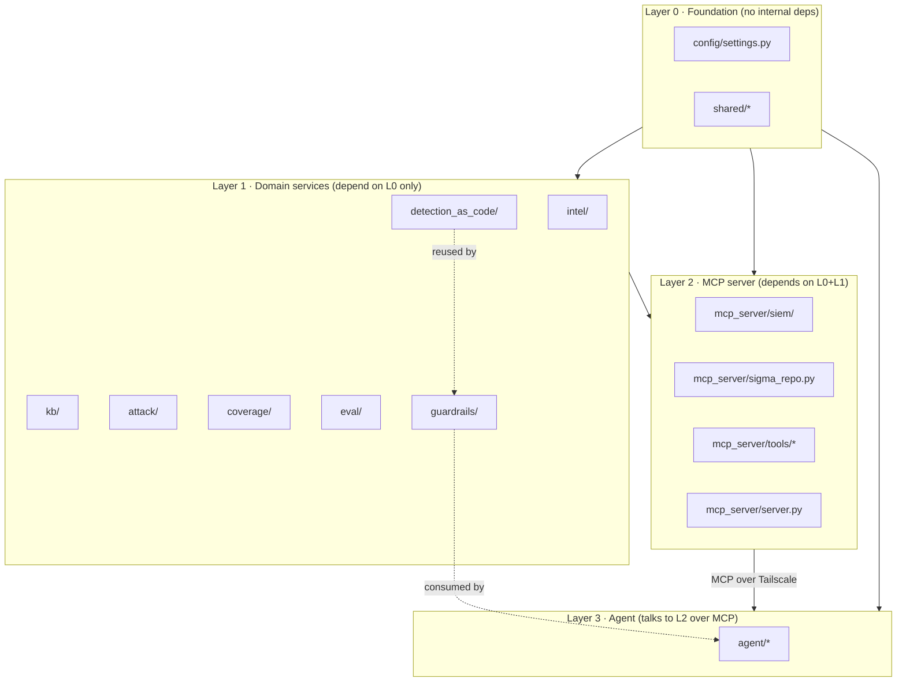
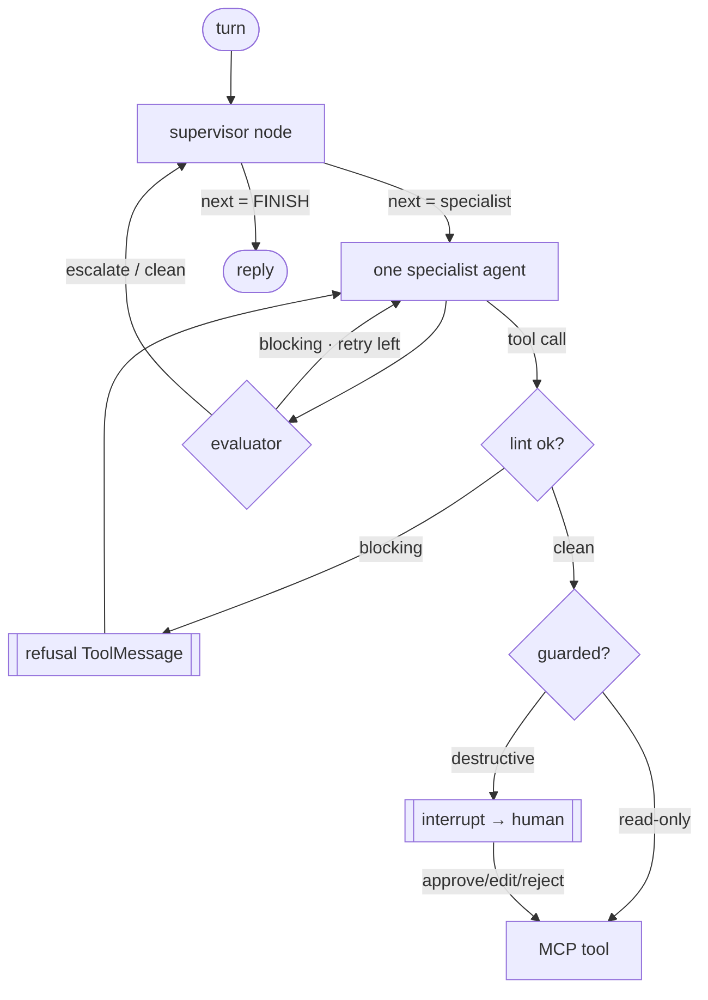

# ADEPT — Code Review & Architecture Walkthrough

> A guided, file-by-file, function-by-function reading plan for understanding
> **every line** of the ADEPT codebase. Follow the parts in order: each part
> only depends on the parts before it, so by the time you reach a file, you
> already understand everything it imports.

---

## How to use this guide

1. **Read the parts in order.** The sequence follows ADEPT's *dependency
   layering* (bottom-up): foundation → domain services → MCP server → agent →
   tests. Nothing in an earlier part depends on a later part, so you never have
   to read forward to understand the code in front of you.
2. **For each file:** read the short "Purpose" line here first, then open the
   file and read top to bottom. Use the **function/class table** in this guide
   as a map — each row tells you what a symbol does *before* you read its body,
   so the code confirms the description rather than puzzling you.
3. **Check off files as you go** using the master checklist in
   [§1 Reading order](#1-master-reading-order).
4. **Cross-reference the tests.** Every domain module has a matching
   `tests/test_<module>.py`. After reading a module, read its test file — the
   tests are the executable specification and show each function's real inputs
   and outputs.
5. **Keep the two design docs open** alongside this one:
   [technical.md](technical.md) (architecture/security) and
   [workflow_nontechnical.md](workflow_nontechnical.md) (plain-language flow).

### Legend

| Marker | Meaning |
| --- | --- |
| **(gated)** | State-changing MCP tool; passes through the human-approval gate before it runs. |
| **(propose-only)** | Renders a plan/command but never executes it; a human runs it. |
| **async** | Coroutine — the function can pause while waiting for I/O without blocking the whole program; see Glossary. |

---

## Glossary — terms used in this guide

Unfamiliar with a term? Look it up here once, then read on.

### Python and software-engineering concepts

| Term | What it means in plain English |
| --- | --- |
| **async / coroutine** | A function marked `async def` can pause while waiting for something (a network response, a disk read) without freezing the whole program. To get its return value you must `await` it. |
| **dataclass** | Python shorthand for a class whose only job is to hold named fields — like a named row in a table. Saves writing repetitive `__init__` code. |
| **Protocol / interface** | Defines which methods an object must have, without forcing it to inherit from a specific parent class. Any object that implements those methods satisfies the Protocol — similar to an interface in Java or TypeScript. |
| **ABC (Abstract Base Class)** | A class that declares methods but leaves their bodies empty. Every concrete subclass *must* fill them in. Used to guarantee that every SIEM backend, for example, has the same set of methods. |
| **lru_cache** | "Least-recently-used cache." A wrapper that remembers a function's return value the first time it is called, then returns that same value on every subsequent call — so the function only runs once. |
| **@cached_property** | Like `lru_cache` but for an object's attribute: the value is computed the first time it is accessed and then stored on the object. Subsequent accesses just return the stored value. |
| **Lazy initialization** | An object or network client is not created until the first time it is actually needed. This means importing a module never triggers a network connection or a large download — those happen only when a tool is first called. |
| **slots=True / frozen=True** | `slots=True` on a dataclass saves memory by preventing arbitrary new attributes from being added at runtime. `frozen=True` makes every field read-only after the object is created — like an immutable record. |
| **TypedDict** | A dictionary whose keys and value types are declared upfront so static analysis tools (and this guide) can reason about it. At runtime it is still just a plain dict. |
| **Type alias** | A new name for an existing type, purely for readability. For example, `Event = dict[str, Any]` lets code say "an Event" instead of "a dict of string keys to anything". |
| **Literal** | A type annotation that only allows specific string or number values — for example `Literal["approve", "reject"]` means the variable can only ever hold those two strings. |
| **Idempotent** | Safe to run more than once. If you call an idempotent function twice with the same inputs, the second call produces the same result as the first and does not cause a duplicate side-effect (e.g. a duplicate database row). |
| **Raises / throws** | When a function encounters an error it cannot handle internally, it *raises an exception* — Python's equivalent of throwing an error. The caller is responsible for catching it or letting it propagate. |
| **Context manager (`with` / `async with`)** | A block of code that has guaranteed setup and teardown. `with open(file) as f:` is the classic example — the file is always closed when the block exits, even if an exception occurs. `async with` is the async equivalent. |
| **@cached_property (on a class)** | The same as above, but stored on the instance. The first access runs the computation; later accesses return the cached result without re-running it. |

### Domain and project-specific terms

| Term | What it means in plain English |
| --- | --- |
| **SIEM** | Security Information and Event Management platform. A system that collects logs from across your environment, stores them, and fires alerts when detection rules match. ADEPT supports three: Elasticsearch/ELK, OpenSearch/Wazuh Indexer, and Splunk. |
| **Sigma rule** | A vendor-neutral detection rule written in YAML. You describe *what to look for* in a log (fields, values, conditions) without tying it to any specific SIEM's query language. The pySigma library then converts it to Lucene, SPL, or any other target language. |
| **logsource** | A section near the top of every Sigma rule that declares what kind of log the rule targets — for example `product: windows, category: process_creation`. It is used to select the right field-name mapping when converting the rule to a SIEM query. |
| **pySigma** | The Python library that parses Sigma rule YAML, validates it, and converts it to a SIEM's native query language. It uses a plugin system: separate packages add support for each SIEM backend and each field-mapping pipeline. |
| **STIX bundle** | The file format MITRE uses to distribute ATT&CK data — a single large JSON file containing every technique, sub-technique, tactic, group, software entry, and data source. ADEPT downloads and caches it locally. |
| **ATT&CK** | The MITRE ATT&CK framework: a publicly maintained taxonomy of the tactics (the *why* — e.g. Credential Access) and techniques (the *how* — e.g. T1003 OS Credential Dumping) that real adversaries use. Sigma rules are tagged with technique IDs so ADEPT can measure how much of the framework your ruleset covers. |
| **MCP (Model Context Protocol)** | A standard protocol that lets an LLM agent call external tools by name, with structured inputs and outputs — similar to how a browser calls a web API. The MCP server exposes ADEPT's capabilities as a catalogue of named tools. The agent calls a tool; the server executes it and returns the result. |
| **LangGraph** | A Python library for building multi-step AI agent workflows as a directed graph. Nodes are agents or processing functions; edges are routing decisions. ADEPT uses it to wire the supervisor, the five specialists, the evaluator, and the approval gate together. |
| **Ollama** | A local LLM inference server. ADEPT runs its language model (e.g. `qwen2.5:7b`) through Ollama instead of sending prompts to an external cloud API — all inference stays on your own hardware. |
| **Chroma** | A local vector database. ADEPT stores text chunks alongside their vector embeddings here so it can retrieve the most semantically relevant documents for a given query (Retrieval-Augmented Generation). |
| **Vector / embedding** | A list of numbers that represents the *meaning* of a piece of text. A model (running in Ollama) converts text to a vector; texts with similar meanings produce vectors that are mathematically close together. Chroma stores these vectors and finds the closest match to a query. |
| **Token-bucket rate limiter** | A traffic-shaping mechanism: tokens accumulate over time at a fixed rate (e.g. 5 per second) up to a maximum burst capacity. Each outbound request spends one token. If the bucket is empty the call waits until a token refills. Used to keep NVD API calls polite. |
| **AST (Abstract Syntax Tree)** | The parsed, tree-shaped internal representation of a Sigma rule's detection logic. The root is the overall condition; branches are AND/OR/NOT operators; leaves are individual field-equals-value checks. ADEPT's offline rule evaluator walks this tree to decide whether a sample event matches the rule. |
| **Jaccard similarity** | A 0–1 score measuring how much two sets overlap: (number of items in both sets) ÷ (number of items in either set). A score of 1.0 means the sets are identical; 0.0 means they share nothing. Used to detect rules with nearly identical detection logic. |
| **Slug** | A URL-safe string of lowercase ASCII letters, digits, and underscores derived from a longer piece of text — for example `suspicious_powershell_execution` from the rule title "Suspicious PowerShell Execution". Used for file and branch names. |
| **DSL (Domain-Specific Language)** | A query language designed for one specific purpose rather than general programming. Lucene query syntax and SPL (Splunk Processing Language) are DSLs for searching log data. |
| **Hop** | One specialist agent's complete turn in a conversation — from receiving a delegated task to returning a final answer (which may involve multiple tool calls internally). |
| **HITL (Human-in-the-loop)** | A design pattern where a human must explicitly approve a decision before it takes effect. ADEPT uses HITL for all state-changing tool calls. |
| **Approval gate / gated tool** | A tool annotated as state-changing (deploying a rule, launching an emulation). When called, LangGraph pauses the graph and presents the proposed action to the human for approval, editing, or rejection before anything is executed. |
| **Lint / guardrail** | Automated checks that inspect a tool's inputs or outputs for known-bad patterns *before* anything is executed or saved. ADEPT's linters catch things like destructive SPL commands or a leading wildcard in a Lucene query. |
| **ScriptedModel** | A test-only fake LLM (defined in `tests/conftest.py`) that returns a pre-programmed list of replies in sequence. Tests use it so they run without Ollama — the model's output is deterministic and the tests stay fully offline. |

---

## 0. The big picture (read this first)

ADEPT is a **local multi-agent AI Detection Engineer** for a homelab SOC. A
LangGraph supervisor routes each chat turn to one of five specialist agents.
The specialists never touch SIEMs or git directly — they call **tools** over an
authenticated **MCP** (Model Context Protocol) tunnel. The MCP server is the
only component that brokers access to SIEMs, the Sigma rules repo, threat
intel, the knowledge base, and adversary-emulation tooling.

### 0.1 Runtime layering (and therefore the review order)



**The golden rule of the codebase:** imports flow one way —
`mcp_server` may import the domain packages; the domain packages must **never**
import `mcp_server`; everything may import `config` and `shared`. (The lone
intra-L1 edge: `guardrails` reuses `detection_as_code`'s Sigma validator. Its
only consumer is the agent, so it is documented there in [§12](#12-part-10--agent-module).)

### 0.2 The six entry points (console scripts)

These are defined in [pyproject.toml](../pyproject.toml) under
`[project.scripts]`. Each is a good "spine" to trace through the code:

| Command | Entry point | What it starts |
| --- | --- | --- |
| `adept` | `adept.agent.cli:app` | The interactive multi-agent chatbot. |
| `adept-mcp` | `adept.mcp_server.server:main` | The FastMCP server (brokers everything). |
| `adept-dac` | `adept.detection_as_code.cli:app` | Standalone Sigma → SIEM convert/validate/test CLI. |
| `adept-kb` | `adept.kb.cli:app` | Knowledge-base ingest/search/info. |
| `adept-coverage` | `adept.coverage.cli:app` | ATT&CK coverage matrix / gaps / overlaps. |
| `adept-eval` | `adept.eval.cli:app` | Offline detection-quality eval + live scenarios. |

---

## 1. Master reading order

Work straight down this list. Estimated reading is "lines of code", not time.

| # | File | LoC | Part |
| --- | --- | --- | --- |
| 1 | `pyproject.toml` + `README.md` + `docs/technical.md` | — | [§2](#2-orientation-non-code) |
| 2 | `adept/config/settings.py` | 314 | [§3](#3-part-1--foundation-layer) |
| 3 | `adept/shared/errors.py` | 46 | §3 |
| 4 | `adept/shared/logging.py` | 107 | §3 |
| 5 | `adept/shared/cache.py` | 62 | §3 |
| 6 | `adept/shared/ratelimit.py` | 85 | §3 |
| 7 | `adept/shared/notify.py` | 82 | §3 |
| 8 | `adept/shared/observability.py` | 67 | §3 |
| 9 | `adept/intel/` (models → http → nvd/kev/attack/news → service) | 708 | [§4](#4-part-2--intel-module) |
| 10 | `adept/kb/` (models → embeddings → store → sources → service → cli) | 770 | [§5](#5-part-3--kb-module) |
| 11 | `adept/attack/` (models → atomic → caldera → service) | 529 | [§6](#6-part-4--attack-module) |
| 12 | `adept/coverage/` (models → attack_data/matrix/navigator/gaps/overlap/baseline/rules → cli) | 835 | [§7](#7-part-5--coverage-module) |
| 13 | `adept/detection_as_code/` (models → targets/pipelines/converter/validator/matcher/unit_tests/backtest/lifecycle → cli) | 880 | [§8](#8-part-6--detection-as-code-module) |
| 14 | `adept/eval/` (models → scenarios → cli) | — | [§9](#9-part-7--eval-module) |
| 15 | `adept/mcp_server/siem/` (models → base → _lucene/_payloads → elk/opensearch/splunk → registry) | 1186 | [§10](#10-part-8--mcp-server-siem-backends) |
| 16 | `adept/mcp_server/` (auth → context → sigma_repo → resources → tools/* → server) | 1700 | [§11](#11-part-9--mcp-server-core--tools) |
| 17 | `adept/guardrails/` (models → spl/lucene/sigma/navigator/git → registry) | 470 | [§12](#12-part-10--agent-module) |
| 18 | `adept/agent/` (state → llm/history/mcp_client/audit → approval → specialists → evaluator → supervisor → service → cli) | 1877 | [§12](#12-part-10--agent-module) |
| 19 | `tests/` (conftest → per-module test files) | 3556 | [§13](#13-part-11--test-suite) |

---

## 2. Orientation (non-code)

Before reading a single line of Python, read the project's "map" files. They
tell you **what** ADEPT is, **how it is packaged**, and **how its pieces are
allowed to talk** — context that makes every later module obvious instead of
mysterious. Spend ~30 minutes here; you will save hours later.

### 2.1 Read these first

| File | What to extract from it |
| --- | --- |
| [README.md](../README.md) | The elevator pitch, the high-level architecture mermaid diagram, and the **Repository layout** table (maps every top-level `adept/` package to one sentence). This is your fastest mental model. |
| [docs/technical.md](technical.md) | The authoritative reference: architecture, technology stack, the **MCP tool & resource reference** (§5), the multi-agent system (§6), the **output guardrails & evaluator** (§7), the purple-team FP/FN loop (§8), and the **security model** (§12). Keep it open the whole way through. |
| [docs/workflow_nontechnical.md](workflow_nontechnical.md) | The plain-language story of how a detection moves "from idea to deployed alert", and the plain-English description of each of the five specialist agents. Read it once to anchor the *why*. |
| [docs/homelab_architecture.md](homelab_architecture.md) | The lab topology template. Note it is a **template to be filled in** — ADEPT serves it verbatim to the agents as the `homelab://architecture` MCP resource, so docs double as runtime data. |
| [pyproject.toml](../pyproject.toml) | Project metadata, the dependency **extras**, the `dev` dependency group, and the six `[project.scripts]` console entry points (see [§0.2](#0-the-big-picture-read-this-first)). |
| [SETUP_CHECKLIST.md](../SETUP_CHECKLIST.md) | The operator's go-live runbook. Skim it to understand the deployment topology (MCP host / agent host / Ollama host) and what "done" looks like in production. |

### 2.2 The packaging model (a key architectural signal)

ADEPT's components are **independently deployable** and that intent is encoded
directly in [pyproject.toml](../pyproject.toml) as optional-dependency *extras*.
Reading them tells you the component boundaries before you see the code:

| Extra | Pulls in | Installed on the host that runs… |
| --- | --- | --- |
| `siem` | `elasticsearch`, `opensearch-py`, `splunk-sdk` | the MCP server (SIEM access). |
| `dac` | `pysigma` + backends/pipelines, `GitPython`, `typer` | the MCP server and CI (detection-as-code). |
| `intel` | `feedparser`, `mitreattack-python` | the MCP server (threat intel). |
| `kb` | `chromadb`, `ollama` | the MCP server (RAG knowledge base). |
| `mcp` | `mcp[cli]` | anything speaking MCP. |
| `mcp-server` | `adept[mcp,siem,dac,intel,kb]` | **the homelab MCP VM** (the aggregate). |
| `agent` | `langgraph`, `langchain-*`, `langchain-mcp-adapters`, `typer` | **the agent/LLM box**. |

> **Why this matters for the review:** the base `dependencies` list is kept
> deliberately light (pydantic, structlog, httpx, tenacity, rich, PyYAML). The
> heavy libraries live behind extras, which is *why* the domain packages import
> their third-party clients lazily — so a host that only runs the agent never
> needs `chromadb` or `elasticsearch`. Watch for those lazy imports later.

### 2.3 Developer commands (how to run what you read)

The [Makefile](../Makefile) wraps `uv` and documents the canonical workflow.
Every target is just a thin `uv run` wrapper, so you can run them directly.

| `make` target | Underlying command | Purpose |
| --- | --- | --- |
| `make install` | `uv sync --group dev` | Base + dev deps (fast, for foundation work). |
| `make install-all` | `uv sync --all-extras --group dev` | Full environment (every extra). |
| `make check` | `ruff check` → `mypy adept` → `pytest` | **The CI gate** — run this to verify the tree is green. |
| `make mcp` / `make agent` | `uv run adept-mcp` / `uv run adept` | Start the server / the chatbot. |
| `make dac` / `make eval` | `uv run adept-dac` / `uv run adept-eval rules` | The standalone CLIs (eval runs TP/FP unit tests from `sigma_rules/tests/`). |

> The container path ([Dockerfile](../Dockerfile) +
> [docker-compose.yml](../docker-compose.yml)) builds one `adept:latest` image
> and runs the `mcp-server` and `agent` services from it, reaching Ollama on the
> host via `host.docker.internal`. Skim these to see the runtime wiring, then
> move on — the interesting logic is all in Python.

> **Reading tip.** With the README's repository-layout table and `technical.md`
> §5 (tool reference) open beside you, start the code in [§3](#3-part-1--foundation-layer).

---

## 3. Part 1 — Foundation layer

Everything in ADEPT imports from here, so internalise these two packages first.
They have **zero** internal dependencies.

### 3.1 · [adept/config/settings.py](../adept/config/settings.py) — 328 LoC

**Purpose.** The single, typed source of truth for all configuration. Uses
`pydantic-settings` to read environment variables (prefix `ADEPT_`, nested
delimiter `__`) and an optional `.env`. Each subsystem gets its own nested
settings model; the root `Settings` aggregates them.

| Symbol | Kind | What it does |
| --- | --- | --- |
| `CsvList` | A type alias (see Glossary) for a list of strings that should be read from a comma-separated environment variable — for example `ADEPT_INTEL__ALLOWED_DOMAINS=nvd.nist.gov,cisa.gov`. Pydantic reads it as a plain string and this alias signals that it must be split on commas, not parsed as JSON. |
| `_split_csv(value)` | A helper pydantic calls automatically when reading a CSV setting: turns `"a, b ,c"` into `["a", "b", "c"]`, stripping leading/trailing whitespace. Passes anything that is already a list through untouched. |
| `MCPSettings` | Holds the MCP server's connection details: which host and port it listens on, the URL path, the transport type (HTTP or stdio), the bearer token agents must present, and the public URL it advertises. The default host is loopback (`127.0.0.1`) so it cannot be reached from outside the machine without explicit configuration. |
| `OllamaSettings` | Connection and model settings for the local Ollama inference server: base URL, which model to use for chat and for embeddings, temperature (how creative vs. deterministic the model is), context window size, and how long a single request may take before timing out. |
| `ELKSettings` | Connection settings for the primary Elasticsearch/Kibana SIEM: an enable flag, the Elasticsearch URL, authentication (API key or username/password), TLS certificate handling, the default index to search, the Kibana URL, and the alerts index. |
| `OpenSearchSettings` | Connection settings for the OpenSearch/Wazuh Indexer SIEM: an enable flag, URL, basic auth, TLS certificate handling, and the default index. |
| `SplunkSettings` | Connection settings for Splunk: host, management port, basic auth or token, HTTP scheme (`http`/`https`), TLS verification, and the default index to search. |
| `SigmaRepoSettings` | Settings for the local Sigma rules git repository: the path on disk, the default branch to commit to, a comma-separated list of protected branches that must never be committed to directly (the validator splits this into a list), and the optional git remote. |
| `IntelSettings` | Settings for the four threat-intel sources: the SSRF allowlist (the only hostnames ADEPT is permitted to contact for intel), NVD API key and URL, CISA KEV URL, ATT&CK STIX URL, the list of RSS feed URLs, how long to cache each source's responses, and the NVD per-minute rate limit. |
| `CoverageSettings` | Settings for the coverage baseline profiler: how many days of historical SIEM data to look back over when profiling field volumes. |
| `KBSettings` | Settings for the RAG knowledge base: where Chroma stores its files, the collection name, which Ollama embedding model to use, text chunk size and overlap, and an optional path or remote URL for the SigmaHQ community rules corpus. |
| `NotifySettings` | Settings for outbound notifications when rules are approved or deployed: which backend to use (`none` / `ntfy` / `discord` / `slack` / `webhook`), and the URL, topic, or token for that backend. |
| `AttackSimSettings` | Settings for adversary emulation guardrails: whether human approval is required before running a Caldera operation, whether to default to dry-run mode, the list of ATT&CK technique IDs that Atomic Red Team is allowed to propose, and the Caldera server URL, API key, and the agent/adversary/operation IDs to use. Safe-by-default (approval required, dry-run on, Atomic off). |
| `AgentSettings` | Runtime settings for the agent: the MCP server URL and token, how long to wait for an MCP call, which LLM model to use, the SQLite file for conversation checkpoints, the audit log path, the graph recursion limit, and the `dangerous_tools` list — any tools named here are added to the approval gate on top of the automatically derived set. |
| `OTelSettings` | Optional OpenTelemetry tracing settings: an enable flag, the OTLP HTTP exporter endpoint, and the service name that appears in traces. |
| `Settings` | The root configuration object. Holds the top-level fields (environment name, log level, data directory, JSON logs flag) plus every nested settings model above. |
| `Settings.enabled_siems()` | Returns the list of SIEM backend IDs (`"elk"`, `"opensearch"`, `"splunk"`) whose enable flag is set to `True` in the current configuration. |
| `Settings.ensure_data_dir()` | Creates the configured runtime data directory if it does not already exist, then returns its path. |
| `get_settings()` | Reads and validates the full configuration once, then caches the result (see Glossary: lru_cache) so every subsequent call returns the same object without re-reading environment variables. Tests call `get_settings.cache_clear()` to reset the cache between runs. |

> **Why first:** every other file receives a `Settings` object (or one of its nested sub-models) as input. Knowing the field names here makes the rest of the codebase self-explanatory.

> **Secrets are `SecretStr`.** Every credential field — `mcp.auth_token`, the SIEM `password`/`api_key`/`token` fields, `intel.nvd_api_key`, and the notify/Caldera/agent tokens — is stored as a pydantic `SecretStr`. This means the value is automatically masked when the object is printed, logged, or serialised with `model_dump()`. To actually use the value, code must call `.get_secret_value()` at the exact point of use. `test_config.py` enforces this invariant (the plaintext must never appear in a dump).

### 3.2 · [adept/shared/errors.py](../adept/shared/errors.py) — 37 LoC

**Purpose.** The typed exception hierarchy. The MCP tool layer catches these and
re-raises them as protocol `ToolError`s, so the categories matter.

| Symbol | What it does |
| --- | --- |
| `AdeptError` | Base class for every ADEPT error. Catch this to catch "anything ADEPT". |
| `ConfigurationError` | Missing/invalid configuration. |
| `BackendNotEnabledError` | A SIEM (or other backend) was requested but is disabled in settings. |
| `SecurityError` | A guardrail was violated (no approval, off-allowlist fetch, protected-branch commit). |
| `ValidationFailedError` | A Sigma rule failed structural validation / linting. |
| `ToolExecutionError` | An MCP tool failed at runtime. |
| `ModelTimeoutError` | The LLM call exceeded its timeout (slow local inference); carries an actionable message instead of a blank failure. |

### 3.3 · [adept/shared/logging.py](../adept/shared/logging.py) — 107 LoC

**Purpose.** Structured logging on `structlog`: JSON in prod, colored console in
dev, with **secret redaction** and quieting of noisy third-party loggers.

| Symbol | What it does |
| --- | --- |
| `_SENSITIVE_HINTS`, `_REDACTED`, `_NOISY_LOGGERS` | Three module-level constants: the list of key-name substrings that identify a sensitive value (e.g. `"password"`, `"token"`), the mask string that replaces them in logs, and the list of verbose third-party libraries (e.g. `httpx`, `mcp`) whose log output ADEPT silences at WARNING level. |
| `_quiet_noisy_loggers(level)` | Raises noisy third-party loggers to WARNING so they don't clutter ADEPT's output — unless ADEPT itself is running at DEBUG level, in which case their full output is preserved. |
| `_redact_processor(logger, method, event_dict)` | A structlog processor (a step in the logging pipeline): scans every key in the log event dictionary and replaces any value whose key name looks like a secret with the mask string. |
| `configure_logging(*, level, json_logs)` | Sets up structured logging for the whole process: connects structlog to Python's standard `logging` module, inserts the redaction processor, and picks either a JSON renderer (for production log aggregation) or a coloured console renderer (for development). Safe to call more than once. |
| `get_logger(name=None)` | Returns a bound structlog logger. If logging has not been configured yet, auto-configures it with sensible defaults first. Binds the `logger=name` field so every log line from that logger is tagged with its source. |

### 3.4 · [adept/shared/cache.py](../adept/shared/cache.py) — 62 LoC

**Purpose.** A dependency-free, thread-safe, file-backed TTL cache. Used to cache
external intel responses (NVD/KEV/ATT&CK/RSS) for resilience and rate-limit
friendliness.

| Symbol | What it does |
| --- | --- |
| `DiskCache.__init__(directory, namespace)` | Creates the cache directory at `<directory>/<namespace>/` (making it if it doesn't exist) and initialises a threading lock so concurrent tool calls don't corrupt each other's files. |
| `DiskCache._path_for(key)` | Maps a cache key string to a file path using its SHA-256 hash as the filename, so any string can be used as a key regardless of special characters. |
| `DiskCache.get(key)` | Returns the cached value if it exists and has not expired, or `None` if the entry is missing or stale. Expired entries are deleted from disk on read. |
| `DiskCache.set(key, value, ttl_seconds)` | Writes the value to disk as a JSON file containing the expiry timestamp and the payload. Uses a temp-file-then-rename pattern so a partial write never leaves a corrupted cache entry. The value must be JSON-serialisable (dicts, lists, strings, numbers). |
| `DiskCache.clear()` | Removes all cached files in this namespace. |

### 3.5 · [adept/shared/ratelimit.py](../adept/shared/ratelimit.py) — 85 LoC

**Purpose.** Token-bucket rate limiters so outbound calls (e.g. NVD) stay polite.
Two variants because tools run sync but some callers are async.

| Symbol | What it does |
| --- | --- |
| `AsyncRateLimiter.__init__(rate, capacity=None)` | Sets the token refill rate (tokens per second) and the burst capacity (the maximum number of tokens that can accumulate; defaults to the refill rate if not specified). Rejects a rate of zero or below. |
| `AsyncRateLimiter.acquire(tokens=1.0)` | **async** — refills the bucket based on how much time has passed since the last call, then waits (without blocking other async tasks) until enough tokens are available, consumes them, and returns. |
| `SyncRateLimiter.__init__(rate, capacity=None)` | Same as `AsyncRateLimiter` but implemented with a standard threading lock instead of async primitives. |
| `SyncRateLimiter.acquire(tokens=1.0)` | The synchronous version — pauses the current thread with `time.sleep` until tokens are available, then consumes them. Used by synchronous SIEM and intel clients that run outside an async event loop. |

### 3.6 · [adept/shared/notify.py](../adept/shared/notify.py) — 82 LoC

**Purpose.** Best-effort outbound notifications for approval/deploy events. The
`none` backend (default) is a silent no-op; failures never raise.

| Symbol | What it does |
| --- | --- |
| `Level` | One of three severity strings (`"info"`, `"warning"`, `"critical"`) used to colour-code notifications. |
| `Notifier.__init__(settings)` | Stores the `NotifySettings`. Does not open any connection — notification backends connect lazily on the first `send` call. |
| `Notifier.send(title, message, level)` | **async** — sends a notification to the configured backend. Returns `True` if the backend is disabled (`none`) or if delivery succeeded. Catches all errors, logs them, and returns `False` — so a broken notification backend never crashes the agent turn. |
| `Notifier._dispatch(client, backend, …)` | **async** — backend-specific HTTP POST for ntfy / Discord / Slack / generic webhook. Raises if the HTTP response indicates an error. |
| `_ntfy_priority(level)` | Converts a severity level to the ntfy-specific priority header value that ntfy uses to control how urgently the notification is displayed. |

### 3.7 · [adept/shared/observability.py](../adept/shared/observability.py) — 67 LoC

**Purpose.** Optional OpenTelemetry tracing that **degrades to a no-op** (plus a
timing log) when the extra isn't installed, so app code can call it
unconditionally.

| Symbol | What it does |
| --- | --- |
| `setup_observability(settings)` | If `OTelSettings.enabled` is `True`, lazily imports the OpenTelemetry SDK and wires an OTLP/HTTP exporter to send traces to the configured endpoint. If the SDK is not installed (`ImportError`), logs a one-time hint and continues — tracing is silently disabled rather than crashing the server. |
| `span(name, **attributes)` | A context manager (see Glossary) that opens an OpenTelemetry span for the wrapped block when tracing is enabled. Always records a `duration_ms` debug log line when the block exits, even when tracing is disabled — so timing information is available in the logs regardless. |

> **Note on `shared/__init__.py`:** it simply re-exports the error classes plus
> `configure_logging`/`get_logger` for convenient importing.

---

## 4. Part 2 — `intel/` module

**Purpose.** Typed, cached, allowlist-guarded clients for four external
threat-intel sources. The design pattern to notice (it repeats across every
domain module): **pure `parse_*` functions** (network-free, unit-testable) +
**thin client classes** + a **`*Service` composition root** built from
`Settings`. Read the files in the order below.

> **Security lens:** this is ADEPT's main SSRF surface (it fetches remote URLs,
> some operator-configured). Pay attention to `host_allowed`, disabled
> redirects, and the download size cap. Note the documented residual risk: the
> allowlist is **host-based** (no resolved-IP pinning), so it does not by itself
> stop DNS rebinding — accepted because the default hosts are fixed public
> endpoints and redirects are off (see the module docstring).

### 4.1 · [adept/intel/models.py](../adept/intel/models.py) — 104 LoC

**Purpose.** Pydantic models that normalise verbose upstream payloads (NVD/KEV/
ATT&CK/RSS) into compact typed shapes. Read first — every client returns these.

| Symbol | What it does |
| --- | --- |
| `CVSSMetric` | One CVSS metric: `version`, `source`, `base_score`, `base_severity`, `vector`. |
| `CVERecord` | A normalised CVE: ids, dates, description, `cvss[]`, `cwes[]`, `references[]`, `in_kev`. |
| `CVERecord.top_severity` | **property** — first non-empty CVSS severity (the headline severity). |
| `CVESearchResult` | A page of CVE search hits: `query`, `total`, `returned`, `cves[]`. |
| `KEVEntry` | One CISA KEV row (vendor/product/name/dates/action/ransomware flag). |
| `KEVResult` | Filtered KEV view: catalogue version/date + `entries[]`. |
| `AttackTechnique` | Normalised ATT&CK technique: id/name/description, tactics, platforms, data sources, detection text, url. |
| `NewsItem` / `NewsResult` | One RSS/Atom entry, and a collection of them. |

### 4.2 · [adept/intel/http.py](../adept/intel/http.py) — 136 LoC

**Purpose.** The shared synchronous HTTP helper that centralises the SSRF guard,
disk cache, and rate limiting for **every** intel request.

| Symbol | What it does |
| --- | --- |
| `_ALLOWED_SCHEMES`, `_MAX_DOWNLOAD_BYTES` | Only `http`/`https` allowed; 256 MiB hard cap on a streamed download. |
| `host_allowed(url, allowed_domains)` | The SSRF guard (see the security lens above): returns `True` only if the URL's scheme is `http` or `https` **and** its hostname appears in the allowlist. Host-based only — does not resolve the hostname to an IP address (documented residual risk: DNS rebinding is not prevented, but accepted because the default hosts are fixed public endpoints and redirects are disabled). |
| `IntelHTTP.__init__(...)` | Stores the allowlist, the disk cache, an optional rate limiter, and an HTTP client. The HTTP client is created immediately at construction (not lazily) but with **redirects disabled** — so a permitted hostname cannot issue a redirect that bounces the request to an off-allowlist destination. |
| `IntelHTTP._guard(url)` | Calls `host_allowed` and raises a `SecurityError` if the URL is not on the allowlist. Called at the top of every outbound request. |
| `IntelHTTP.get_json(url, …)` | The full fetch-with-caching pipeline: guard the URL → check the disk cache → wait for a rate-limit token → send GET request → parse JSON → store in cache. Wraps HTTP errors and JSON parse errors as `ToolExecutionError`. |
| `IntelHTTP.download_text(url, max_bytes)` | A guarded, streamed GET that reads the response body incrementally and aborts if it exceeds `max_bytes`. Used for the large ATT&CK STIX bundle and RSS feed text, where the full content is not known in advance. |
| `IntelHTTP.close()` | Closes the underlying HTTP client and releases its connection pool. |

### 4.3 · [adept/intel/nvd.py](../adept/intel/nvd.py) — 135 LoC

**Purpose.** NVD CVE 2.0 client. Parsing is split into pure functions so it is
unit-testable without the network.

| Symbol | What it does |
| --- | --- |
| `validate_cve_id(cve_id)` | Checks that the string matches the standard `CVE-YYYY-NNNNN` format and upper-cases it. Raises `ValidationFailedError` on a bad format. This guard also prevents a malformed id from being used to construct unexpected filesystem paths later. |
| `_english_description(cve)` | Picks the English-language entry from the NVD `descriptions` array. |
| `_parse_metrics(cve)` | Flattens the NVD response's nested CVSS metric blocks (which can hold v3.1, v3.0, and v2 scores simultaneously) into a flat list of `CVSSMetric` objects, handling the slight schema differences between versions. |
| `_parse_cwes(cve)` | Extracts the list of CWE (Common Weakness Enumeration) IDs from the `weaknesses` block, removing duplicates. |
| `parse_cve(cve)` | Combines the helpers above into a single `CVERecord`. Sets the `in_kev` flag from the `cisaExploitAdd` field if present — this indicates CISA has confirmed the vulnerability is being actively exploited in the wild. |
| `parse_cve_response(payload)` | Extracts all `CVERecord` objects from a raw NVD API response envelope. |
| `NVDClient.__init__(http, base_url, api_key, ttl)` | Stores the HTTP helper, the NVD API base URL, an optional API key for higher rate limits, and the cache TTL in seconds. |
| `NVDClient._headers()` | Returns the request headers dictionary, adding the `apiKey` header only when an API key is configured. |
| `NVDClient.lookup_cve(cve_id)` | Validates the CVE ID, fetches the single CVE record from NVD (using the disk cache), and raises if no matching CVE is found. |
| `NVDClient.search_cves(keyword, limit)` | Searches NVD by keyword. Results are capped at 50 to avoid enormous responses. Results are cached so repeated identical searches do not count against the rate limit. |

### 4.4 · [adept/intel/kev.py](../adept/intel/kev.py) — 79 LoC

**Purpose.** CISA KEV client — fetch the single catalogue JSON once (long TTL),
then filter client-side.

| Symbol | What it does |
| --- | --- |
| `parse_kev_entry(raw)` | Converts one raw object from the CISA KEV JSON catalogue into a typed `KEVEntry`. |
| `_matches(entry, query)` | Returns `True` if the query string appears (case-insensitively) anywhere in the entry's CVE ID, vendor, product, name, or description. Used for free-text filtering. |
| `KEVClient.__init__(http, url, ttl)` | Stores the catalogue URL and how long to cache it. |
| `KEVClient._catalog()` | Fetches the entire CISA KEV JSON catalogue (cached for `ttl` seconds). The full catalogue is small enough to hold in memory and filter client-side. |
| `KEVClient.get_kev(cve_id, query, limit)` | Filters the cached catalogue: by exact CVE ID match if one is supplied, otherwise by free-text `query`. Caps results at `limit`. Returns a `KEVResult`. |

### 4.5 · [adept/intel/attack.py](../adept/intel/attack.py) — 119 LoC

**Purpose.** MITRE ATT&CK technique lookup from the official STIX bundle.
`mitreattack-python` is imported lazily so the module stays light.

| Symbol | What it does |
| --- | --- |
| `_ATTACK_ID_RE` | Regular expression matching ATT&CK technique IDs in the forms `T1234` or `T1234.001`. |
| `validate_attack_id(id)` | Normalises and validates an ATT&CK technique ID against the regex above. Raises `ValidationFailedError` on a bad format. This validation also protects against an attacker supplying a crafted ID to traverse filesystem paths when the ID is used to locate files. |
| `_mitre_url(stix_obj)` | Extracts the external technique ID (e.g. `T1059`) and the ATT&CK website URL from a STIX object's `external_references` list. |
| `parse_technique(stix_obj, tactics)` | Converts a raw STIX `attack-pattern` object (a technique record from the ATT&CK STIX bundle) into a typed `AttackTechnique`. Takes the pre-resolved list of tactic names as a separate argument to avoid a second lookup. |
| `AttackClient.__init__(...)` | Stores the STIX bundle download URL, the local file path to cache it at, the cache TTL, and a variable to hold the in-memory index (initially `None` — not built until first use). |
| `AttackClient._bundle_is_fresh()` | Returns `True` if the cached STIX file already exists on disk and was downloaded within the TTL window. |
| `AttackClient._ensure_bundle()` | Downloads the STIX bundle if the cached copy is stale, writes it atomically to disk, and clears the in-memory index so the next lookup rebuilds it from the new file. |
| `AttackClient._attack_data()` | Builds the in-memory lookup index over the cached STIX bundle the first time a technique is requested (see Glossary: lazy initialization). The `mitreattack-python` library is imported here, not at module load, so importing `intel.attack` never requires the library to be installed. |
| `AttackClient.ensure_bundle_path()` | Public method: refreshes the bundle if stale and returns the local file path. Called by `coverage/` when it needs to load the catalogue from disk. |
| `AttackClient.get_technique(id)` | Validates the technique ID → ensures the bundle is current → looks up the technique and its associated tactics → returns an `AttackTechnique`. |

### 4.6 · [adept/intel/news.py](../adept/intel/news.py) — 79 LoC

**Purpose.** Security-news aggregation from operator-configured RSS/Atom feeds.
`feedparser` is imported lazily.

| Symbol | What it does |
| --- | --- |
| `feed_hosts(feeds)` | Extracts the hostname from each configured feed URL and returns them as a set. The `IntelService` adds these to the SSRF allowlist so the HTTP client is permitted to fetch them. |
| `_parse_with_timestamps(text, hint)` | Parses raw feed text (using the `feedparser` library, imported lazily) into a list of `(NewsItem, sort_epoch)` tuples, where `sort_epoch` is the publication timestamp as a Unix epoch for sorting. The `hint` is the feed URL, used by `feedparser` to resolve relative links. |
| `parse_feed(text, hint)` | Calls `_parse_with_timestamps`, sorts entries newest-first, and returns the `NewsItem` list. Does not make any network calls. |
| `NewsClient.__init__(http, feeds, ttl)` | Stores the list of feed URLs and the cache TTL. |
| `NewsClient.fetch_security_news(limit)` | Downloads each configured feed in turn (a feed that fails to parse is logged and skipped rather than aborting the whole call), merges all entries, sorts newest-first, and returns the top `limit` items. |

### 4.7 · [adept/intel/service.py](../adept/intel/service.py) — 76 LoC

**Purpose.** The composition root — wires the shared HTTP helper to all four
clients from `Settings`. The MCP intel tools depend only on this object.

| Symbol | What it does |
| --- | --- |
| `IntelService` | A read-only container grouping all four clients (`nvd`, `kev`, `attack`, `news`) together with the underlying HTTP helpers. Passed as a unit to the MCP `AppContext` so tool code never has to build clients itself. |
| `IntelService.from_settings(settings)` | Constructs the whole intel stack from the settings object: creates the disk cache, merges the configured `allowed_domains` with the hostnames extracted from the RSS feed URLs (so feed hosts are automatically allowed), creates a rate limiter sized to the NVD per-minute budget with a burst allowance, then builds each of the four clients. |
| `IntelService.close()` | Closes both underlying HTTP clients and releases their connection pools. |

> **Reading tip:** `from_settings` is the clearest single function for seeing how
> `Settings` → live clients. Then read `tests/test_intel.py` to see the parsers
> exercised against canned payloads.

---

## 5. Part 3 — `kb/` module

**Purpose.** The retrieval-augmented knowledge base: it ingests local corpora
(your own Sigma rules, ATT&CK technique text, the homelab doc, rule tuning
history) plus optional SigmaHQ community rules into a **Chroma** vector store,
embedding with a local **Ollama** model, and serves semantic search to the agent
and CLI.

> **Forward-dependency note:** `kb/sources.py` imports `load_rules` from
> `coverage/rules.py` (covered in [§7](#7-part-5--coverage-module)) and
> `kb/service.py` lazily uses `intel/`'s `AttackClient` for the ATT&CK bundle.
> Both are leaf helpers — you can read the rest of kb without them and circle
> back. The Ollama/Chroma clients are all **lazily** constructed, so importing kb
> never requires those services running.

### 5.1 · [adept/kb/models.py](../adept/kb/models.py) — 44 LoC

**Purpose.** The data shapes that flow between the KB service and its callers. When the agent or CLI queries the knowledge base, these are the objects it gets back.

| Symbol | What it does |
| --- | --- |
| `KBDocument` | A single piece of text ready to be stored in the vector database — for example, one chunk of a Sigma rule, an ATT&CK technique description, or a section of the homelab architecture doc. The `source` tag (e.g. `own_rules`, `attack`) lets searches be filtered to a specific corpus. |
| `KBSearchHit` | One result from a semantic search: the matching text, where it came from, and a relevance `score` between 0 and 1 (higher = more relevant). |
| `KBSearchResult` | The full result set for one query: the original query string, how many documents matched, and the top-ranked hits. |
| `IngestReport` | A summary of what happened after a bulk ingest: how many documents were stored per corpus, and which sources were skipped (e.g. because they weren't configured or the directory was missing). |

### 5.2 · [adept/kb/embeddings.py](../adept/kb/embeddings.py) — 69 LoC

**Purpose.** Decouples the store from any embedding provider via a `Protocol`, so
tests can substitute a deterministic fake.

| Symbol | What it does |
| --- | --- |
| `Embedder` | An interface contract (see Glossary: Protocol) — any object that implements `embed_documents(texts)` and `embed_query(text)` can be used as the embedder in this codebase. This decoupling means tests can substitute a fast, deterministic fake embedder instead of calling Ollama. |
| `OllamaEmbedder` | The production embedder. Wraps an Ollama client and calls the configured embedding model to convert text into vectors. The Ollama client itself is not created until the first embedding call (see Glossary: lazy initialization). |
| `OllamaEmbedder._ollama()` | Returns the Ollama client, building it on first call and caching it on the object (see Glossary: @cached_property). |
| `OllamaEmbedder.embed_documents(texts)` | Sends a batch of text strings to Ollama and returns a list of embedding vectors in the same order. Wraps any Ollama failure as a `ToolExecutionError`. |
| `OllamaEmbedder.embed_query(text)` | Embeds a single query string. Re-uses `embed_documents` with a one-item list. |

### 5.3 · [adept/kb/store.py](../adept/kb/store.py) — 143 LoC

**Purpose.** Chroma-backed vector store. Embeddings are computed **explicitly**
and passed in (`embedding_function=None`) so Chroma never downloads its own model.

| Symbol | What it does |
| --- | --- |
| `_flatten_metadata(doc)` | Converts the document's metadata dictionary to a flat key→string mapping, because Chroma only accepts string values in metadata fields. |
| `_first(rows)` | Chroma returns results as parallel lists-of-lists (one inner list per query). This helper extracts the first inner list — since ADEPT always runs a single query at a time. |
| `VectorStore` | The wrapper around the Chroma collection. Holds the persist directory, collection name, embedder, and lazy references to the Chroma client and collection (see Glossary: lazy initialization). |
| `VectorStore._get_collection()` | Opens (or creates) the Chroma collection with cosine-distance similarity on first access, then caches the reference. |
| `VectorStore.upsert(documents, batch_size)` | Embeds all documents and inserts them into Chroma in batches. Safe to run more than once — if a document with the same ID already exists it is updated rather than duplicated (see Glossary: idempotent). Skips documents whose text is empty. |
| `VectorStore.search(query, n_results, sources)` | Embeds the query, optionally adds a source-filter to restrict results to a specific corpus (e.g. `own_rules` only), and returns a `KBSearchResult`. |
| `VectorStore.count()` | Returns the total number of documents currently stored in the collection. |
| `_build_result(query, result)` | Converts a raw Chroma response into `KBSearchHit` objects. Chroma returns a distance value (0 = identical, larger = more different); this converts it to a 0–1 relevance score by computing `1 − distance`. |

### 5.4 · [adept/kb/sources.py](../adept/kb/sources.py) — 216 LoC

**Purpose.** Pure document loaders — each turns a local corpus into `KBDocument`s
tagged with a `source`. Filesystem-pure, so unit-testable without services.

| Symbol | What it does |
| --- | --- |
| `chunk_text(text, chunk_chars, overlap)` | Splits a long text into overlapping fixed-size character windows. The overlap means that a sentence crossing a chunk boundary appears in both chunks, so its meaning is not lost. |
| `iter_rule_documents(rules_dir, source)` | Loads every Sigma rule YAML file from the directory and yields one `KBDocument` per rule, tagged with the ATT&CK technique IDs from the rule's tags. |
| `iter_homelab_documents(doc_path, …)` | Chunks the homelab architecture Markdown file into `KBDocument` pieces small enough to embed and retrieve individually. |
| `_format_metadata(data)` | Renders a rule's `*.meta.yml` sidecar file (its lifecycle and tuning history) into a human-readable text summary suitable for embedding. |
| `iter_tuning_documents(metadata_dir)` | Yields one `KBDocument` per `*.meta.yml` file found in the metadata directory. |
| `_get(obj, key, default)` | Reads a key from a STIX object that may expose its data either as a Python dict or as object attributes — handles both forms transparently. |
| `_external_id(obj)` | Extracts the ATT&CK technique ID (e.g. `T1059`) from a STIX object's `external_references` list. |
| `_kill_chain_tactics(obj)` | Extracts the ATT&CK tactic names (e.g. `execution`, `persistence`) from the STIX object's `kill_chain_phases` list. |
| `attack_document(obj)` | Builds a `KBDocument` from one STIX technique object, or returns `None` if the object has no ATT&CK technique ID (e.g. it is a group or software entry). |
| `iter_attack_documents(stix_filepath)` | Opens a local STIX bundle file and yields one `KBDocument` per technique. |

### 5.5 · [adept/kb/service.py](../adept/kb/service.py) — 193 LoC

**Purpose.** Orchestration: resolves each corpus, ingests into the store, and
serves retrieval. This is the KB composition root.

| Symbol | What it does |
| --- | --- |
| `ALL_SOURCES` | The ordered tuple of corpus names ADEPT knows about: `own_rules`, `attack`, `homelab`, `tuning`, `sigmahq`. The ingest command processes them in this order. |
| `_rules_subdir(base)` | Returns `<base>/rules` if that sub-directory exists, otherwise returns `base` as-is. Handles both a bare rules directory and the SigmaHQ repo layout (which puts rules in a `rules/` sub-folder). |
| `KnowledgeBase` | The main KB object. Holds the vector store, the settings, and an optional intel service reference. Not connected to Chroma or Ollama until the first method call. |
| `KnowledgeBase.from_settings(settings, intel)` | Constructs the `OllamaEmbedder` and `VectorStore` from settings, then wraps them in a `KnowledgeBase`. |
| `KnowledgeBase._intel_service()` | Returns the `IntelService`, building it on first call (see Glossary: lazy initialization). Used when ingesting the ATT&CK corpus so the STIX bundle is available. |
| `KnowledgeBase._sigmahq_rules_dir()` | Resolves the location of the SigmaHQ community rules, either from a local path configured in settings or by cloning the remote repository. Returns `None` if SigmaHQ is not configured. |
| `KnowledgeBase._clone_sigmahq()` | Attempts a shallow `git clone` of the SigmaHQ repository into the data directory. Logs a warning and returns `None` if the clone fails — the rest of the ingest continues without SigmaHQ. |
| `KnowledgeBase._documents_for(source)` | Given a corpus name (e.g. `"attack"`), returns the corresponding document iterator. Returns `None` if the corpus is not available (directory missing, not configured, etc.) — the ingest loop then skips it and records it as skipped in the report. |
| `KnowledgeBase.ingest(sources)` | Validates the requested source names, runs each available corpus through its loader and into the vector store, and returns an `IngestReport` summarising what was stored and what was skipped. |
| `KnowledgeBase.search(query, n_results, sources)` | Performs a semantic search over the vector store. Delegates directly to `VectorStore.search`. |
| `KnowledgeBase.count()` / `.close()` | Returns the number of documents in the collection / closes the intel HTTP clients. |
| `available_sources(settings)` | Inspects the filesystem and configuration to determine which corpora have data available right now. Returns only the names of sources that could actually be ingested. |

### 5.6 · [adept/kb/cli.py](../adept/kb/cli.py) — 113 LoC — `adept-kb`

**Purpose.** Typer CLI exposing the same library that backs the MCP
`search_knowledge_base` tool, so CLI and agent retrieval stay aligned.

| Symbol | What it does |
| --- | --- |
| `app`, `console`, `err_console` | The Typer application object and two Rich console instances (one for standard output, one for error output). |
| `_knowledge_base()` | Convenience helper that reads the current settings and constructs a `KnowledgeBase` from them. |
| `ingest(source)` | `adept-kb ingest` — ingests the requested corpus (or all corpora if none specified) and prints a per-source table showing how many documents were stored or skipped. |
| `search(query, source, limit)` | `adept-kb search` — runs a semantic search and prints the ranked results with scores. |
| `info()` | `adept-kb info` — prints the collection name, storage directory, embedding model, and current document count. |

---

## 6. Part 4 — `attack/` module

**Purpose.** Adversary emulation: **Atomic Red Team (propose-only)** and a
**MITRE Caldera v2** REST client. The security model is the headline here:
Atomic tests are *rendered but never executed* by ADEPT, and Caldera
state-changing calls are exposed as **gated** MCP tools.

> **Security lens:** note the layered guards — `atomic_enabled` flag → ATT&CK-id
> regex → allow-list membership before a test is even *proposed*; and for
> Caldera, an enabled flag + configured URL + HTTP(S)-scheme check before any
> request, with redirects disabled.

### 6.1 · [adept/attack/models.py](../adept/attack/models.py) — 117 LoC

**Purpose.** Data shapes for the two attack-simulation backends. Atomic models describe tests that are *rendered but never run*; Caldera models normalise the v2 REST API payloads for operations the agent may trigger through the approval gate.

| Symbol | What it does |
| --- | --- |
| `AtomicArgument` | One configurable input to an atomic test — its name, description, expected type (`string`, `path`, etc.), and a safe default value. These are the `#{arg}` placeholders in the command templates that ADEPT fills in when rendering a plan. |
| `AtomicExecutor` | The rendered command and cleanup script showing how a test would be run on a target system, along with whether it needs administrator/root privileges and any manual prerequisite steps. ADEPT fills this in but never executes it. |
| `AtomicTestSummary` | A brief one-line listing entry for a single atomic test: the technique ID, test name, a unique GUID, and which operating system platforms it supports. Used in the listing view before you drill into the details of a specific test. |
| `AtomicListing` | The full catalogue of atomic tests for one ATT&CK technique: how many tests exist and their summaries. |
| `AtomicTestPlan` | The complete propose-only plan for one test: all `#{arg}` placeholders already filled in with real values, plus an explicit `PROPOSE-ONLY` label reminding the reviewer that ADEPT generated this plan but did not run it. |
| `CalderaAdversary` / `CalderaAgent` | A Caldera adversary profile (the named set of TTPs an operation will exercise) / a live agent process registered in Caldera, identified by its unique `paw` ID. |
| `CalderaOperationSummary` | The high-level status of one Caldera operation — its ID, name, current state (e.g. `running`, `finished`), and which adversary profile it is executing. |
| `CalderaOperationReport` | A wrapper around the full Caldera operation report. The raw JSON from the Caldera API (which is large and version-specific) is preserved verbatim under `report`; the common summary fields are surfaced at the top level for easy reading by the agent. |

### 6.2 · [adept/attack/atomic.py](../adept/attack/atomic.py) — 192 LoC

**Purpose.** Read a local `redcanaryco/atomic-red-team` checkout and render a
chosen test into command/cleanup/telemetry — propose-only.

| Symbol | What it does |
| --- | --- |
| `_PLACEHOLDER`, `_TECHNIQUE` | Regular expressions matching `#{arg}` placeholders in command templates and ATT&CK technique ID strings respectively. |
| `_render(command, resolved)` | Replaces every `#{name}` placeholder in a command template with the corresponding resolved argument value. |
| `AtomicLibrary` | The read-only library over the local Atomic Red Team repository checkout. Holds the repository path and security settings. |
| `AtomicLibrary.from_settings(settings)` | Builds the library from the `AttackSimSettings` section of configuration. |
| `AtomicLibrary._require_enabled()` | Raises `BackendNotEnabledError` if the `atomic_enabled` setting is `False`. Called at the top of every public method so disabled Atomic cannot be accidentally used. |
| `AtomicLibrary._require_allowed(technique)` | Validates that the technique ID matches the ATT&CK regex **and** appears in the configured allow-list. Raises `SecurityError` on either failure — so the agent cannot propose an Atomic test for a technique the operator has not explicitly permitted. |
| `AtomicLibrary._atomics_dir()` | Resolves the `atomics/` directory inside the repository checkout. Raises a `ConfigurationError` if the repository path is not configured. The technique-ID regex validation earlier in the call chain prevents path traversal from a crafted ID. |
| `AtomicLibrary._load_technique(technique)` | Reads and safely parses the `<technique>/<technique>.yaml` file from the atomics directory. |
| `AtomicLibrary.list_tests(technique)` | Lists the available tests for an ATT&CK technique and returns an `AtomicListing`. |
| `AtomicLibrary.plan_test(technique, test, arguments)` | Renders one test into an `AtomicTestPlan` — fills in the argument placeholders with either the supplied values or the safe defaults, then marks the result `PROPOSE-ONLY`. |
| `_select_test(tests, selector)` | Selects one test from the list by 1-based index, GUID, or partial name match. Defaults to the first test if no selector is given. |

### 6.3 · [adept/attack/caldera.py](../adept/attack/caldera.py) — 186 LoC

**Purpose.** A typed client for the subset of Caldera v2 ADEPT needs. Reads are
free; `create_operation`/`set_operation_state` back the **gated** tools.

| Symbol | What it does |
| --- | --- |
| `CalderaClient` | Holds the Caldera API base URL, the API key, the pre-configured adversary/agent/operation IDs from settings, and a lazily-built HTTP client. |
| `CalderaClient.from_settings(settings)` | Constructs the `/api/v2` base URL from the configured host and builds the `Authorization: KEY <key>` authentication header. |
| `CalderaClient._require_ready()` | Checks that the Caldera backend is enabled, has a URL configured, and that the URL uses `http` or `https` (not a file path or other scheme). Raises `SecurityError` if any check fails. |
| `CalderaClient._http()` | Returns the HTTP client, building it on first call with the API key authentication header and redirects disabled (see Glossary: lazy initialization). |
| `CalderaClient._request(method, path, json)` | Calls `_require_ready`, then sends the HTTP request. Wraps HTTP and JSON errors as `ToolExecutionError`. |
| `CalderaClient.list_adversaries()` / `list_agents()` / `list_operations()` | Read-only calls to the Caldera API that return typed model objects. |
| `CalderaClient.get_operation_report(id, agent_output)` | Fetches the full report for a completed Caldera operation. The raw response is preserved verbatim alongside the summary fields. |
| `CalderaClient.create_operation(...)` | **(gated)** Launches a new Caldera operation. Requires human approval before it runs. |
| `CalderaClient.set_operation_state(id, state)` | **(gated)** Changes the state of a running operation (e.g. stops it). Requires human approval. |
| `CalderaClient.close()` | Closes the HTTP client. |
| `_operation_summary(item)` | Converts one raw Caldera operation dictionary into a `CalderaOperationSummary`. |

### 6.4 · [adept/attack/service.py](../adept/attack/service.py) — 34 LoC

**Purpose.** A thin composition root that groups the Atomic Red Team library and the Caldera client behind a single handle. The MCP `AppContext` calls `AttackService.from_settings()` once at startup and holds the result — so the tool layer never has to build either backend itself.

| Symbol | What it does |
| --- | --- |
| `AttackService` | A container that holds both the `AtomicLibrary` and the `CalderaClient` together so they can be constructed and shut down as a unit. The MCP `AppContext` holds one `AttackService` instance and the tool layer calls into it. |
| `AttackService.from_settings(settings)` | Reads the `attack` section of settings and constructs both the `AtomicLibrary` and the `CalderaClient`. |
| `AttackService.close()` | Shuts down the Caldera HTTP connection. The Atomic library is read-only file access and needs no teardown. |

---

## 7. Part 5 — `coverage/` module

**Purpose.** ATT&CK coverage analytics over the **local Sigma ruleset**: build a
coverage matrix, export a Navigator layer, prioritise detection gaps, find rule
overlaps, and profile SIEM field baselines (noise prediction). The recurring
design pattern: **pure analysis functions** over small `Protocol`s, so each is
unit-testable with a fake catalogue/backend.

> **Layering lens:** `baseline.py` only references `mcp_server.siem.models` under
> `TYPE_CHECKING`, and `cli.py` imports `build_backends` *lazily inside* the
> `baseline` command. So `coverage` keeps the one-way rule at runtime (it never
> imports `mcp_server` at module load).

### 7.1 · [adept/coverage/models.py](../adept/coverage/models.py) — 95 LoC

**Purpose.** Data shapes for the coverage analytics pipeline. These are what `adept-coverage` commands and the MCP coverage tools return — a snapshot of which ATT&CK techniques your ruleset covers, what's missing, which rules look redundant, and how noisy certain SIEM fields are.

| Symbol | What it does |
| --- | --- |
| `Priority` | A three-tier ranking (`high` / `medium` / `low`) used to sort detection gaps so you know which uncovered techniques to address first. |
| `TechniqueCoverage` | For one ATT&CK technique, records how many of your Sigma rules cover it and exactly which rules they are — so you know both whether you're covered and by what. |
| `CoverageMatrix` | A full report of your ruleset's ATT&CK footprint: the overall coverage percentage, a per-technique breakdown, and a list of rules that have no ATT&CK tags at all (and therefore do not contribute to coverage). |
| `CoverageGap` | An ATT&CK technique you have **no** rules for, annotated with why it was flagged as high, medium, or low priority — for example, it belongs to a high-value tactic like Privilege Escalation, or it is a parent technique whose sub-techniques you already cover. |
| `GapReport` | The prioritised, scoped gap list — filtered to the platforms and tactics you asked about, with totals showing how many in-scope techniques are uncovered. |
| `OverlapPair` | Two rules that look suspiciously similar: they share ATT&CK technique tags and their detection logic (the specific fields and values they match) overlaps significantly. A candidate pair for consolidation. |
| `OverlapReport` | The full list of candidate-duplicate rule pairs found in your ruleset. |
| `FieldBaseline` | A traffic snapshot of one SIEM field over a time window: how many events contain it, how many distinct values it takes, and whether those numbers cross the "noisy" threshold. Used to warn before deploying a detection that would fire constantly. |
| `BaselineReport` | A collection of `FieldBaseline` entries for all the fields you asked to profile, grouped by SIEM and index. |

### 7.2 · [adept/coverage/rules.py](../adept/coverage/rules.py) — 124 LoC

**Purpose.** Parse local Sigma rules into an analysis-friendly `RuleInfo` (ATT&CK
tags + a `(field,value)` signature for overlap detection). Used by `coverage` and
re-used by `kb`.

| Symbol | What it does |
| --- | --- |
| `_TECHNIQUE_RE` | Regular expression matching ATT&CK technique tag names inside a Sigma rule (e.g. `attack.t1059`). |
| `RuleInfo` | A read-only, lightweight snapshot of one Sigma rule's analysis-relevant fields: ID, title, logsource (what kind of log it targets), ATT&CK technique IDs, tactic names, and detection signature. |
| `extract_attack_tags(rule)` | Reads the `tags:` section of a parsed Sigma rule and splits the ATT&CK entries into two lists: technique IDs (e.g. `T1059.001`) and tactic names (e.g. `execution`). |
| `_iter_field_equals(node)` | Recursively walks the parsed condition tree (see Glossary: AST) and yields every `(field, value)` pair it finds — for example `("process.name", "powershell.exe")`. Used to build the rule's detection signature. |
| `_signature(rule)` | Builds the set of `(field, value)` pairs that fingerprint a rule's detection logic. Two rules with a high overlap in their signatures are candidates for consolidation. |
| `_rule_info(rule, path)` | Assembles a `RuleInfo` from a parsed Sigma rule object and its file path. |
| `load_rules(rules_dir)` | Loads every `*.yml` file in the rules directory as a Sigma rule. A file that fails to parse is logged and skipped rather than aborting the entire load. |
| `rules_to_techniques(rules)` | Inverts the rules list into a dictionary mapping each ATT&CK technique ID to the list of rules that cover it. |

### 7.3 · [adept/coverage/attack_data.py](../adept/coverage/attack_data.py) — 89 LoC

**Purpose.** A read-only catalogue view over the cached ATT&CK STIX bundle.
Analysis depends only on the small `CatalogProtocol`.

| Symbol | What it does |
| --- | --- |
| `TechniqueMeta` | A read-only snapshot of one ATT&CK technique's static metadata: its ID, name, tactic list, platform list, and whether it is a sub-technique. |
| `CatalogProtocol` | A minimal interface (see Glossary: Protocol) — any object with a `name()` method and a `techniques()` method can serve as the ATT&CK catalogue. This lets analysis functions be tested with a tiny fake catalogue instead of requiring the full STIX bundle. |
| `_mitre_external_id(obj)` / `_tactics(obj)` | Helper functions that extract the ATT&CK technique ID and tactic short-names from a raw STIX object's metadata. |
| `AttackCatalog` | An in-memory dictionary mapping ATT&CK technique IDs to their metadata, built from the local STIX bundle. |
| `AttackCatalog.from_techniques(metas)` | Builds the index from a pre-parsed list of `TechniqueMeta` objects. Used in tests to avoid reading a STIX file from disk. |
| `AttackCatalog.from_file(stix_filepath)` | Builds the index by loading a STIX bundle from disk. The `mitreattack-python` library is imported here (not at module load) so the module stays importable without it. |
| `AttackCatalog.name()` / `.get()` / `.techniques()` | Look up a technique's name by ID / retrieve its full `TechniqueMeta` / return all techniques in the catalogue. |

### 7.4 · [adept/coverage/matrix.py](../adept/coverage/matrix.py) — 46 LoC

**Purpose.** A single function file. Takes your loaded Sigma rules and the ATT&CK technique catalogue and produces the full coverage matrix.

| Symbol | What it does |
| --- | --- |
| `build_coverage_matrix(rules, catalog)` | Reads all your Sigma rules, groups them by the ATT&CK technique IDs in their tags, and works out which techniques in the full ATT&CK catalogue you cover. Returns a `CoverageMatrix` with an overall coverage percentage, a per-technique breakdown sorted by rule count, and a list of rules that carry no ATT&CK tags at all. Does not make any network calls — takes the already-loaded rules list and catalogue as inputs. |

### 7.5 · [adept/coverage/navigator.py](../adept/coverage/navigator.py) — 58 LoC

**Purpose.** Takes the coverage matrix you just built and exports it as a JSON layer file for the [ATT&CK Navigator](https://mitre-attack.github.io/attack-navigator/) web tool. When you import this file into the Navigator, each ATT&CK technique your rules cover lights up in blue — deeper blue for more rules. This lets you see your entire coverage picture in one visual grid without writing any code.

| Symbol | What it does |
| --- | --- |
| `LAYER_VERSION`/`NAVIGATOR_VERSION`/`GRADIENT_COLORS` | Constants that pin the output to the ATT&CK Navigator layer file format version 4.5 / Navigator application version 5.2.0, and define the white-to-blue colour gradient used to shade covered techniques. |
| `build_navigator_layer(matrix, …)` | Takes a `CoverageMatrix` and produces a JSON dictionary in the ATT&CK Navigator layer format. Save it as a `.json` file and import it into the Navigator web UI — techniques you cover light up in blue (more rules = deeper blue), and techniques with zero coverage stay white. The gradient scale adjusts automatically to your highest rule count. |

### 7.6 · [adept/coverage/gaps.py](../adept/coverage/gaps.py) — 104 LoC

**Purpose.** Prioritise uncovered techniques using a documented heuristic.

| Symbol | What it does |
| --- | --- |
| `DEFAULT_HIGH_VALUE_TACTICS`/`_PRIORITY_RANK` | The list of ATT&CK tactics (e.g. Privilege Escalation, Credential Access) that automatically elevate a gap to `high` priority, and the sort order for the three priority tiers. |
| `_normalise(values)` | Converts a filter set to lowercase and strips whitespace so platform and tactic filters are case-insensitive. |
| `_in_scope(meta, platforms, tactics)` | Returns `True` if a technique belongs to the requested platforms and tactics. Used to scope the gap report to what is relevant for your environment. |
| `_prioritise(meta, high_value)` | Assigns a `high`, `medium`, or `low` priority to an uncovered technique based on its tactics and whether it is a parent or sub-technique. Parent techniques (those with sub-techniques you already cover) are ranked above those with no coverage at all. |
| `identify_gaps(covered_ids, catalog, …)` | Takes the set of technique IDs your rules already cover, the full ATT&CK catalogue, and optional platform/tactic scope filters. Returns the prioritised, scoped `GapReport`. |

### 7.7 · [adept/coverage/overlap.py](../adept/coverage/overlap.py) — 59 LoC

| Symbol | What it does |
| --- | --- |
| `_jaccard(a, b)` | Computes the Jaccard similarity score (see Glossary) for two rule detection signatures — a score of 1.0 means the two rules match on exactly the same set of field-value pairs. |
| `_same_logsource(a, b)` | Returns `True` if two rules share the same logsource product, category, and service. Only rules from the same log source are compared for overlap — there is no point flagging overlap between a Windows process-creation rule and a network firewall rule. |
| `find_overlaps(rules, min_similarity)` | Finds all pairs of rules that share ATT&CK technique tags and have a detection signature Jaccard similarity at or above `min_similarity` (within the same log source). Returns an `OverlapReport`. |

### 7.8 · [adept/coverage/baseline.py](../adept/coverage/baseline.py) — 91 LoC

**Purpose.** Predict noisy detections by profiling field volume/cardinality. Only
needs a backend's `aggregate_field` (a `Protocol`).

| Symbol | What it does |
| --- | --- |
| `DEFAULT_NOISY_RATIO`/`DEFAULT_NOISY_DISTINCT` | Two thresholds for flagging a field as noisy. A field is considered noisy if (a) its distinct value count exceeds `DEFAULT_NOISY_DISTINCT`, OR (b) distinct values make up more than `DEFAULT_NOISY_RATIO` of total events — either threshold alone is enough to trigger the warning. |
| `AggregatingBackend` | A minimal interface (see Glossary: Protocol) that any SIEM backend must satisfy to be used for baseline profiling: it must expose a `siem_id` string and an `aggregate_field(...)` method. This keeps the baseline logic independent of any specific SIEM client. |
| `_classify(agg, …)` | Decides whether a single `FieldAggregation` result looks noisy and assembles a human-readable reason string explaining which threshold was crossed. |
| `profile_fields(backend, fields, …)` | Calls `aggregate_field` on the backend for each requested field, classifies each result, and assembles a `BaselineReport`. |

### 7.9 · [adept/coverage/cli.py](../adept/coverage/cli.py) — 200 LoC — `adept-coverage`

| Symbol | What it does |
| --- | --- |
| `_default_rules_dir()` | Reads the configured Sigma rules directory path from settings. |
| `_load_catalog(bundle)` | Builds an `AttackCatalog` from either a supplied STIX file path argument or the cached intel bundle on disk. |
| `matrix(...)` | `adept-coverage matrix` — loads rules and the ATT&CK catalogue, prints the coverage percentage table, and optionally exports a Navigator layer JSON file. |
| `gaps(...)` | `adept-coverage gaps` — identifies uncovered techniques and prints them as a prioritised table, optionally scoped to specific platforms or tactics. |
| `overlap(...)` | `adept-coverage overlap` — finds candidate duplicate rule pairs and prints them. |
| `baseline(...)` | `adept-coverage baseline` — profiles the specified SIEM fields for noise and prints the results. Builds the SIEM backends lazily the first time this command runs (they are not needed for the other commands). |

---

## 8. Part 6 — detection-as-code module

**Purpose.** The standalone Sigma engine: convert a Sigma rule to each SIEM's
query language (pySigma), validate/lint it, **match it against sample events**
with a hand-written evaluator, run TP/FP unit tests, backtest against real logs,
and manage rule-lifecycle metadata. This is the most algorithmically dense
module — read it slowly, especially `matcher.py`.

> **Two security hot-spots to study:** (1) `pipelines._resolve_pipeline_path`
> confines model-supplied pipeline file paths to an allow-listed directory
> (arbitrary-file-read defence); (2) `matcher` raises on anything unsupported
> rather than returning a wrong verdict (a silent detection mismatch is worse
> than a loud failure).

### 8.1 · [adept/detection_as_code/models.py](../adept/detection_as_code/models.py) — 80 LoC

**Purpose.** Data shapes for every stage of the detection-as-code pipeline. Each object captures the result of one step — conversion, validation, unit testing, or backtesting — so it can be reported to the agent, the CLI, or the approval packet.

| Symbol | What it does |
| --- | --- |
| `IssueSeverity` / `LifecycleStage` | `IssueSeverity` ranks a validation problem: `high` means the rule should not be deployed; `low` and `medium` are advisories that should be reviewed but do not block deployment. `LifecycleStage` tracks where a rule sits in its operational life, from first `draft` through to `deprecated`. |
| `ConversionResult` | The output when a Sigma rule is translated to a SIEM's query language: the ready-to-use query string(s), plus which target SIEM and which pipelines were applied. A single rule can produce more than one query string if the Sigma backend splits it (some complex conditions require multiple queries). |
| `ValidationIssue` | One problem found by the Sigma linter: which check flagged it, how serious it is (`high`/`medium`/`low`), and a human-readable explanation of what is wrong. |
| `ValidationReport` | Whether a rule is clean or not, and the full list of issues. The `error_count` property counts only `high`-severity findings — if that is non-zero, the rule should not be deployed. |
| `UnitTestCaseResult` | The pass/fail result for a single sample event: did the rule fire when it was supposed to, or stay silent when it should not have? `passed` is `True` only when the actual outcome matches the expectation. |
| `UnitTestReport` | The aggregate result for all TP and FP sample events for one rule. `ok` is `True` only if every case passed — a single false-positive or missed detection makes the whole report fail. |
| `BacktestResult` | How many times a rule would have fired over the past N days of real SIEM data, with an estimated daily alert rate. This number appears in the approval packet so a reviewer can spot a noisy rule before it goes live. |

### 8.2 · [adept/detection_as_code/targets.py](../adept/detection_as_code/targets.py) — 30 LoC

**Purpose.** A small lookup table that maps ADEPT's internal SIEM IDs (`elk`, `opensearch`, `splunk`) to the pySigma conversion target names and human-readable query language labels. Used whenever code needs to know what `-t` flag to pass to the sigma backend, or what to call a query language in a prompt.

| Symbol | What it does |
| --- | --- |
| `SIEM_CONVERTER_TARGETS` | Maps each SIEM id to the string the pySigma `sigma convert -t <target>` command expects. Note: for Elasticsearch the target is `lucene`, not the backend package name. |
| `SIEM_QUERY_LANGUAGE` / `SIEM_IDS` | A human-readable label for each SIEM's query language (e.g. `"Elasticsearch Lucene"`), used in agent prompts and approval packets / the complete tuple of SIEM ids ADEPT understands. |
| `converter_target(siem_id)` | Looks up the pySigma target string for a given SIEM id. Raises `KeyError` for unknown ids rather than silently returning an empty value. |

### 8.3 · [adept/detection_as_code/pipelines.py](../adept/detection_as_code/pipelines.py) — 111 LoC

**Purpose.** Select + load pySigma processing pipelines (which translate generic
Sigma fields to a SIEM's schema).

| Symbol | What it does |
| --- | --- |
| `_WINDOWS_PIPELINES` | Maps each SIEM id to the list of pySigma pipeline names that translate generic Windows and Sysmon field names to that SIEM's index schema — for example mapping `CommandLine` to `process.command_line`. |
| `default_pipelines(siem_id, product)` | Default pipeline selection policy: if the rule targets `windows` as its logsource product, load the Sysmon-to-SIEM mapping pipeline(s); otherwise load nothing. |
| `_resolve_pipeline_path(spec, allowed_dir)` | **Security:** resolves a pipeline name that looks like a file path and verifies that the resolved path stays inside `allowed_dir`. Raises `SecurityError` if the path would escape the allowed directory — preventing the model from supplying a path like `../../etc/passwd`. |
| `_load_one(spec, plugins, allowed_dir)` | Loads one pipeline: if `spec` is a recognised installed plugin name it is loaded by name; if it looks like a file path it is loaded from disk only if `allowed_dir` is set and the path is inside it. |
| `build_pipeline(specs, plugins, allowed_dir)` | Combines all the specified pipeline specs into a single pySigma `ProcessingPipeline` that will be applied during rule conversion. Returns `None` if the spec list is empty (no field-name mapping needed). |

### 8.4 · [adept/detection_as_code/converter.py](../adept/detection_as_code/converter.py) — 102 LoC

| Symbol | What it does |
| --- | --- |
| `_first_product(collection)` | Reads the `logsource.product` field from the first rule in a pySigma collection — used to decide which default pipelines to apply (e.g. if product is `windows`, load the Sysmon mapping pipeline). |
| `SigmaConverter.__init__(pipeline_dir)` | `pipeline_dir=None` means only built-in, installed pipeline names are accepted — file paths from the model are rejected. This is the safe mode for tool calls. Passing a directory (used by the CLI) allows local pipeline files from that directory. |
| `SigmaConverter._plugins` | Discovers all installed pySigma backend and pipeline plugins the first time they are needed and caches the result (see Glossary: @cached_property). |
| `SigmaConverter._parse(rule_text)` | Parses the Sigma YAML text into a pySigma `SigmaCollection` object. Raises `ValidationFailedError` with a clear message if the YAML is malformed or not a valid Sigma rule. |
| `SigmaConverter.convert(rule_text, siem_id, pipelines)` | The full conversion pipeline: validate the target SIEM id → build the processing pipeline → parse the rule → run the pySigma backend → return a `ConversionResult`. |

### 8.5 · [adept/detection_as_code/validator.py](../adept/detection_as_code/validator.py) — 84 LoC

**Purpose.** Runs pySigma's built-in linting checks against a Sigma rule's YAML text and translates the findings into ADEPT's own `ValidationIssue` / `ValidationReport` models. A rule that has any `high`-severity issues should not be converted or deployed — the `ValidationReport.error_count` property makes that gate explicit. The validator caches the set of installed pySigma check plugins so it only discovers them once per process.

| Symbol | What it does |
| --- | --- |
| `_SEVERITY_MAP` | Translates pySigma's internal severity levels to ADEPT's `IssueSeverity` values (`high`/`medium`/`low`). |
| `_issue_to_model(issue)` | Converts one pySigma validation issue object into an ADEPT `ValidationIssue`. |
| `RuleValidator._validator` | The set of all installed pySigma validation check plugins, built once and cached (see Glossary: @cached_property) so plugin discovery runs only once per process. |
| `RuleValidator.validate_text(rule_text)` | Parses the Sigma YAML text and runs every installed validation check against it. A YAML parse error is converted into a single `high`-severity issue. Returns a `ValidationReport`. |
| `RuleValidator._validate_collection(collection)` | Runs the validator set against a pre-parsed `SigmaCollection`. Sets `ok=True` only if there are no `high`-severity issues. |

### 8.6 · [adept/detection_as_code/matcher.py](../adept/detection_as_code/matcher.py) — 178 LoC

**Purpose.** A hand-written evaluator that decides whether an event matches a
rule's parsed condition AST — pySigma has no matching engine. **This is the core
of the offline eval and unit tests; read every function.**

| Symbol | What it does |
| --- | --- |
| `Event` | A type alias (see Glossary) for a log event: a dictionary of field name → value, where values can be strings, numbers, lists, or null. |
| `_regex_body(value)` | Converts a pySigma string value (which may contain `*` wildcards) into a regular expression fragment. For example `powershell*` becomes `powershell.*`. |
| `_field_pattern(value)` | Builds a case-insensitive regular expression that must match the entire field value from start to end (anchored). Used for whole-field comparisons like `process.name = powershell.exe`. |
| `_keyword_pattern(value)` | Builds a case-insensitive regular expression that can match anywhere within a string (unanchored). Used for Sigma keyword matches that search across all fields. |
| `_as_iter(field_value)` | Normalises a field value that may be a single item or a list into a consistent list, so the matcher always iterates the same way. |
| `_match_string/_match_number/_match_regex` | Type-specific field comparison functions: `_match_string` applies wildcard/exact matching; `_match_number` does numeric equality; `_match_regex` applies a compiled regular expression with the correct flags. |
| `_RE_FLAG_BY_NAME` / `_regex_flags(value)` | Maps pySigma modifier names (e.g. `i` for case-insensitive, `m` for multiline) to Python `re` module flag constants. |
| `_match_value(value, field_value, present)` | Routes to the right comparison function based on the Sigma value's type (string, number, regex, or null). Raises `NotImplementedError` on unsupported types — a silent wrong verdict is worse than a loud failure. |
| `_match_keyword(value, event)` | Applies a keyword match (no specific field) by testing the pattern against every field value in the event. |
| `_eval(node, event)` | Recursively evaluates the parsed condition tree (see Glossary: AST) against an event: AND nodes require all children to match; OR nodes require at least one; NOT nodes invert; leaf nodes call `_match_value` or `_match_keyword`. |
| `evaluate_rule(rule, event)` | The public entry point: returns `True` if the event satisfies the rule's detection conditions. When a rule has multiple conditions they are OR-ed together. |

### 8.7 · [adept/detection_as_code/unit_tests.py](../adept/detection_as_code/unit_tests.py) — 87 LoC

| Symbol | What it does |
| --- | --- |
| `_load_rule(rule_path)` | Reads a Sigma rule YAML file and returns the first rule object in the collection. Raises immediately with a clear message if the YAML is malformed or the file contains no rules. |
| `_cases(samples, kind, expected_match, rule)` | Runs a list of sample events through `evaluate_rule` and records whether each one fired or not. `expected_match=True` for true-positive samples (the rule *should* fire); `expected_match=False` for false-positive samples (it *should not* fire). |
| `run_test_file(test_path, repo_root)` | Reads a YAML test specification file (from `sigma_rules/tests/`) which names a rule file and provides lists of `true_positives:` and `false_positives:` sample events. Runs every event through the rule evaluator and returns a `UnitTestReport`. The test file references its rule by a relative path from the repo root. |

### 8.8 · [adept/detection_as_code/backtest.py](../adept/detection_as_code/backtest.py) — 65 LoC

**Purpose.** Answers the question *"how noisy would this rule be if we deployed it?"* by converting the Sigma rule to the target SIEM's query language and running it as a real search over the last N days of historical logs. The resulting hit count and estimated daily alert rate appear in the approval packet so a reviewer can spot a rule that would fire hundreds of times a day — before it ever goes live.

| Symbol | What it does |
| --- | --- |
| `backtest_rule(rule_text, backend, …)` | Translates the Sigma rule to the target SIEM's query language and runs it against the last N days of real logs (default 7 days). Returns a `BacktestResult` showing how many times the rule would have fired and an estimated daily alert volume. The `SiemBackend` type is referenced only at static-analysis time (not at import time) so this module stays importable without a live SIEM connection. |

### 8.9 · [adept/detection_as_code/lifecycle.py](../adept/detection_as_code/lifecycle.py) — 73 LoC

**Purpose.** Manages a rule's operational lifecycle metadata — the small `*.meta.yml` sidecar file that lives alongside each Sigma rule in the repo and records its current stage (`draft`, `testing`, `production`, `disabled`, or `deprecated`), version history, and tuning notes. This file validates that sidecar against a JSON Schema, and enforces the allowed stage transitions so a rule cannot jump to an illegal state (e.g. you cannot un-deprecate a rule).

| Symbol | What it does |
| --- | --- |
| `STAGE_TRANSITIONS` | A dictionary mapping each lifecycle stage to the set of stages it is permitted to move to. A rule can advance from `draft` to `testing` or `production`, be `disabled` from any active stage, or be `deprecated` — but `deprecated` is a dead end: once a rule is deprecated it cannot be moved to any other stage. |
| `_normalise(obj)` | JSON round-trips the metadata dictionary to convert Python `datetime` objects (which YAML's `safe_load` produces for date fields) into plain ISO 8601 strings. This is necessary because the JSON Schema validator expects string values for date fields, not Python datetime objects. |
| `schema_path(repo_root)` | Returns the path to `metadata/lifecycle.schema.json` — the JSON Schema file that defines what a valid metadata sidecar file must contain. |
| `load_metadata(meta_path, repo_root)` | Reads a `*.meta.yml` sidecar file, normalises its date fields, and validates it against the lifecycle schema. Raises immediately with a precise error message if the schema file is missing, the YAML is malformed, or a required field fails validation. |
| `can_transition(current, target)` | Returns `True` if moving a rule from `current` stage to `target` stage is an allowed transition according to `STAGE_TRANSITIONS`. Use this before programmatically changing a rule's lifecycle stage to avoid illegal moves. |

### 8.10 · [adept/detection_as_code/cli.py](../adept/detection_as_code/cli.py) — 120 LoC — `adept-dac`

**Purpose.** The `adept-dac` command-line tool — a standalone interface to the detection-as-code pipeline that does not need the agent or MCP server running. Useful for CI pipelines or quick manual checks: convert a rule to a SIEM query, validate it, or run its TP/FP unit tests directly from the terminal.

| Symbol | What it does |
| --- | --- |
| `_read(path)` | Reads a file's contents and exits with a non-zero code (code 2) if the file cannot be opened, instead of printing a raw Python exception. |
| `convert(rule_file, siem, pipeline)` | `adept-dac convert` — reads the rule file and converts it to the target SIEM's query language. Passes `pipeline_dir=cwd` so CLI users can load local pipeline YAML files from their working directory. |
| `validate(rule_file)` | `adept-dac validate` — validates the rule and prints all findings. Exits with a non-zero code if any `high`-severity issue is found. |
| `test(path)` | `adept-dac test` — runs TP/FP unit tests for either a single test file or all `*.yml` test files found recursively in a directory. Exits with a non-zero code if any test case fails. |

---

## 9. Part 7 — `eval/` module

**Purpose.** One evaluation layer: an **LLM-in-the-loop scenario eval** that
drives the live agent and scores routing/tool-use/content against a rubric.
Detection-quality regression (TP/FP correctness of individual Sigma rules) is
handled by `adept/detection_as_code/unit_tests.py` and the test files in
`sigma_rules/tests/`; `adept-eval rules` is the CLI entry point that runs those.

> **Forward-dependency note:** `scenarios.py` drives the agent, so it lazily
> imports `agent.*` ([§12](#12-part-10--agent-module)); skim it now and re-read
> after the agent module. Its rubric scorer (`score_scenario`) is itself pure
> and unit-testable.

### 9.1 · [adept/eval/models.py](../adept/eval/models.py)

**Purpose.** Data shapes for the scenario evaluation layer.

| Symbol | What it does |
| --- | --- |
| `Scenario` | A natural-language task for the live agent plus a rubric: which specialist(s) should handle it, which tools should be called, which tools must **not** be called, and what words should appear in the answer. |
| `ScenarioTrace` | A record of what the agent actually did when given the scenario prompt: which specialists it routed to, which tools it called, and what the final answer said. Captured by replaying the graph stream. |
| `ScenarioCheck` | The pass/fail result for one rubric item, plus a reason if it failed — e.g. "expected specialist `rule_author` but got `hunt_analyst`". |
| `ScenarioResult` | The full scored outcome for one scenario: overall pass/fail, a percentage score (checks passed / total checks), and the per-check breakdown. |

### 9.2 · [adept/eval/scenarios.py](../adept/eval/scenarios.py)

**Purpose.** Two things live here. First, the built-in scenario library — a set of representative tasks (one per specialist type) that the live eval can replay against a running agent. Second, the rubric-scoring logic — given what the scenario expected and what the agent actually did, it grades four criteria and returns a pass/fail breakdown. The scoring is purely computational (no LLM call) so it is deterministic and fast.

| Symbol | What it does |
| --- | --- |
| `score_scenario(scenario, trace)` | Takes a test scenario (what the agent was expected to do) and a trace (what it actually did), then checks four criteria: (1) did the correct specialist handle the request? (2) were all the expected tools called? (3) were all forbidden tools avoided? (4) do the required keywords appear in the final answer? Returns a `ScenarioResult` with a pass/fail score and a per-check breakdown. Does not call the LLM — purely compares the recorded trace against the rubric. |
| `DEFAULT_SCENARIOS` | The built-in suite of representative test scenarios — one covering each specialist type (rule authoring, coverage, intel lookup, purple team), plus one that exercises the approval gate. Each scenario includes the task prompt, the expected specialist(s), expected tools, forbidden tools, and required answer keywords. |
| `_absorb_update(update, trace, specialists)` | Each time LangGraph emits a state update while the agent is running, this merges that update's information (routing decisions, tool calls, final answer text) into the running `ScenarioTrace` record. |
| `run_scenarios(session, scenarios, …)` | **async** — drives the live agent through each scenario in turn. Automatically rejects every approval gate prompt (so no destructive actions are actually executed — only the agent's *intent* and routing are being scored). Returns a list of `ScenarioResult` objects. |

### 9.3 · [adept/eval/cli.py](../adept/eval/cli.py) — `adept-eval`

**Purpose.** The `adept-eval` command-line tool with two sub-commands. `adept-eval rules` runs the offline TP/FP unit tests for every Sigma rule that has a test file — no agent or MCP server needed. `adept-eval scenarios` drives the live agent through the built-in scenario suite and scores the results — this one requires Ollama and the MCP server to be running.

| Symbol | What it does |
| --- | --- |
| `_render_unit_tests(reports)` | Formats the unit test results as a Rich terminal table, showing each rule's pass/fail status and the details of any failing test case. |
| `_render_scenarios(results)` | Formats the scenario evaluation results as a Rich terminal table, showing each scenario's overall score and which rubric checks passed or failed. |
| `rules(tests_dir)` | `adept-eval rules` — discovers all `*.yml` files in `sigma_rules/tests/` (or a custom path) and runs them via `run_test_file`. Exits with a non-zero code unless every test case passes. |
| `scenarios(auto_approve)` | `adept-eval scenarios` — drives the live agent through the built-in scenario suite and prints the scoring results. Requires both Ollama and the MCP server to be running. |

---

## 10. Part 8 — MCP server SIEM backends

**Purpose.** The multi-SIEM abstraction. One `SiemBackend` ABC defines a uniform
read+deploy surface; three concrete backends implement it (ELK is primary). All
clients are **lazily** built and injectable, so the whole layer is unit-testable
with fakes. Read `models` → `base` → the shared `_lucene`/`_payloads` helpers →
the three backends → `registry`.

> **Security lens:** note the query-cost guards baked into `base` +
> `_lucene.lucene_query_string`: `allow_leading_wildcard=False`,
> `terminate_after`, server `timeout`, and `MAX_SEARCH_SIZE`. These bound any
> single (possibly model-authored) query so it cannot DoS the cluster.

### 10.1 · [adept/mcp_server/siem/models.py](../adept/mcp_server/siem/models.py) — 120 LoC

**Purpose.** The common data shapes that all three SIEM backends return. Because the agent calls ADEPT tools rather than talking to Elasticsearch or Splunk directly, it always gets one of these typed objects back — regardless of which SIEM served the request.

| Symbol | What it does |
| --- | --- |
| `SearchHit` | One raw event/document from a SIEM search. The `source` dict contains the original log fields. |
| `SearchResult` | The full outcome of a search: how many events matched in total, how many were actually returned (which may be less than the total due to the result-size cap), and the event payloads. |
| `QueryValidation` | Whether a query string is syntactically valid for a particular backend. If `valid` is `False`, the `error` field explains what's wrong so you can fix it before running the query. |
| `FieldInfo` | The name and data type of a single field in a SIEM index — for example `process.name: keyword`. |
| `FieldList` | All the fields that exist in an index, discovered from its schema mapping. Lets the agent know what fields are available to query against. |
| `FieldAggregation` | Traffic statistics for a single field over a time window: event volume, distinct value count, and the most common values. Used by the coverage baseline profiler to predict how noisy a detection would be before it's deployed. |
| `Severity` | A four-tier alert severity label (`low` / `medium` / `high` / `critical`) used when creating SIEM detections. |
| `DeployRequest` | The complete specification for a detection rule to be pushed to a SIEM. The `query` field must already be in the target backend's language (Lucene for ELK/OpenSearch, SPL for Splunk). This is what the agent assembles and hands to a gated deploy tool. |
| `DeployResult` | Confirmation that a deploy / disable / delete succeeded, including the `deploy_id` the SIEM assigned to the rule. |
| `AlertSummary` | A single triggered alert record — the rule name, severity, state, and when it fired. |
| `AlertList` | A recent batch of triggered alerts from one SIEM backend — lets the hunt analyst ask "what alerts fired today?". |

### 10.2 · [adept/mcp_server/siem/base.py](../adept/mcp_server/siem/base.py) — 106 LoC

**Purpose.** Defines the abstract contract that every SIEM backend must implement (see Glossary: ABC), plus the safety constants that bound every query. Any new SIEM backend added in the future will inherit from `SiemBackend` and fill in the same set of methods — guaranteeing the MCP tool layer never needs to know which specific SIEM it is talking to. The cost-guard constants (`MAX_SEARCH_SIZE`, `SEARCH_TERMINATE_AFTER`, `SEARCH_TIMEOUT`) are set once here and enforced by every backend, so an AI-authored query can never accidentally overload the cluster.

| Symbol | What it does |
| --- | --- |
| `MAX_SEARCH_SIZE` / `SEARCH_TERMINATE_AFTER` / `SEARCH_TIMEOUT` / `SEARCH_REQUEST_TIMEOUT` | The four safety constants that every backend inherits and enforces: the maximum number of events a single search may return; the maximum number of documents the SIEM should examine before stopping (even if more match); the server-side query timeout; and the client-side HTTP request timeout. These four limits together ensure a single AI-authored query cannot overload the cluster. |
| `SiemBackend` | The abstract base class (see Glossary: ABC) that all three SIEM backends inherit. Declares the `siem_id` and `query_language` class attributes, and all the methods every backend must implement. |
| `SiemBackend._clamp_size(size)` | Ensures a requested result size stays between 1 and `MAX_SEARCH_SIZE`. Silently clamps values that are too small or too large rather than raising an error. |
| `search` / `validate_query` / `get_fields` / `deploy_rule` / `disable_rule` / `delete_rule` / `list_alerts` | Abstract methods that every backend must implement. `search`, `validate_query`, `get_fields`, and `list_alerts` are read-only. `deploy_rule`, `disable_rule`, and `delete_rule` are state-changing (gated). |
| `aggregate_field(...)` | Default implementation raises `NotImplementedError` immediately — any backend that supports field aggregation must override this. This ensures a missing implementation is loud rather than silently returning empty results. |

### 10.3 · [adept/mcp_server/siem/_lucene.py](../adept/mcp_server/siem/_lucene.py) — 167 LoC

**Purpose.** Pure query builders + response parsers shared by ELK and OpenSearch
(same DSL). No live client ⇒ directly unit-testable.

| Symbol | What it does |
| --- | --- |
| `lucene_query_string(query)` | Wraps the query string in a Lucene `query_string` clause — the standard DSL block Elasticsearch and OpenSearch use to run a free-text Lucene query. Sets `allow_leading_wildcard: false` as a safety guard (see the security lens above). |
| `build_lucene_query(query, earliest, latest)` | Combines the `query_string` clause with an `@timestamp` range filter when time bounds are given. Produces the complete `bool` query body ready to send to the SIEM's search API. |
| `build_terms_aggregation(field, top_n)` | Builds the request body for a Elasticsearch `terms` aggregation (top N values) combined with a `cardinality` aggregation (distinct value count). Used by the baseline field profiler. |
| `_hits_total(hits_obj)` | Reads the total hit count from a search response. Handles both the integer form and the `{"value": N, "relation": "eq"}` object form that Elasticsearch returns depending on its version and configuration. |
| `parse_terms_aggregation(resp, …)` | Converts a raw Elasticsearch aggregation response into a `FieldAggregation` model. |
| `parse_search_response(resp, …)` | Converts a raw Elasticsearch/OpenSearch `_search` response into a `SearchResult` model. |
| `parse_validate_query_response(resp, backend)` | Converts a raw `_validate/query` response into a `QueryValidation` model. Shared between the ELK and OpenSearch backends since they return the same format. |
| `_flatten_properties(properties, prefix, out)` | Recursively walks an Elasticsearch index mapping's nested `properties` structure and builds a flat list of dotted field paths — for example turning `{"process": {"properties": {"name": ...}}}` into `["process.name"]`. |
| `parse_mapping_response(resp, …)` | Converts a raw `get_mapping` response into a sorted `FieldList` model using `_flatten_properties`. |

### 10.4 · [adept/mcp_server/siem/_payloads.py](../adept/mcp_server/siem/_payloads.py) — 125 LoC

**Purpose.** Translates a `DeployRequest` (ADEPT's generic rule-deploy specification) into the exact JSON or keyword-argument format each SIEM management API expects. Each function is network-free — it just assembles a data structure — so it can be unit-tested without a live SIEM.

| Symbol | What it does |
| --- | --- |
| `KIBANA_RISK_SCORE` / `OPENSEARCH_SEVERITY` | Kibana's Detection Engine uses a numeric risk score (0–100) rather than text severity labels. This mapping translates each severity tier (`low`/`medium`/`high`/`critical`) to the corresponding Kibana score band. OpenSearch Alerting uses integer severity levels instead — this mapping translates each label to the integer value its API expects. |
| `kibana_rule_payload(req)` | Builds the JSON body for a Kibana Detection Engine `query`-type rule creation request. Takes the generic `DeployRequest` and adds all the Kibana-specific fields (risk score, interval schedule, etc.). |
| `opensearch_monitor_payload(req)` | Builds the JSON body for an OpenSearch Alerting `query_level_monitor`. Includes the Painless trigger script that fires when the query returns results. |
| `splunk_saved_search_args(req)` | Builds the keyword arguments dictionary for creating a Splunk scheduled saved-search alert via the `splunklib` SDK. |

### 10.5 · [adept/mcp_server/siem/elk.py](../adept/mcp_server/siem/elk.py) — 253 LoC

**Purpose.** The primary SIEM backend for the Elastic Stack. Read operations (search, field discovery, query validation, field aggregation) go through the official `elasticsearch-py` client talking to Elasticsearch. Write operations (deploy, disable, delete detection rules) go through the Kibana Detection Engine REST API using a separate HTTP client — because Kibana's management API and the Elasticsearch search API are different endpoints. Both clients are built lazily on first use (see Glossary: lazy initialization).

| Symbol | What it does |
| --- | --- |
| `ELKBackend.client` / `_build_client()` | The lazily-initialised `elasticsearch-py` client (see Glossary: lazy initialization). `_build_client` constructs it from settings: API-key or username/password authentication, TLS certificate configuration, and the client-level HTTP request timeout. |
| `search` / `validate_query` / `get_fields` / `aggregate_field` | Read operations using the shared `_lucene` query builders and response parsers, plus the cost-guard constants from `base`. |
| `ELKBackend.kibana` / `_build_kibana_client()` | A separate lazily-initialised HTTP client for the Kibana Detection Engine REST API. Only built when a deploy/disable/delete operation is requested and `kibana_url` is configured. |
| `_kibana_request(method, path, …)` | Makes an authenticated HTTP request to the Kibana API. Wraps any HTTP error response as a `ToolExecutionError` so the agent gets a clean error message. |
| `deploy_rule` **(gated)** / `disable_rule` **(gated)** / `delete_rule` **(gated)** | Create / update (PATCH) / delete a Detection Engine rule via the Kibana API. Each requires human approval before running. |
| `list_alerts(limit)` | Reads recent triggered alerts from the `.alerts-security.alerts-*` index and returns an `AlertList`. |

### 10.6 · [adept/mcp_server/siem/opensearch.py](../adept/mcp_server/siem/opensearch.py) — 206 LoC

**Purpose.** The SIEM backend for OpenSearch — used in ADEPT's homelab to front the Wazuh Indexer. Structurally mirrors the ELK backend (same Lucene DSL, same query helpers from `_lucene.py`) but with two differences: the `opensearch-py` client uses a `body=` keyword argument for the search DSL rather than positional arguments, and deployed detection rules are managed through OpenSearch's **Alerting plugin** API rather than a separate UI server like Kibana.

| Symbol | What it does |
| --- | --- |
| `OpenSearchBackend.client` / `_build_client()` | The lazily-initialised `opensearch-py` client. Constructed from settings with basic-auth credentials, TLS certificate configuration, and a request timeout. |
| `search` / `validate_query` / `get_fields` / `aggregate_field` | Read operations. Use the same `_lucene` query builders as ELK but pass the query as `body=` keyword argument, which is the `opensearch-py` client's required calling convention. |
| `_alerting_request(method, path, body)` | Low-level HTTP call to the OpenSearch Alerting plugin REST API, routed through the `opensearch-py` client's transport layer. |
| `deploy_rule` **(gated)** / `disable_rule` **(gated)** / `delete_rule` **(gated)** | Create a new query-level monitor / toggle its `enabled` flag / delete it via the Alerting plugin. Each requires human approval. |
| `list_alerts(limit)` | Retrieves recent triggered alerts from the Alerting plugin's alerts endpoint and returns an `AlertList`. |

### 10.7 · [adept/mcp_server/siem/splunk.py](../adept/mcp_server/siem/splunk.py) — 252 LoC

**Purpose.** The SIEM backend for Splunk. Unlike the two Lucene backends, Splunk uses SPL (Splunk Processing Language), so this file has its own query helpers. Read operations use the `splunklib` SDK to run one-shot search jobs. Deployed detection rules become scheduled saved searches in Splunk — enabling a rule means creating a saved search with a cron schedule; disabling it means setting its `disabled` flag.

| Symbol | What it does |
| --- | --- |
| `normalize_spl(query, index)` | Ensures the SPL query is a complete, runnable search statement. Wraps a bare query with `search index=<idx> …` if it does not already start with `search` or `|` (a pipe-only command). |
| `_read_json_results(stream)` / `_to_int(value)` | Reads Splunk's streamed JSON results format and converts each row's values into Python objects / safely converts a value to an integer without crashing if the value is `None` or a non-numeric string. |
| `SplunkBackend.service` / `_build_service()` | The lazily-initialised `splunklib` service connection (see Glossary: lazy initialization). Authenticates with either a token or username/password. |
| `search` / `validate_query` / `get_fields` / `aggregate_field` | Read operations. `search` runs a one-shot SPL job and reads the results stream. `validate_query` uses Splunk's `parse` endpoint to check SPL syntax. `get_fields` runs a `fieldsummary` search. `aggregate_field` runs a `stats` command. |
| `deploy_rule` **(gated)** / `disable_rule` **(gated)** / `delete_rule` **(gated)** | Create a scheduled saved search with alert actions / set its `disabled` flag to `1` / delete it. Each requires human approval. |
| `list_alerts(limit)` | Reads recently fired alert entries from the Splunk `fired_alerts` collection and returns an `AlertList`. |

### 10.8 · [adept/mcp_server/siem/registry.py](../adept/mcp_server/siem/registry.py) — 26 LoC

| Symbol | What it does |
| --- | --- |
| `build_backends(settings)` | Reads the `enabled_siems()` list from settings and constructs one backend instance per enabled SIEM, returning them as a `{siem_id: backend}` dictionary. No network connections are opened at this point — each backend's client is built lazily on first use. |

> `siem/__init__.py` re-exports the models, `SiemBackend`, and `build_backends`.

---

## 11. Part 9 — MCP server core + tools

**Purpose.** This is the **capability broker** and the **trust boundary**. Everything the agent can do reaches
the homelab through here: tools are authenticated (bearer token), annotated by
risk tier, and back onto the domain packages you have already read. This is the
one layer allowed to import every domain package.

Read order: `auth` → `context` → `sigma_repo` → `resources` → the tool tier
helper `_annotations` → the seven `tools/*` modules → `server` (which wires it
all together). The `server.build_server` registration order is the reading map.

> **Whole-system security checkpoint.** Three independent controls converge
> here: (1) **auth** — constant-time bearer check, fail-closed in prod;
> (2) **annotations** — every tool is tagged `READ_ONLY` / `LOW_RISK_WRITE` /
> `DESTRUCTIVE`, and the agent's gate **default-denies** anything not explicitly
> read-only; (3) **path/branch guards** in `sigma_repo`. Trace a `DESTRUCTIVE`
> tool from here to the approval gate in §12 to see the full HITL story.

### 11.1 · [adept/mcp_server/auth.py](../adept/mcp_server/auth.py) — 39 LoC

**Purpose.** Authenticates every inbound MCP request. The server uses a single pre-shared bearer token — the agent must include it in every request as an `Authorization: Bearer <token>` HTTP header. This file defines the token verifier that FastMCP calls; if the token is missing or wrong, FastMCP returns HTTP 401 and the request is rejected before any tool code runs.

| Symbol | What it does |
| --- | --- |
| `ADEPT_SCOPE` / `ADEPT_CLIENT_ID` | The OAuth-style scope string and client ID that identify the ADEPT agent as the one trusted caller of this server. Used by FastMCP to populate the `AccessToken` it issues after a successful verification. |
| `StaticTokenVerifier` | The FastMCP authentication handler. Checks every incoming HTTP request against the single configured bearer token. |
| `StaticTokenVerifier.verify_token()` **async** | Compares the token from the incoming `Authorization: Bearer <token>` header against the configured token using a constant-time comparison — this means an attacker cannot tell how many bytes matched by measuring how long the comparison took. Returns an `AccessToken` on success, or `None` (which causes FastMCP to return HTTP 401) on failure. |

### 11.2 · [adept/mcp_server/context.py](../adept/mcp_server/context.py) — 86 LoC

**Purpose.** The `AppContext` shared by every tool/resource closure. Heavy
domain services are built **lazily and cached**, all sharing the one SSRF-guarded
intel client's on-disk STIX bundle.

| Symbol | What it does |
| --- | --- |
| `AppContext` (`slots=True`) | The single shared object passed to every tool and resource handler. Built once when the MCP server starts; holds the settings object, the sigma repo handle, the SIEM backend dictionary, the intel service, and three cached domain-service handles. |
| `AppContext.from_settings()` | Constructs and connects all the services the server needs at startup: the sigma repo (initialising git if needed), the SIEM backends (not yet connected), and the intel HTTP clients. |
| `attack_catalog()` | Returns the ATT&CK catalogue, building it from the local STIX bundle on the first call and caching it for all subsequent calls (see Glossary: lazy initialization). |
| `knowledge_base()` | Returns the `KnowledgeBase`, building it — sharing the intel service's already-downloaded STIX bundle — on the first call and caching it (see Glossary: lazy initialization). |
| `attack()` | Returns the `AttackService` (Atomic library + Caldera client), building it on the first call and caching it (see Glossary: lazy initialization). |

> **Layering note:** the `AttackService`/`AttackCatalog`/`KnowledgeBase` imports
> are inside the methods (deferred), so importing `context` does not drag in the
> heavy domain stacks until a tool first needs them.

### 11.3 · [adept/mcp_server/sigma_repo.py](../adept/mcp_server/sigma_repo.py) — 378 LoC

**Purpose.** The git-backed Sigma working copy and the security-critical
filename-derivation logic. The **server owns the filename** (so the model cannot
misname/overwrite arbitrary files) and **path/branch guards** confine all writes.
This is the longest support file — read it carefully.

| Symbol | What it does |
| --- | --- |
| `_SLUG_RE` / `_MAX_SLUG_LEN` | The regular expression and length limit used to convert a rule title to a safe file-name slug (see Glossary: slug). |
| `_WINDOWS_CATEGORY` / `_WINDOWS_SERVICE` | Lookup tables that mirror the SigmaHQ repository's folder structure. Given a rule's logsource `category` or `service`, they return the correct sub-folder path and file-name prefix. For example, a rule with `category: process_creation` goes in `windows/process_creation/` with the prefix `proc_creation_win_`. |
| `_PRODUCT_ABBR` / `_CATEGORY_PREFIX` | Abbreviations used for the generic (non-Windows) fallback path derivation. |
| `_slugify(text)` | Converts a rule title to a safe ASCII slug (see Glossary: slug) — for example `"Suspicious PowerShell Execution"` becomes `"suspicious_powershell_execution"`, capped at `_MAX_SLUG_LEN` characters. |
| `_generic_location(...)` / `_logsource_location(...)` | Resolve the `(sub_folder, file_prefix)` tuple for a rule based on its logsource. `_logsource_location` tries the Windows-specific lookup tables first; `_generic_location` handles all other products. |
| `derive_rule_path(doc)` | **Key function.** Builds the repository-relative file path for a new rule based on the rule's own `title` and `logsource` fields, following SigmaHQ naming conventions. Raises `ValidationFailedError` if the title or logsource is missing or unusable. The model never chooses the path — the server derives it deterministically. |
| `RuleRef` | A lightweight snapshot of a rule's key fields (path, ID, title, status, severity, logsource, ATT&CK tags) read from its front-matter. Used for listing and filtering without fully parsing every rule. |
| `SigmaRepo.__init__` | Resolves the repository root path, records the default and protected branches, and stores the optional git remote. Does not open git yet. |
| `rules_dir` / `ensure_repo()` / `_ensure_identity()` / `_repo()` | `rules_dir` is a property returning the `<root>/rules/` path. `ensure_repo()` initialises git if needed and sets a deterministic default branch name. `_ensure_identity()` sets a deterministic git author identity for commits. `_repo()` returns the `gitpython` `Repo` handle, initialising if not yet done. |
| `_safe_rule_path(rel)` | **Security:** resolves a relative path argument and verifies two things: (1) the resolved path stays inside the `rules/` directory (not elsewhere in the repo), and (2) the file extension is `.yml`. Raises `SecurityError` on any violation — so a model-supplied path like `../../.env` is rejected before any file operation. |
| `_rel(path)` | Returns the POSIX-style path of a file relative to the repo root. |
| `list_rules()` / `_summarise(path)` | `list_rules` returns a `RuleRef` for every rule YAML file in the repo. `_summarise` reads one file's front-matter into a `RuleRef`, skipping `.meta.yml` sidecar files. |
| `read_rule(rel)` / `_parse_rule(content)` | `read_rule` reads the raw YAML text of a rule at a validated path. `_parse_rule` parses the YAML text and verifies it is a key→value mapping (not a list — multi-document or list-format YAML is rejected with a clear error). |
| `write_rule(rel, content, …)` / `write_derived_rule(content)` | `write_rule` writes to a caller-supplied path after validating it through `_safe_rule_path`. `write_derived_rule` parses the rule's title and logsource, derives the correct path via `derive_rule_path`, and writes it there — so the model never chooses the path. |
| `current_branch` / `list_branches` / `is_protected` / `create_branch` / `checkout` | Branch management operations. All handle the edge case of a freshly initialised repository that has no commits yet — git calls this an "unborn HEAD" and some operations behave differently in that state. |
| `commit(paths, message, …)` | **Security:** stages the specified file paths and commits them. Refuses to commit to a protected branch unless the `allow_protected` flag is explicitly set — so the agent cannot commit directly to `main`. |
| `diff(staged, ref)` | Returns the text diff of either unstaged changes, staged-but-uncommitted changes, or the working tree vs. a reference branch. |

### 11.4 · [adept/mcp_server/resources.py](../adept/mcp_server/resources.py) — 165 LoC

**Purpose.** Read-only reference material the agent fetches on demand (no tool
call, no side effects). Two are baked-in strings; three are computed from config.

| Symbol | What it does |
| --- | --- |
| `_ADE_TAXONOMY` / `_SIGMA_SCHEMA` | Two strings embedded directly in the source file: the ADE (Adversary Detection Evasion) framework taxonomy — a reference for understanding how adversaries evade detections — and a Sigma rule authoring quick reference (field names, condition syntax, logsource conventions). |
| `register_resources(mcp, ctx)` | Registers all five MCP resources with the server. Resources are read-only reference documents the agent can fetch on demand without triggering a tool call. |
| `homelab://architecture` | Reads `docs/homelab_architecture.md` from disk each time it is requested and returns it as text. This file describes the operator's specific lab topology and is used by the agent as ground truth about what hosts, indices, and log sources exist. |
| `ade://taxonomy` | Returns the embedded ADE evasion taxonomy text. |
| `sigma://schema` | Returns the embedded Sigma rule authoring quick reference. |
| `sigma://pipelines` | Lists all pySigma pipeline names available in the repository's `pipelines/` directory and all installed pySigma community pipeline plugins. |
| `siem://targets` | Returns a table of the enabled SIEMs, their pySigma conversion target names, and their query language labels. |

### 11.5 · [adept/mcp_server/tools/_annotations.py](../adept/mcp_server/tools/_annotations.py) — 24 LoC

**Purpose.** The **source of truth** for which tools change state. The agent's
gate derives from these with a fail-safe **default-deny**.

| Symbol | What it does |
| --- | --- |
| `READ_ONLY` | Tools annotated as read-only (`readOnlyHint=True`). They fetch or compute information but make no changes. These are never gated — the agent can call them freely. |
| `LOW_RISK_WRITE` | Tools that make reversible, local changes to the Sigma rules git working tree (write a rule file, create a branch, commit). Not gated by default. |
| `DESTRUCTIVE` | Tools that make hard-to-reverse changes on live systems (deploy, disable, or delete a SIEM detection rule; launch or stop a Caldera operation). These are **always gated** and require human approval. |

### 11.6 · The seven `tools/*` modules — 41 tools total

Each module exposes a `register_*_tools(mcp, ctx)` function that registers a group of tools with the FastMCP server. Every tool follows the same three-step pattern: (1) validate and resolve its inputs, (2) call the relevant domain service (intel, kb, attack, etc.), (3) return the result as a plain dictionary. Any ADEPT error is re-raised as a standard MCP `ToolError` so the agent receives a clean, readable error message rather than a raw Python exception. **(gated)** marks `DESTRUCTIVE` tools that pause for human approval before executing.

#### 11.6.1 · [tools/sigma_git_tools.py](../adept/mcp_server/tools/sigma_git_tools.py) — 116 LoC (7 tools)

| Tool | Tier · What it does |
| --- | --- |
| `list_sigma_rules(product, category, tag, level)` | READ_ONLY · Returns summaries of rules in the repo, optionally filtered by logsource product/category, ATT&CK tag, or severity level. |
| `read_sigma_rule(path)` | READ_ONLY · Returns the raw YAML content of a single rule file at the given repo-relative path. |
| `write_sigma_rule(content)` | LOW_RISK_WRITE · Writes the rule YAML to the server-derived file path (the server decides the path from the rule's title and logsource — the model does not supply it). Does not commit. |
| `git_create_branch(name)` | LOW_RISK_WRITE · Creates and checks out a new feature branch in the Sigma repo. |
| `git_commit(paths, message)` | LOW_RISK_WRITE · Stages the specified files and commits them. The server refuses commits to protected branches. |
| `git_diff(ref)` / `git_status()` | READ_ONLY · Returns the text diff between the working tree and a reference branch / returns the current branch name and list of changed files. |

#### 11.6.2 · [tools/siem_tools.py](../adept/mcp_server/tools/siem_tools.py) — 167 LoC (8 tools)

| Tool | Tier · What it does |
| --- | --- |
| `siem_list_backends()` | READ_ONLY · Returns the list of enabled SIEMs and their query languages. |
| `siem_search(backend, query, …)` | READ_ONLY · Runs a search query against the specified backend. Rejects unknown or disabled backend IDs before the query is sent. |
| `siem_validate_query(...)` / `siem_get_fields(...)` | READ_ONLY · Checks a query string for syntax errors / returns the list of fields defined in an index. |
| `siem_deploy_rule(...)` | DESTRUCTIVE **(gated)** · Creates a live detection rule in the specified SIEM. |
| `siem_disable_rule(...)` | DESTRUCTIVE **(gated)** · Disables an existing deployed detection rule. |
| `siem_delete_rule(...)` | DESTRUCTIVE **(gated)** · Permanently deletes a deployed detection rule. |
| `siem_list_alerts(backend, limit)` | READ_ONLY · Returns recent triggered alerts from the specified SIEM. |

#### 11.6.3 · [tools/dac_tools.py](../adept/mcp_server/tools/dac_tools.py) — 133 LoC (5 tools)

| Tool | Tier · What it does |
| --- | --- |
| `convert_sigma_rule(rule_text, siem, pipelines)` | READ_ONLY · Converts a Sigma rule YAML string to the specified SIEM's query language. Pipeline file paths are confined to the repo's `pipelines/` directory. |
| `validate_sigma_rule(rule_text)` | READ_ONLY · Runs the pySigma linters against the rule and returns a `ValidationReport`. |
| `list_conversion_targets()` | READ_ONLY · Returns the enabled SIEMs and all installed pySigma pipeline names. |
| `run_rule_unit_tests(test_path)` | READ_ONLY · Runs TP/FP unit tests for the test spec at the given path. The path is confined to the Sigma repo directory. |
| `backtest_sigma_rule(rule_text, backend, …)` | READ_ONLY · Converts the rule and runs it against historical SIEM logs. Returns the hit count and estimated daily alert rate for inclusion in the approval packet. |

#### 11.6.4 · [tools/intel_tools.py](../adept/mcp_server/tools/intel_tools.py) — 79 LoC (5 tools)

| Tool | Tier · What it does |
| --- | --- |
| `lookup_cve(cve_id)` / `search_cves(keyword, limit)` | READ_ONLY · Fetches a single CVE record by ID / searches NVD by keyword. Results are cached on disk. |
| `get_kev(cve_id, query, limit)` | READ_ONLY · Searches the CISA Known Exploited Vulnerabilities catalogue by CVE ID or free-text query. |
| `get_attack_technique(attack_id)` | READ_ONLY · Returns the full ATT&CK technique details for a technique ID (e.g. `T1059.001`). |
| `fetch_security_news(limit)` | READ_ONLY · Fetches recent items from the configured security news RSS/Atom feeds. |

#### 11.6.5 · [tools/coverage_tools.py](../adept/mcp_server/tools/coverage_tools.py) — 130 LoC (5 tools)

| Tool | Tier · What it does |
| --- | --- |
| `build_coverage_matrix()` | READ_ONLY · Loads the local Sigma rules and the ATT&CK catalogue, then returns a full coverage matrix. |
| `export_navigator_layer(name, description)` | READ_ONLY · Builds a coverage matrix and exports it as an ATT&CK Navigator v4.5 JSON layer. |
| `identify_coverage_gaps(platforms, tactics)` | READ_ONLY · Returns the prioritised list of uncovered ATT&CK techniques, optionally scoped to specific platforms and tactics. |
| `find_rule_overlaps(min_similarity)` | READ_ONLY · Returns candidate duplicate rule pairs whose detection signatures exceed the similarity threshold. |
| `profile_field_baseline(backend, fields, …)` | READ_ONLY · Queries the specified SIEM for field volume and cardinality statistics and returns a noise estimate for each field. |

#### 11.6.6 · [tools/kb_tools.py](../adept/mcp_server/tools/kb_tools.py) — 52 LoC (2 tools)

| Tool | Tier · What it does |
| --- | --- |
| `search_knowledge_base(query, limit, sources)` | READ_ONLY · Runs a semantic search over the Chroma knowledge base and returns the top-ranked matching chunks with relevance scores. |
| `knowledge_base_status()` | READ_ONLY · Returns the collection name, storage directory, embedding model name, and current document count. |

#### 11.6.7 · [tools/attack_tools.py](../adept/mcp_server/tools/attack_tools.py) — 141 LoC (8 tools)

| Tool | Tier · What it does |
| --- | --- |
| `list_atomic_tests(technique)` / `plan_atomic_test(...)` | READ_ONLY · **(propose-only)** Lists available Atomic Red Team tests for a technique / renders a full test plan with arguments filled in. The plan is a text document; ADEPT never executes it. |
| `list_caldera_adversaries()` / `list_caldera_agents()` / `list_caldera_operations()` | READ_ONLY · Fetches adversary profiles / registered agent processes / current operations from the Caldera server. |
| `get_caldera_operation_report(operation_id, agent_output)` | READ_ONLY · Fetches the full report for a completed Caldera operation. |
| `run_caldera_operation(name, adversary_id, group)` | DESTRUCTIVE **(gated)** · Launches a new live adversary emulation operation in Caldera. Requires human approval. |
| `stop_caldera_operation(operation_id, state)` | DESTRUCTIVE **(gated)** · Transitions a running operation to a new state (e.g. stops it). Validates the target state before sending the request. Requires human approval. |

### 11.7 · [adept/mcp_server/server.py](../adept/mcp_server/server.py) — 105 LoC

**Purpose.** Construction + the `adept-mcp` entry point. Read this **last** in
this part: it shows how everything above is wired in one place.

| Symbol | What it does |
| --- | --- |
| `INSTRUCTIONS` | The system-prompt text the MCP server advertises to connecting agents, describing its capabilities and intended use. |
| `build_server(settings)` | The main construction function. Builds the `AppContext` (all domain services), calls `ensure_repo()` so the Sigma git repo is ready, sets up the token authenticator (or warns if running without one), then calls each `register_*` function to attach all resources and tool groups to the FastMCP server object. |
| — auth branch | If `settings.env == "prod"` and no token is configured, the server refuses to start (`SystemExit`). In other environments it logs a warning and continues — so development runs without a token but production is fail-closed. |
| `main()` | The `adept-mcp` console entry point. Configures logging and OpenTelemetry, ensures the data directory exists, calls `build_server(...)`, and starts the FastMCP server on the configured transport. |

> **Reading tip:** the registration order in `build_server` (sigma_git → siem →
> dac → intel → coverage → kb → attack) is exactly §11.6's order — follow it to
> see each group attach to the same `mcp` + `ctx`.

---

## 12. Part 10 — agent module

**Purpose.** The brain — the LangGraph multi-agent client. A lightweight **supervisor** routes each turn to one of
five **specialists**; each is a tool-calling agent restricted to a role-scoped
subset of the MCP tools loaded over authenticated HTTP. State-changing tools are
wrapped by a **human-in-the-loop approval gate**; conversations persist in a
SQLite checkpointer. Two **deterministic guardrail** layers wrap the model:
a **submit-time lint middleware** refuses illegal tool inputs (e.g. destructive
SPL) *before* they execute, and an **evaluator (critic) node** reviews each
specialist's hop and either regenerates it with feedback or escalates. Both are
config-gated (on by default). This is the layer that consumes the server you
just read, plus the `guardrails/` library (covered in §12.7 below).

Read order (leaf → root): `state` → `llm` → `mcp_client` → `history` → `audit`
→ `approval` → `guardrails/*` → `specialists` → `evaluator` → `supervisor` →
`service` → `cli`.



> Both guardrail layers are optional: the **lint gate** appears only when
> `agent.lint_enabled`, and the **evaluator** node only when `agent.eval_enabled`
> (both default `true`). With a `Settings` of `None` the graph keeps its plain
> `supervisor → specialist → supervisor` shape — which is why the existing graph
> tests still hold.

### 12.1 · [adept/agent/state.py](../adept/agent/state.py) — 36 LoC

| Symbol | What it does |
| --- | --- |
| `EVALUATOR_FEEDBACK_NAME` | The string `"evaluator_feedback"` — used as the `name` field on the critique message the evaluator injects when it asks a specialist to revise its output. The supervisor router recognises this name and ignores it when deciding what the user actually asked, so an internal critique note is never mistaken for a new user request. |
| `SupervisorState` | The dictionary that LangGraph's state machine passes between nodes (see Glossary: LangGraph). `messages` holds the growing conversation history — LangGraph appends each update rather than replacing the whole list. `next` is which specialist the supervisor chose to run, or `"FINISH"` to end the turn. `route_override` is an optional one-shot pin set when the user types `@specialist` — the supervisor uses it for one hop then clears it so later hops route normally. `eval_route` is set by the evaluator after checking a specialist's output: the specialist's name to send work back for revision, or `"supervisor"` to move on. |

### 12.2 · [adept/agent/llm.py](../adept/agent/llm.py) — 31 LoC

| Symbol | What it does |
| --- | --- |
| `build_chat_model(settings)` | Creates the LangChain `ChatOllama` instance (LangChain's Ollama chat client) used by the supervisor router and all five specialist agents. No network call happens here — the connection to Ollama is deferred until the first actual LLM call. The `request_timeout` from settings caps how long any single LLM response may take before ADEPT surfaces a `ModelTimeoutError` instead of hanging indefinitely. |

### 12.3 · [adept/agent/mcp_client.py](../adept/agent/mcp_client.py) — 34 LoC

| Symbol | What it does |
| --- | --- |
| `SERVER_NAME` | The string `"adept"` — the key used to identify this MCP server inside LangChain's multi-server MCP client dictionary. |
| `build_connection(settings)` | Builds the connection configuration dictionary that tells the MCP client how to reach the server: the URL, transport type (`streamable-HTTP`), and the `Authorization: Bearer` header value when a token is configured. |
| `load_tools(settings)` | Connects to the MCP server and downloads the full catalogue of available tools, wrapping each MCP tool as a LangChain tool that the agent executor can call. Called once at session startup; the same tool objects are reused for the entire conversation. |

### 12.4 · [adept/agent/history.py](../adept/agent/history.py) — 37 LoC

| Symbol | What it does |
| --- | --- |
| `list_threads(db_path)` | Opens the SQLite checkpoint database in read-only mode (so it cannot corrupt an active session) and returns the IDs of all saved conversation threads. Returns an empty list rather than raising an error if the database file does not exist yet or the schema has not been initialised. |
| `new_thread_id()` | Generates a fresh, human-readable conversation ID in the form `YYYYMMDD-HHMMSS-<random_suffix>` — for example `20260614-143021-a3f7b2`. Readable enough to be useful in the `adept threads` listing. |

### 12.5 · [adept/agent/audit.py](../adept/agent/audit.py) — 44 LoC

| Symbol | What it does |
| --- | --- |
| `AuditLog` | An append-only file of JSON lines, one line per significant event. Provides a human-readable trail of everything ADEPT has done on the live system: what was approved, rejected, edited, auto-refused by the lint gate, or regenerated by the evaluator. |
| `AuditLog.record(event, **data)` | Appends one timestamped JSON line to the log file. `event` names the type of event (e.g. `approved`, `rejected`, `eval_regenerate`); any extra keyword arguments are stored alongside it as structured fields. Returns the entry dictionary so callers can also log it to the structured logger. |
| `AuditLog.entries()` | Reads the entire audit log back as a list of dictionaries. Used by the `adept audit` CLI command to display recent decisions. Returns an empty list if the file does not exist yet. |

### 12.6 · [adept/agent/approval.py](../adept/agent/approval.py) — 131 LoC

**Purpose.** The HITL gate. **Read this twice.** Note the fail-safe
default-deny in `_tool_requires_approval` that pairs with the server's
`_annotations` tiers (§11.5) — the server is the single source of truth.

| Symbol | What it does |
| --- | --- |
| `ApprovalAction` | The four decisions a human can make when shown a gated tool call: `"approve"` (run it as-is), `"edit"` (run it with modified arguments), `"reject"` (refuse this specific call), or `"request_changes"` (refuse and ask the agent to reconsider). |
| `ApprovalRequest` | What the human sees in the approval prompt: the tool name, a one-line summary of what it will do, and the full arguments dictionary. |
| `ApprovalDecision` | The human's response: which `ApprovalAction` they chose, optionally a replacement arguments dictionary (for `edit`), and optionally a text note explaining the decision. |
| `_summarize(tool, arguments)` | Renders a compact one-line summary string like `siem_deploy_rule(backend="elk", query="process.name:*")` for display in the approval prompt. |
| `guard_tool(tool, audit)` | Wraps a single tool with the approval gate. When the wrapped tool is called, LangGraph pauses the graph (raising an interrupt), the CLI collects the human's decision, and then: on `approve` — the original tool runs with the original arguments; on `edit` — the tool runs with the human's revised arguments; on `reject` or `request_changes` — a refusal `ToolMessage` is returned without executing anything. The wrapper keeps the original tool name and parameter schema so the LLM sees no difference. Logs every outcome to the audit log. |
| `guard_tools(tools, dangerous, audit)` | Applies `guard_tool` only to the tools whose names appear in the `dangerous` set. Passes all other tools through unchanged. |
| `_tool_requires_approval(tool)` | The fail-safe default-deny rule: if a tool is explicitly marked read-only, it does not need approval; if it is explicitly marked non-destructive (low-risk write), it does not need approval; in every other case — including tools that have no annotation at all — it is gated. This means a newly added tool that has not yet been classified is automatically gated rather than silently permitted. |
| `derive_guarded_tool_names(tools)` | Reads the MCP annotations from every tool in the list and returns the set of names that require approval, using the `_tool_requires_approval` rule. The gate is derived from the server's annotations rather than a hand-maintained client-side list, so the two can never drift apart. |

### 12.7 · [adept/guardrails/](../adept/guardrails/) — 470 LoC — the deterministic linters

**Purpose.** A standalone **Layer 1 domain service**: pure, offline, code-only
checks on model output. No LLM, no network. It depends **only** on
`detection_as_code` (for the Sigma validator) and `shared`, and nothing imports
it except `agent`. Every check returns the same `LintReport` shape, and the
severity contract is uniform: **`error` blocks**, while `warning`/`info` are
advisory only. The lint middleware (§12.10) and the evaluator (§12.9) both
consume it; reading it first makes both obvious.

Read order (leaf → root): `models` → `_text` → `spl`/`lucene`/`sigma`/`navigator`/`git` → `registry`.

| File | Symbol | What it does |
| --- | --- | --- |
| [models.py](../adept/guardrails/models.py) (57) | `LintSeverity` / `LintFinding` / `LintReport` / `finding()` | The shared vocabulary: one of three severity levels (`"error"`, `"warning"`, `"info"`); one finding (a short code identifying the check, its severity, and a plain-English message); a report holding a list of findings with `.ok` (no findings at all), `.blocking` (only `error`-severity findings), `.advisory` (only `warning`/`info`), and `.summary()` (a one-line text summary). **`error` is the only blocking severity — the lint middleware will refuse a tool call only when a finding with `severity="error"` is present.** |
| [_text.py](../adept/guardrails/_text.py) (32) | `QUOTED` / `blank_quotes()` / `balance_findings()` | Shared text helpers reused by the query linters: a regular expression matching quoted strings; a function that detects empty-quote patterns like `""` or `''` in a query; and a function that checks for unbalanced parentheses, brackets, and quotes. |
| [spl.py](../adept/guardrails/spl.py) (91) | `DANGEROUS_SPL_COMMANDS` / `lint_spl(query, *, denylist=None)` | Checks an SPL query for dangerous commands that could delete data, exfiltrate results, or execute arbitrary code (e.g. `delete`, `outputlookup`, `sendemail`, `script`, `collect`). Also catches empty pipes and unbalanced syntax. `denylist=None` uses the built-in default list; passing a different list overrides it; passing an empty list disables the dangerous-command check entirely (useful in tests). **Best-effort** — matches leading command names so it catches dangerous commands even inside sub-searches, but does not catch every possible dangerous argument. The human approval gate is the real enforcement control. |
| [lucene.py](../adept/guardrails/lucene.py) (44) | `lint_lucene(query)` | Checks a Lucene query for two known-bad patterns: a **match-all** query (`*` or `*:*`) is flagged as a `warning` (advisory only — it may be intentional); a **leading wildcard** (e.g. `*powershell`) is flagged as a blocking `error` because Elasticsearch forbids it by default and it would cause the query to fail. Also runs the shared balance checks. |
| [sigma.py](../adept/guardrails/sigma.py) (90) | `lint_sigma(rule_text, *, validator=None)` | Runs the pySigma structural validator (from `detection_as_code`) and adds three extra checks: does the rule have a UUID? Does it have a non-empty title? Is it a single-document YAML file (not a multi-document stream)? |
| [navigator.py](../adept/guardrails/navigator.py) (65) | `lint_navigator_layer(layer)` | Validates an ATT&CK Navigator layer dictionary: checks the JSON structure, required top-level fields, the domain string, and that all technique IDs match the expected `T####` / `T####.###` format. |
| [git.py](../adept/guardrails/git.py) (57) | `lint_git_branch(branch, *, protected=())` / `lint_git_commit(message)` | `lint_git_branch` checks that the branch name is a valid git ref name and refuses names that appear in the `protected` set (e.g. `main`, `production`). `lint_git_commit` checks that the commit message is non-empty and not unreasonably short. |
| [registry.py](../adept/guardrails/registry.py) (49) | `lint_query(query, siem, *, spl_denylist=None)` / `lint_tool_input(tool_name, args, *, protected_branches=(), spl_denylist=None)` | The single entry points the lint middleware calls. `lint_query` routes to the SPL or Lucene linter based on the SIEM id. `lint_tool_input` maps a tool name and its arguments to the appropriate linter: `write_sigma_rule` → Sigma linter on the `content` argument; `git_create_branch` → branch name linter; `git_commit` → commit message linter; query tools → `lint_query`. Returns `None` when no linter applies to that particular tool. |

> **Why a separate package (not inside `agent/`)?** The checks are pure domain
> logic with no agent/graph dependencies, so they sit at Layer 1 alongside
> `detection_as_code`. That keeps them independently testable
> ([test_guardrails.py](../tests/test_guardrails.py), §13.2) and lets the
> middleware and the evaluator share one source of truth for “what is illegal”.

### 12.8 · [adept/agent/specialists.py](../adept/agent/specialists.py) — 242 LoC

**Purpose.** The five role definitions. Each `SpecialistSpec` carries a system
prompt and a **fixed set of allowed tool names** — the role's tool scope. Read
each prompt: it encodes the intended workflow and guardrails.

| Symbol | Role · Tool scope highlights |
| --- | --- |
| `_GUARDRAILS` | A shared prompt preamble prepended to all five specialist system prompts. It mirrors the deterministic linters in natural language — telling the model not to generate destructive SPL, to use balanced query syntax, to use real identifiers, and to self-check before finishing. Belt-and-suspenders with §12.7: the model is steered to produce output that will pass the lint gate before the gate even runs. |
| `SpecialistSpec` | A read-only definition of one specialist role: its internal name, display title, description, system prompt, and the frozen set of MCP tool names it is permitted to call. |
| `HUNT_ANALYST` | The threat-hunt and intel specialist. Tool scope: SIEM read operations, intel (NVD, KEV, ATT&CK, news), and knowledge-base search. Cannot author rules or deploy anything. |
| `RULE_AUTHOR` | The Sigma rule authoring specialist. Tool scope: Sigma git tools (read + write + commit), conversion, validation, unit tests, backtest, and knowledge-base search. Cannot deploy to live SIEMs. Carries an extra self-check checklist in its system prompt. |
| `COVERAGE_STRATEGIST` | The coverage analytics specialist. Tool scope: all five coverage tools (matrix, gaps, overlaps, baseline, Navigator export). Advisory only — cannot modify rules or SIEMs. |
| `DEPLOYMENT_OPERATOR` | The SIEM deployment specialist. Tool scope: the three gated SIEM deploy/disable/delete tools, plus SIEM read operations and backtest. The only specialist that can trigger the approval gate for live SIEM changes. |
| `PURPLE_TEAM` | The adversary emulation specialist. Tool scope: Atomic Red Team propose-only tools, the two gated Caldera tools, SIEM search, and the unit-test tool for scoring TP/FN/FP after an emulation run. |
| `SPECIALISTS` | The 5-tuple of all specialist definitions, consumed by the graph builder. |

### 12.9 · [adept/agent/evaluator.py](../adept/agent/evaluator.py) — 383 LoC — the critic node

**Purpose.** The **evaluator (critic)** graph node. After a specialist finishes
a hop, it lints that hop's *output* with the §12.7 library and decides the next
edge: send the work **back** to the same specialist with feedback, **escalate**
to the user, or pass it on to the **supervisor**. It is the runtime enforcement
of “the team reviews its own work before you see it.” **Read this alongside
§12.7 and the wiring in §12.10.**

| Symbol | What it does |
| --- | --- |
| `SUPERVISOR_TARGET` / `EVALUATOR_NAME` | The string `"supervisor"` used as the routing target when the evaluator decides a hop is good enough to pass on / the string `"evaluator"` used as the node name and as the `name` field on escalation messages. |
| `_collect_reports(...)` (+ `_result_reports`, `_fenced_reports`, helpers) | Gathers everything that should be linted from the specialist's hop: the content argument of any `write_sigma_rule` call, the result text of any `convert_sigma_rule` or `export_navigator_layer` call, git arguments, and any fenced code blocks (` ```spl `, ` ```sigma `, ` ```lucene `) in the final answer. Deliberately skips tool calls whose `ToolMessage` already has status `error` — those are already handled by the error-recovery middleware. |
| `_run_judge(...)` | An optional secondary LLM call that gives a plain-English opinion on the specialist's output. Off by default. Results are advisory only and wrapped in a bare `except Exception:` catch so a judge failure can **never** break the turn. |
| `_critique_message(...)` / `_escalation_note(...)` | Build the two possible evaluator outputs: a `HumanMessage` named `evaluator_feedback` (sent back to the specialist with specific feedback when revision is requested) and an `AIMessage` named `evaluator` (sent to the user when the retry budget is exhausted and the output is escalated). |
| `make_evaluator_node(model, specialists, *, settings, audit)` | Factory that returns the async evaluator graph node. Logic: lint the hop with the §12.7 linters → if there are blocking findings and retry budget remains (default 2 retries), send the hop back to the specialist with a critique message and record `eval_regenerate` in the audit log → if the budget is spent, escalate to the user and record `eval_escalation` → if the hop is clean (or has only advisory findings), pass to the supervisor and optionally record `eval_advisory`. |

> **Failure isolation.** The deterministic linters decide routing; the optional
> LLM judge is strictly advisory. The node never raises on a judge error, and a
> hop that already errored at the tool layer is left to the recovery middleware
> — so the critic adds safety without adding new ways to wedge a turn.

### 12.10 · [adept/agent/supervisor.py](../adept/agent/supervisor.py) — 460 LoC

**Purpose.** Builds the graph: the routing node, the per-specialist agents, the
tool-error recovery middleware, the **submit-time lint middleware**, and the
optional **evaluator** wiring. The **most important file in this part**.

| Symbol | What it does |
| --- | --- |
| `FINISH` | The string `"FINISH"` — when the supervisor sets `next` to this value, LangGraph routes to the `END` node and the turn is complete. |
| `message_text(message)` | Extracts plain text from a LangChain message whose `content` field may be either a plain string or a list of content blocks (LangChain's two supported message content formats). |
| `_supervisor_prompt(specialists)` | Builds the router's system prompt. Instructs the LLM to route based on the **current** request only — not to let earlier handled requests in the conversation history pull the routing choice. |
| `_parse_choice(text, options)` | Maps the router's free-text reply to one of the valid specialist names: exact match wins; otherwise returns the earliest whole-word mention of a valid name; defaults to `FINISH` if none found. |
| `_snippet(text, limit)` | Collapses all whitespace in a text string and hard-truncates it to `limit` characters. Used to fit long tool outputs into the bounded routing digest. |
| `_routing_digest(messages)` | **Key function.** Builds a compact, bounded prompt for the supervisor router that avoids history bias and context overflow. The most recent human message is the "Current request"; earlier human messages are demoted to background context labelled "already handled"; progress entries are scoped to messages *after* the last human turn. Evaluator feedback messages (name=`evaluator_feedback`) are excluded so an internal regeneration note is never mistaken for a new user request. |
| `_specialist_just_finished(messages, name)` | Returns `True` when the most recent message is a complete response from the named specialist (an AI message with no further tool calls pending). Used to break a routing loop where the supervisor would keep re-selecting the same specialist that just finished. |
| `make_supervisor_node(model, specialists)` **async node** | Runs the router. Honours a one-shot `route_override` (from an `@specialist` prefix) before consulting the LLM. Otherwise feeds the routing digest to the model, parses the reply with `_parse_choice`, applies the self-loop guard, and returns `{"next": <choice>}`. |
| `_ToolErrorRecoveryMiddleware` | Wraps every tool call. Catches any exception the tool raises and converts it into an `error`-status `ToolMessage` so the specialist can self-correct on the next step — rather than crashing the turn. **But re-raises LangGraph's special interrupt signal** (`GraphBubbleUp`) so the approval gate interrupt is never silently swallowed. |
| `_OutputLintMiddleware` | Wraps every tool call. **Before** the tool is executed, runs `lint_tool_input` (§12.7) against the proposed arguments. If a blocking `error` finding is returned (e.g. a destructive SPL command), returns a refusal `ToolMessage` with status `"error"` without calling the tool at all. Re-raises `GraphBubbleUp` so the approval gate still works normally. |
| `build_specialist_agents(..., lint_enabled=False, protected_branches=(), spl_denylist=())` | Creates one LangGraph `create_agent` node per specialist spec with its role-scoped, approval-guarded tool subset. When `lint_enabled=True`, inserts `_OutputLintMiddleware` at position 0 in the middleware stack so it runs before any other wrapper. |
| `build_supervisor_graph(..., settings=None)` | Wires the complete LangGraph graph. When `settings` is provided and `eval_enabled=True`, adds the evaluator node and routes `specialist → evaluator → {specialist | supervisor | END}`. When `lint_enabled=True`, wraps each specialist's tools with `_OutputLintMiddleware`. Compiles the graph with the SQLite checkpoint saver. When `settings=None` (used in basic tests), both the lint gate and the evaluator are omitted and the graph is a plain `supervisor → specialists → supervisor` loop. |

### 12.11 · [adept/agent/service.py](../adept/agent/service.py) — 172 LoC

**Purpose.** The runtime session: streams a turn, surfaces progress, and pumps
the interrupt/resume loop. This is the orchestration heart of a single turn.

| Symbol | What it does |
| --- | --- |
| `InterruptHandler` | A type alias (see Glossary) for the interrupt-handling function signature: any async function that takes an approval payload and returns an `ApprovalDecision` can serve as the interrupt handler. |
| `ProgressEvent` | One step of agent progress surfaced to the UI: what kind of step it was (routing decision, specialist work, or evaluation result), a human-readable label (e.g. `"rule_author"`, `"regenerate:rule_author"`, `"passed"`), and a list of tool names called during that step. |
| `_progress_from_update(update)` | Each time LangGraph emits a state update while streaming, this converts that update into one or more `ProgressEvent` objects for the CLI to display. Handles routing updates from the supervisor, tool-calling updates from specialists, and evaluate events from the evaluator node (labelled `regenerate:<name>`, `escalated`, or `passed`). |
| `AgentSession` | A live graph instance combined with the audit log and settings. Created once per CLI session and reused across turns. |
| `AgentSession.run_turn(..., route_override=None)` **async** | Runs one complete conversation turn. If `route_override` is given, it seeds the `route_override` field in the graph state so the supervisor skips model routing for the first hop. Streams LangGraph updates; whenever a gated tool raises an interrupt, collects the human's `ApprovalDecision` and resumes the graph. Wraps Ollama `httpx.TimeoutException` as `ModelTimeoutError` with a clear message. Returns the final graph state. |
| `open_agent_session(settings)` **async context manager** | An `async with` block (see Glossary: Context manager) that builds the chat model, loads the MCP tools, derives the gated tool set (server annotations plus any extra names from `settings.agent.dangerous_tools`), opens the SQLite checkpoint saver, wires everything through `build_supervisor_graph` (activating the lint gate and evaluator from `settings`), and yields the `AgentSession`. Cleans up on exit. |

### 12.12 · [adept/agent/cli.py](../adept/agent/cli.py) — 307 LoC

**Purpose.** The `adept` console script: a Rich REPL that renders progress and
the approval prompt inline.

| Symbol | What it does |
| --- | --- |
| `_SPECIALIST_NAMES` | The tuple of valid `@specialist` mention names, derived from the `SPECIALISTS` roster. |
| `_parse_mention(text, valid)` | Pure helper: if the message starts with `@<name>` (case-insensitive) and `<name>` is in `valid`, returns `(name, remaining_text)`. Otherwise returns `(None, original_text)` unchanged. Preserves a literal `@` character at the start of messages that do not match. |
| `_resolve_editor` / `_edit_arguments(...)` | Picks the user's preferred editor from the `$EDITOR` environment variable, then opens the tool's argument dictionary as JSON in that editor for the user to modify in-place. |
| `_render_request(request)` | Renders the approval prompt panel in the terminal using Rich formatting, showing the tool name, summary, and arguments. |
| `_make_interrupt_handler(settings)` | Builds and returns the interrupt handler function the REPL uses. When called: sends a notification, renders the approval panel, reads the user's typed decision (`approve` / `reject` / `edit` / `changes`), and returns an `ApprovalDecision`. Also sends a notification on approval. |
| `_render_progress(event)` | Prints the live routing and specialist-stage indicators to the terminal as the agent works, including the evaluator stage (showing `regenerate / escalated / passed`). |
| `_print_response` / `_print_threads` | Render the agent's final answer message / the list of saved conversation thread IDs. |
| `_run_repl(settings, thread_id)` **async** | The interactive REPL loop. Reads input, handles `:help`, `:threads`, `:new`, `:thread <id>`, and `:quit` meta-commands, parses `@specialist` mentions, calls `run_turn`, and renders progress and the final answer. |
| `chat(thread, model)` | `adept chat` — starts a new conversation or resumes an existing thread by ID. |
| `threads()` | `adept threads` — lists all saved conversation threads from the checkpoint database. |
| `audit(limit)` | `adept audit` — reads and displays the most recent entries from the approval audit log. |

> **Capstone trace.** Follow one deployment end-to-end: `cli.chat` →
> `service.run_turn` streams → `supervisor` routes to `deployment_operator` →
> it calls `siem_deploy_rule` (DESTRUCTIVE, §11.6.2). First the `_OutputLintMiddleware`
> (§12.10) clears the input, then `approval.guard_tool` raises `interrupt` → the
> `cli` handler collects a decision → `run_turn` resumes → the `evaluator`
> (§12.9) lints the resulting hop and routes back to the supervisor → the ELK
> backend (`§10.5`) created the rule → `AuditLog` records it. That single path
> touches every layer of ADEPT.

---

## 13. Part 11 — test suite

**Purpose.** The executable specification: 14 files, ~3,560 LoC, **200+ tests**, all **offline**: no Ollama, no
live SIEM, no network. Every external edge is faked — `httpx.MockTransport` for
HTTP clients, injected fake SIEM clients, a deterministic bag-of-words embedder
for Chroma, and a `ScriptedModel` for the LLM. Read a module's source, then read
its test file: the tests are the precise, runnable statement of intended
behaviour (especially the **security** invariants).

Run the suite (note the repo's environment caveat):

```bash
env -u VIRTUAL_ENV uv run pytest -q
```

> **Why `env -u VIRTUAL_ENV`?** Your shell may have a sibling project's venv
> active; stripping it lets `uv` use ADEPT's own environment. The full quality
> gate is `ruff check` + `mypy --strict` (adept only) + `pytest`.
>
> The suite prints a coverage report by default (`--cov=adept`, configured in
> `pyproject.toml`); it is informational — there is no `--cov-fail-under` gate.

### 13.1 · [tests/conftest.py](../tests/conftest.py) — 21 LoC

| Symbol | What it does |
| --- | --- |
| `tmp_settings` fixture | A pytest setup helper that builds a `Settings` object pointing at a temporary data directory (not at any developer `.env` file) and clears the `get_settings` cache before and after the test. This means no test can be influenced by a developer's local environment variables, and each test starts with a clean configuration slate. |

> **Convention you'll see everywhere:** `Settings(_env_file=None)  # type: ignore[call-arg]` — constructs a Settings object without reading any `.env` file, keeping tests isolated from the developer's environment. The `# type: ignore` comment silences a mypy warning caused by pydantic-settings not declaring `_env_file` in its type stubs.

> **ScriptedModel** (used in agent tests): a fake LLM defined in `tests/conftest.py` that returns a pre-programmed list of reply strings in sequence. Tests use it so they run without Ollama — the model's output is deterministic and the tests stay fully offline.

### 13.2 · Test-file → module map

| Test file | Specs | Key invariants it locks in |
| --- | --- | --- |
| [test_config.py](../tests/test_config.py) | `config/settings` | ELK is enabled by default; nested `ADEPT_X__Y` environment variable format overrides nested settings correctly; CSV list parsing splits on commas; **attack simulation defaults are safe** (approval required, dry-run mode on, Atomic tests off). |
| [test_shared.py](../tests/test_shared.py) | `shared/*` | Disk cache stores, expires, and misses correctly; **secret values are redacted** from log output; logging setup is idempotent; noisy third-party loggers are silenced; rate-limiter respects its burst capacity and rejects oversized token requests; the `none` notification backend is a silent no-op. |
| [test_intel.py](../tests/test_intel.py) | `intel/*` | **SSRF guard** works: `host_allowed` rejects off-allowlist hosts, and a blocked host never reaches the HTTP transport layer; HTTP 500 responses become `ToolExecutionError`; the disk cache is hit on repeated identical calls; NVD/KEV/ATT&CK/RSS parsing produces the correct typed models. |
| [test_kb.py](../tests/test_kb.py) | `kb/*` | Text chunking; vector upsert and search ranking; **source filtering** returns only the requested corpus; upsert is idempotent (no duplicate documents on second run); document loaders produce the correct output; ingest skips unconfigured SigmaHQ without error; unknown source names are rejected. |
| [test_attack.py](../tests/test_attack.py) | `attack/*` | Atomic is **propose-only** and guarded: allow-list enforcement, enabled-flag check, and path-validation all raise the correct errors; Caldera REST request bodies are correctly formed; disabled/missing-URL/non-HTTP guards raise before any request is sent. |
| [test_coverage.py](../tests/test_coverage.py) | `coverage/*` | ATT&CK tag extraction; coverage percentage calculation; Navigator layer JSON structure; **gap prioritisation** (high-value tactic → high priority); overlap detection (same-logsource, Jaccard threshold); noisy-field flagging with correct thresholds. |
| [test_detection_as_code.py](../tests/test_detection_as_code.py) | `detection_as_code/*` | Sigma-to-SIEM conversion for each backend; **pipeline path-traversal rejected** with `SecurityError`; the hand-written **matcher** handles all supported modifiers (endswith/keyword/null/`\|re\|i`); unit-test harness correctly records TP/FP pass/fail; lifecycle stage transitions are validated; backtest returns hit count and daily rate. |
| [test_guardrails.py](../tests/test_guardrails.py) | `guardrails/*` | **`error` severity blocks execution, `warning`/`info` are advisory only**; SPL **denylist refuses dangerous commands** (`denylist=None` → default list, `denylist=[]` → disabled); Lucene **leading-wildcard is a blocking error, match-all is an advisory warning**; Sigma checks catch missing UUID/title and multi-document YAML; Navigator shape validation works; git **protected-branch names are refused**; `lint_tool_input` routes each tool name to the correct linter. |
| [test_siem_backends.py](../tests/test_siem_backends.py) | `mcp_server/siem/*` | **Leading wildcard is disabled** in the Lucene query builder; search/mapping responses parse to correct models; SPL normalisation adds the `search index=` prefix when missing; backends work correctly with injected fake clients; registry skips disabled SIEMs; deploy-payload bodies have the correct structure for each platform; ELK deploy raises if `kibana_url` is not configured. |
| [test_sigma_repo.py](../tests/test_sigma_repo.py) | `mcp_server/sigma_repo` | **Path traversal is blocked** (a path like `../../.env` raises `SecurityError`); **non-YAML extensions are rejected**; **protected-branch commits raise `SecurityError`**; `derive_rule_path` produces the correct SigmaHQ-convention path; writing the derived path is idempotent; multi-document YAML is rejected. |
| [test_mcp_server.py](../tests/test_mcp_server.py) | `mcp_server/server` | All **40 tools** are registered; **every tool carries a risk-tier annotation** (no unannotated tools); exactly 5 are `DESTRUCTIVE`, exactly 3 are `LOW_RISK_WRITE`, the rest are `READ_ONLY`; all 5 resources are registered; the repo is initialised on server build. |
| [test_eval.py](../tests/test_eval.py) | `eval/*` | Golden test cases produce 0 FP and 0 FN; TP/FP counts are correct; scenario rubric scoring detects each type of failure independently; the default scenario suite is internally consistent (no contradictory requirements). |
| [test_agent.py](../tests/test_agent.py) | `agent/*` | **HITL gate** approve/reject/edit/request-changes end-to-end using a ScriptedModel and the compiled graph; **fail-safe default-deny**: an unannotated tool is gated; routing digest is bounded and **turn-isolated** (earlier turns do not bias the current request); `@specialist` mention parsing extracts the name and passes `route_override` correctly; model timeout surfaces as `ModelTimeoutError`; progress events are emitted in the correct order; tool-error recovery converts exceptions to error ToolMessages; audit entries round-trip correctly; thread helpers work; `_parse_choice` uses whole-word matching; the **lint middleware refuses illegal SPL before the tool executes**; the **evaluator regenerates, then passes on a clean retry**, then **escalates after the retry budget is exhausted**, and is **only wired into the graph when `settings` is provided**. |

### 13.3 · The highest-value tests to read first

If you read only a handful, read these — they encode ADEPT's safety contract:

1. [test_agent.py](../tests/test_agent.py) `test_derive_guarded_tool_names_is_fail_safe_default_deny` — an **unannotated** tool is gated. New tools fail safe.
2. [test_agent.py](../tests/test_agent.py) `test_hitl_*` (4 tests) — the approval gate's four actions, driven end-to-end through the compiled graph with a `ScriptedModel`.
3. [test_mcp_server.py](../tests/test_mcp_server.py) `test_tools_carry_risk_annotations` — the server-side half of the same contract: every tool is tiered, the 5 destructive ones are flagged.
4. [test_sigma_repo.py](../tests/test_sigma_repo.py) `test_path_traversal_blocked` + `test_protected_branch_commit_refused` — the filesystem/git guardrails.
5. [test_agent.py](../tests/test_agent.py) `test_lint_middleware_refuses_illegal_spl_before_execution` + `test_evaluator_escalates_after_retry_budget` — the deterministic output guardrails: an illegal input is refused before it runs, and a hop that can't be fixed is escalated rather than shipped.
6. [test_intel.py](../tests/test_intel.py) `test_get_json_blocks_unlisted_host` — the SSRF allow-list, proven by asserting the transport is never reached.
7. [test_detection_as_code.py](../tests/test_detection_as_code.py) `test_matcher_*` — the offline matcher must agree with deployed queries (the eval harness depends on it).

---