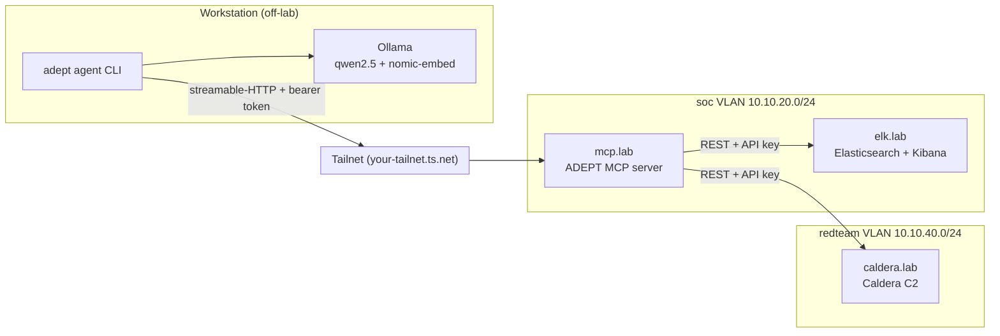

# Homelab Architecture

> **This is a worked example — replace it with your real lab.**
> ADEPT serves this file verbatim to the agent as the `homelab://architecture`
> MCP resource. The agent reads it to ground its reasoning: which log sources
> exist, what the SIEM can see, where detections live, and what it is allowed to
> emulate. The more accurate this document is, the better the agent's coverage
> analysis, rule targeting, and purple-team plans will be.
>
> The values below describe a realistic small Proxmox-based detection lab. Keep
> the section headings (the agent expects them), edit the contents down to match
> your environment, and delete anything you don't run.
>
> **Never put credentials, API keys, or tokens in this file.** Secrets live in
> `.env` only. This document is descriptive, not sensitive.

---

## 1. Overview

A single-node **Proxmox VE** host runs the whole lab as VMs and LXC containers.
The goal is end-to-end detection engineering: emulate an adversary on
instrumented endpoints, ship telemetry to a SIEM, author and tune Sigma rules,
and measure ATT&CK coverage — all driven through ADEPT.

| Property | Value |
| --- | --- |
| Hypervisor | Proxmox VE 8.x on a single mini-PC (32 GB RAM, 1 TB NVMe) |
| Primary SIEM | Elastic Stack (Elasticsearch + Kibana) 8.x |
| Secondary SIEM | Wazuh 4.x (manager + indexer) — optional, off by default in `.env` |
| Detection format | Sigma (authored in this repo, converted per-backend) |
| Emulation | Atomic Red Team (propose-only) + MITRE Caldera 5.x |
| Remote access | Tailscale tailnet (`your-tailnet.ts.net`) |
| Agent runtime | Ollama (`qwen2.5:7b-instruct` + `nomic-embed-text`) on the workstation |

---

## 2. Network zones

All zones are VLANs behind an **OPNsense** firewall VM. Inter-VLAN traffic is
default-deny; only the flows below are allowed.

| VLAN | CIDR | Purpose | Notable hosts |
| --- | --- | --- | --- |
| 10 — `mgmt` | `10.10.10.0/24` | Hypervisor + admin | Proxmox, OPNsense mgmt |
| 20 — `soc` | `10.10.20.0/24` | Detection + logging | `elk.lab`, `wazuh.lab`, `mcp.lab` |
| 30 — `corp` | `10.10.30.0/24` | "Victim" enterprise net | `dc01.lab`, `win10-*.lab`, `ubuntu-*.lab` |
| 40 — `redteam` | `10.10.40.0/24` | Attacker infrastructure | `kali.lab`, `caldera.lab` |

**Allowed flows (summary):** `corp` and `redteam` endpoints ship logs to `soc`
(Beats/Wazuh agent → 5044/1514); `redteam` may reach `corp` (emulation); `mcp.lab`
in `soc` may query the SIEM APIs and the Caldera API; admin reaches everything
from `mgmt`. Nothing in `corp`/`redteam` may initiate to `mgmt`.

---

## 3. Hosts

| Host | Zone | OS | Role |
| --- | --- | --- | --- |
| `pve.lab` | mgmt | Proxmox VE 8 | Hypervisor |
| `opnsense.lab` | all (router) | OPNsense | Firewall, VLAN routing, DHCP/DNS |
| `elk.lab` | soc | Ubuntu 22.04 | Elasticsearch + Kibana (primary SIEM) |
| `wazuh.lab` | soc | Ubuntu 22.04 | Wazuh manager + indexer (optional) |
| `mcp.lab` | soc | Ubuntu 22.04 (LXC) | Hosts the ADEPT MCP server |
| `dc01.lab` | corp | Windows Server 2022 | Active Directory domain controller |
| `win10-01.lab` | corp | Windows 10 22H2 | Domain-joined workstation (victim) |
| `win10-02.lab` | corp | Windows 10 22H2 | Domain-joined workstation (victim) |
| `ubuntu-01.lab` | corp | Ubuntu 22.04 | Linux server (victim) |
| `kali.lab` | redteam | Kali Linux | Manual attacker workstation |
| `caldera.lab` | redteam | Ubuntu 22.04 | MITRE Caldera C2 server |

The **workstation** (your laptop/desktop) is *not* a lab VM — it runs Ollama and
the `adept` agent CLI, and reaches `mcp.lab` over Tailscale.

---

## 4. Log sources & telemetry

| Source | On | Ships via | Lands in |
| --- | --- | --- | --- |
| **Sysmon** (SwiftOnSecurity config) | all Windows hosts | Winlogbeat | `winlogbeat-*` |
| Windows Security / PowerShell logs | all Windows hosts | Winlogbeat | `winlogbeat-*` |
| **auditd** + **Sysmon for Linux** | Linux victims | Filebeat / Auditbeat | `auditbeat-*` |
| Zeek network logs | OPNsense span / `soc` sensor | Filebeat | `zeek-*` |
| OPNsense firewall logs | firewall | Filebeat (syslog) | `filebeat-*` |
| Caldera operation logs | `caldera.lab` | API (pulled by ADEPT) | n/a (read on demand) |

**Field convention:** the lab uses the **Elastic Common Schema (ECS)**. Sigma
rules are converted with the ECS-aligned pipeline so field names
(`process.command_line`, `winlog.event_id`, `source.ip`, …) match what's indexed.

---

## 5. SIEM endpoints

These are the targets ADEPT talks to. Hostnames are reachable from `mcp.lab`
inside the `soc` VLAN (and from the workstation over Tailscale). **URLs only —
credentials live in `.env`.**

| Backend | Endpoint | Notes |
| --- | --- | --- |
| Elasticsearch | `https://elk.lab:9200` | Primary; `ADEPT_SIEM__ELK_*` in `.env` |
| Kibana | `https://elk.lab:5601` | Needed for rule **deploy** (detection-engine API) |
| Wazuh indexer | `https://wazuh.lab:9200` | Optional; enable via `ADEPT_SIEM__OPENSEARCH_*` |
| Splunk (not deployed) | — | Left disabled in this lab |

Primary detection index pattern: `winlogbeat-*,auditbeat-*,zeek-*`.

---

## 6. Detection repository

Sigma rules are authored and version-controlled in **this** repo under
[`sigma_rules/`](../sigma_rules/):

- `sigma_rules/rules/` — the rules themselves (SigmaHQ folder convention).
- `sigma_rules/pipelines/` — backend/field-mapping pipelines (e.g. ECS).
- `sigma_rules/tests/` — unit tests (`pass`/`fail` log samples per rule).
- `sigma_rules/metadata/` — lifecycle state (draft → test → production).

ADEPT's `rule_author` and `deployment_operator` specialists read and write here
through the `sigma_git` MCP tools; commits to `main` are blocked (write to a
branch and open a PR).

---

## 7. Adversary emulation

| Tool | Host | Mode in this lab |
| --- | --- | --- |
| **Atomic Red Team** | run on victims | **Propose-only** — ADEPT plans the atomic test and prints commands; a human runs them. Never auto-executed. |
| **MITRE Caldera** | `caldera.lab` | ADEPT can *list* adversaries/agents/operations and *read* reports freely; **starting/stopping** an operation is an approval-gated action. |

Caldera agents are deployed on the `corp` victims (`win10-*`, `ubuntu-01`) and
beacon to `caldera.lab:8888`.

---

## 8. MCP / Tailscale topology

- The agent runs on the **workstation**; only the **MCP server** is exposed, and
  only over Tailscale, protected by a bearer token (`ADEPT_MCP__AUTH_TOKEN`).
- The MCP server is the single choke point that reaches the SIEM and Caldera —
  no lab secret ever leaves the `soc`/`redteam` VLANs.
- For a single-box setup, drop Tailscale and run everything on `localhost`
  (`stdio` transport); the topology above is the split/remote deployment.

---

## 9. Assumptions & conventions

- **Schema:** ECS everywhere; convert Sigma with the ECS pipeline.
- **Time:** all hosts NTP-synced to the OPNsense router; SIEM in UTC.
- **Naming:** `*.lab` internal DNS served by OPNsense (Unbound).
- **Safety:** destructive SIEM ops (deploy/disable/delete rule) and Caldera
  start/stop are **approval-gated**; Atomic Red Team is **propose-only**.
- **Secrets:** every credential, API key, and token lives in `.env`, never here.
- **Source of truth:** if the lab and this document disagree, fix the document —
  the agent believes what it reads here.
