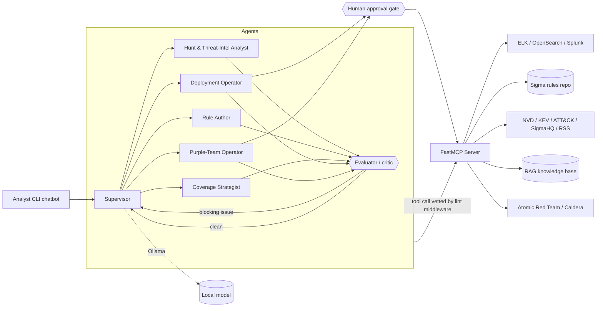

# ADEPT — Technical Guide

> Technical reference for ADEPT's architecture, components, tools, security
> model, and operations. Every package, tool, and command below is implemented
> and verified against the codebase.

## Table of contents

1. [Overview](#1-overview)
2. [Architecture](#2-architecture)
3. [Technology stack](#3-technology-stack)
4. [Components](#4-components)
5. [MCP tool & resource reference](#5-mcp-tool--resource-reference)
6. [The multi-agent system](#6-the-multi-agent-system)
7. [Output guardrails & the evaluator](#7-output-guardrails--the-evaluator)
8. [The purple-team FP/FN loop](#8-the-purple-team-fpfn-loop)
9. [Setup & installation](#9-setup--installation)
10. [Configuration](#10-configuration)
11. [Running ADEPT](#11-running-adept)
12. [Security model](#12-security-model)
13. [Testing & evaluation](#13-testing--evaluation)

## 1. Overview

ADEPT is a local, multi-agent AI detection engineer. A LangGraph supervisor
coordinates specialist agents that connect — over a Tailscale/MCP tunnel — to an
MCP server brokering access to SIEMs, a Sigma rules repository, threat
intelligence, and adversary-emulation tooling. All inference runs on local
open-source models via Ollama.

## 2. Architecture



The supervisor inspects the conversation and routes to exactly one specialist
per turn (a *hybrid supervisor* pattern); each specialist only sees the MCP
tools for its role. Before a specialist's output proceeds, an **evaluator
(critic) node** lints it and may route it back for regeneration. A specialist's
tool calls are vetted by a **submit-time lint middleware**, and state-changing
tools (SIEM deploy/disable/delete, Caldera operations) additionally pause at the
human approval gate before they execute.

## 3. Technology stack

| Concern | Choice |
| --- | --- |
| Language / runtime | Python 3.12 |
| Dependency manager | uv |
| MCP server | MCP Python SDK (`FastMCP`), streamable HTTP transport |
| Agent framework | LangGraph (supervisor pattern) + `langchain-mcp-adapters` |
| LLM runtime | Ollama (`langchain-ollama`) |
| Detection-as-code | pySigma + sigma-cli with Elasticsearch/OpenSearch/Splunk backends |
| Vector store / RAG | Chroma + Ollama embeddings (`nomic-embed-text`) |
| Persistence | SQLite (chat history + LangGraph checkpoints) |
| Observability | structlog; optional OpenTelemetry traces |

## 4. Components

Every package below is implemented and exercised by the test suite.

| Package | Responsibility |
| --- | --- |
| `adept/config` | Typed settings from environment / `.env` (`pydantic-settings`). |
| `adept/shared` | Cross-cutting utilities: structured logging, caching, rate limiting, typed errors, observability. |
| `adept/mcp_server` | The FastMCP server: app context, auth, SIEM backends, Sigma repo, and all tools/resources. |
| `adept/detection_as_code` | Sigma conversion, validation, TP/FP unit tests, event matcher, backtest, git lifecycle, CLI. |
| `adept/intel` | Threat intelligence: NVD CVEs, CISA KEV, MITRE ATT&CK (STIX), security-news feeds, SSRF-guarded HTTP. |
| `adept/coverage` | ATT&CK coverage matrix, Navigator layers, gap analysis, rule-overlap detection, field baselines, optional DeTT&CT. |
| `adept/kb` | Retrieval-augmented knowledge base (Chroma + Ollama embeddings) over ATT&CK and local docs. |
| `adept/attack` | Atomic Red Team (propose-only) and MITRE Caldera v2 client for adversary emulation. |
| `adept/guardrails` | Deterministic, offline linters (SPL, Lucene, Sigma, Navigator, git) returning a uniform lint report; backs the evaluator node and the submit-time lint middleware. Depends only on `detection_as_code` + `shared`. |
| `adept/agent` | The LangGraph supervisor + specialist agents, the evaluator (critic) node, human-approval gate, audit log, SQLite history, CLI chatbot. |
| `adept/eval` | Offline golden-case component eval and the LLM-in-the-loop scenario harness. |

The runtime import direction is one-way: `mcp_server` depends on the domain
packages (`detection_as_code`, `intel`, `coverage`, `kb`, `attack`); those
packages never import `mcp_server` at runtime. `guardrails` depends only on
`detection_as_code` + `shared`, and `agent` imports `guardrails`.

## 5. MCP tool & resource reference

The server registers **41 tools** in seven groups and **5 resources**. Tools
marked **gated** are state-changing and pass through the agent's human-approval
gate before executing.

**Sigma repository (git):** `list_sigma_rules`, `read_sigma_rule`,
`write_sigma_rule`, `git_create_branch`, `git_commit`, `git_diff`, `git_status`.

**SIEM:** `siem_list_backends`, `siem_search`, `siem_validate_query`,
`siem_get_fields`, `siem_list_alerts`, `siem_deploy_rule` *(gated)*,
`siem_disable_rule` *(gated)*, `siem_delete_rule` *(gated)*.

**Detection-as-code:** `convert_sigma_rule`, `validate_sigma_rule`,
`list_conversion_targets`, `run_rule_unit_tests`, `backtest_sigma_rule`.

**Threat intelligence:** `lookup_cve`, `search_cves`, `get_kev`,
`get_attack_technique`, `fetch_security_news`.

**Coverage:** `build_coverage_matrix`, `export_navigator_layer`,
`identify_coverage_gaps`, `find_rule_overlaps`, `profile_field_baseline`,
`dettect_generate_layer`.

**Knowledge base:** `search_knowledge_base`, `knowledge_base_status`.

**Attack simulation:** `list_atomic_tests`, `plan_atomic_test`,
`list_caldera_adversaries`, `list_caldera_agents`, `list_caldera_operations`,
`get_caldera_operation_report`, `run_caldera_operation` *(gated)*,
`stop_caldera_operation` *(gated)*.

Atomic Red Team tools are **propose-only**: ADEPT renders the command, cleanup,
and expected telemetry but never executes an atomic — a human runs it.

**Resources:** `ade://taxonomy` (Adversarial Detection Engineering taxonomy),
`homelab://architecture` (your architecture document), `siem://targets` (enabled
SIEM backends), `sigma://schema` (Sigma rule schema), `sigma://pipelines`
(available conversion pipelines).

## 6. The multi-agent system

A lightweight **supervisor** routes each turn to one of five specialists, each
restricted to the MCP tools for its role:

| Specialist | Role | Representative tools |
| --- | --- | --- |
| `hunt_analyst` | Hunt & threat-intel analysis (read-only) | `siem_search`, `lookup_cve`, `get_kev`, `get_attack_technique`, `search_knowledge_base` |
| `rule_author` | Author, validate, convert, unit-test, and backtest Sigma rules | `write_sigma_rule`, `validate_sigma_rule`, `convert_sigma_rule`, `run_rule_unit_tests`, `backtest_sigma_rule` |
| `coverage_strategist` | Coverage matrix, gaps, overlaps, field baselines | `build_coverage_matrix`, `identify_coverage_gaps`, `find_rule_overlaps` |
| `deployment_operator` | Deploy / disable / delete detections (gated) | `siem_deploy_rule`, `siem_disable_rule`, `siem_delete_rule`, `siem_list_alerts` |
| `purple_team` | Adversary emulation + detection scoring | `plan_atomic_test`, `run_caldera_operation`, `siem_search`, `siem_list_alerts` |

The supervisor prompt and routing options are generated from the specialist
roster, so adding a specialist needs no orchestration changes. Conversations
persist per named thread in a SQLite checkpointer (`langgraph-checkpoint-sqlite`)
so sessions resume.

**Routing mechanics.** Each turn the supervisor routes on a compact,
*turn-isolated* digest of the conversation: the latest human message is the
request to act on, earlier (already-handled) turns are demoted to brief context,
and assistant/tool output is truncated. Only activity *after* the latest human
message counts as progress, which prevents a long multi-turn history from biasing
every request toward one specialist. A self-delegation guard stops a specialist
from being re-handed work it just finished. A user can **force the first hop** by
prefixing a chat message with `@specialist_name`; this one-shot override pins the
next routing decision and is then cleared, so subsequent hops route normally and
multi-step work still chains.

**Human approval gate.** Tools named in `agent.dangerous_tools` are wrapped so
that, when a specialist calls one, the graph *interrupts* and surfaces an
approval request (tool, summary, arguments). The human can **approve**, **edit**
the arguments, **reject**, or **request changes**; only approve/edit execute the
tool. Every decision and every executed tool is appended to a JSONL **audit log**.

**Evaluator node + lint middleware.** After each specialist hop the graph routes
through an evaluator (critic) node that lints the output and either sends it back
to the same specialist for regeneration or forwards it to the supervisor; and
before any tool runs, a lint middleware vets its arguments and refuses illegal
input. Both are detailed in [§7](#7-output-guardrails--the-evaluator).

## 7. Output guardrails & the evaluator

The `adept/guardrails` package is a set of pure, offline **linters** that vet
every artifact the agents generate and return a uniform `LintReport`. `error`
findings block; `warning`/`info` findings are advisory.

| Linter | Catches (blocking unless noted) |
| --- | --- |
| `lint_spl` | Destructive/exfiltrating commands (`delete`, `outputlookup`, `outputcsv`, `sendemail`, `sendalert`, `script`, `runshell`, `collect`, `summaryindex`, `tscollect`, `mcollect`, `crawl`, `dump`, `external`, …), unbalanced quotes/parens/brackets, empty pipe segments. |
| `lint_lucene` | Leading `*`/`?` wildcard (cost); match-all (`*` / `*:*`) as advisory; unbalanced grouping. |
| `lint_sigma` | Wraps `RuleValidator` (pySigma); flags multiple YAML docs, missing/placeholder `id` (must be a real UUIDv4), missing/placeholder `title`. |
| `lint_navigator_layer` | Invalid JSON, missing required fields (`name`/`versions`/`domain`/`techniques`), unknown domain (advisory), malformed technique entries. |
| `lint_git_branch` / `lint_git_commit` | Empty/invalid branch name, commits to a protected branch; empty commit subject (oversized subject is advisory). |
| `lint_query` / `lint_tool_input` | Dispatch helpers: pick SPL vs Lucene by SIEM, and map a tool call's arguments to the right linter. |

**Submit-time lint middleware** (`_OutputLintMiddleware`, layered into each
specialist agent). Before a tool call executes, its arguments are vetted with
`lint_tool_input`. A call with any blocking finding is converted into an `error`
`ToolMessage` that explains the problem and is **not executed**, so the
specialist self-corrects on its next step. It runs *before* the approval gate, so
a human is never asked to approve an illegal query, and it re-raises
`GraphBubbleUp` so the approval interrupt is unaffected.

**Evaluator (critic) node** (`make_evaluator_node`). After a specialist finishes
a hop, this node lints everything it actually produced — `write_sigma_rule`
content, `convert_sigma_rule` query output, `export_navigator_layer` layers,
branch/commit arguments, and any query/rule fenced in the final answer. It skips
tool calls whose result came back as an error (already self-corrected). Then:

- **Blocking findings** (or an optional judge "REVISE") → it appends a concrete
  critique as a `HumanMessage` tagged `evaluator_feedback` and routes back to the
  same specialist to regenerate — up to `agent.eval_max_retries` times (default
  2). The supervisor's routing digest ignores these tagged turns so they don't
  pollute routing.
- **Retry budget spent** → it escalates: appends an `evaluator`-authored note
  listing the unresolved issues and hands control to the supervisor.
- **Clean** → it proceeds to the supervisor (recording an `eval_advisory` audit
  entry if there were non-blocking notes).

An optional **LLM judge** (`agent.llm_judge_enabled`, off by default) adds a
single-shot, lenient semantic second opinion for issues the deterministic linters
can't see; it is best-effort and never blocks a turn on a flaky model. Every
evaluator decision is audited (`eval_regenerate`, `eval_escalation`,
`eval_advisory`).

Both layers are independently config-gated (`agent.lint_enabled`,
`agent.eval_enabled`); when the graph is built without settings (as in unit
tests) it keeps its plain supervisor → specialist → supervisor shape. Specialist
prompts also carry a shared guardrail preamble mirroring these linters so the
model usually self-corrects before the evaluator intervenes.

## 8. The purple-team FP/FN loop

The `purple_team` specialist closes the loop between adversary emulation and
detection quality:

1. **Pick** an ATT&CK technique (from a coverage gap or the user's goal).
2. **Simulate** it — either render an Atomic Red Team test for a human to run
   (propose-only) or launch a Caldera operation (gated by human approval).
3. **Observe** the resulting telemetry with `siem_search` / `siem_list_alerts`.
4. **Score** the outcome as a true positive, false negative, or false positive.
5. **Hand off** any needed tuning to `rule_author` via the supervisor, which
   revises and backtests the rule.

The offline component evaluator (`adept-eval rules`) anchors this loop with a
deterministic regression: golden `(rule, events)` cases are scored with the real
Sigma matcher into a precision/recall report, with no model involved.

## 9. Setup & installation

ADEPT is split into optional extras so each host installs only what it needs.

```bash
uv sync --group dev            # foundation: lint / type / test
uv sync --extra mcp-server     # the homelab MCP VM (mcp + siem + dac + intel + kb)
uv sync --extra agent          # the host running the LLM agent
uv sync --extra dac            # detection-as-code only (e.g. CI)
uv sync --all-extras --group dev   # everything (full dev environment)
```

Individual extras also exist: `siem`, `dac`, `intel`, `kb`, `mcp`,
`observability`. Pull the local models referenced by the defaults:

```bash
ollama pull qwen2.5:7b-instruct
ollama pull nomic-embed-text
```

## 10. Configuration

All configuration is environment-driven (prefix `ADEPT_`, nested delimiter
`__`). Copy `.env.example` to `.env` and edit; that file is the fully annotated
source of truth. The settings groups are:

| Group | Prefix | Purpose |
| --- | --- | --- |
| Core | `ADEPT_LOG_*`, `ADEPT_*_DIR` | Logging and data/doc directories. |
| MCP server | `ADEPT_MCP__` | Host/port/path, transport, bearer auth token. |
| Ollama | `ADEPT_OLLAMA__` | Base URL and model name. |
| Sigma repo | `ADEPT_SIGMA__` | Rules path, default/protected branches, remote. |
| SIEMs | `ADEPT_ELK__`, `ADEPT_OPENSEARCH__`, `ADEPT_SPLUNK__` | Per-SIEM enable flag, endpoint, credentials, index. |
| Intel | `ADEPT_INTEL__` | NVD key, feeds, cache, host allowlist. |
| Knowledge base | `ADEPT_KB__` | Chroma path, collection, embedding model. |
| Coverage | `ADEPT_COVERAGE__` | Optional DeTT&CT integration. |
| Attack sim | `ADEPT_ATTACK__` | Atomic path/allow-list, Caldera URL/key/ids. |
| Agent | `ADEPT_AGENT__` | MCP URL/token, model, history DB, audit log, dangerous-tools list, and the output-guardrail toggles (`lint_enabled`, `eval_enabled`, `eval_max_retries`, `llm_judge_enabled`, `spl_denylist`). |
| Observability | `ADEPT_OTEL__` | Optional OTLP tracing. |

## 11. Running ADEPT

```bash
make mcp     # start the MCP server          (adept-mcp)
make agent   # start the agent chatbot       (adept)
make dac     # detection-as-code CLI         (adept-dac)
make eval    # offline detection-quality eval (adept-eval rules)
```

The project installs six console scripts (each also runnable as `uv run <name>`):

| Script | Purpose |
| --- | --- |
| `adept` | Interactive detection-engineering chatbot (`chat`, `threads`, `audit`). |
| `adept-mcp` | Start the FastMCP server. |
| `adept-dac` | Standalone detection-as-code CLI (convert / validate / unit-test). |
| `adept-kb` | Knowledge base: `ingest`, `search`, `info`. |
| `adept-coverage` | ATT&CK coverage matrix, gaps, and overlaps. |
| `adept-eval` | Offline detection-quality eval (`rules`) and live scenarios (`scenarios`). |

The agent CLI (`adept`) supports `chat`, `threads`, and `audit` commands;
inside a chat, `:help`, `:threads`, `:new`, `:thread <id>`, and `:quit` control
the session, and starting a message with `@<specialist>` forces the first hop to
that specialist. The knowledge base must be ingested once (`adept-kb ingest`)
before retrieval works. The scenario evaluation (`adept-eval scenarios`) drives
the live agent and requires a reachable Ollama and MCP server.

## 12. Security model

ADEPT brokers powerful capabilities, so security is layered:

- **Authenticated transport.** The MCP server requires a bearer token compared
  in constant time (`hmac.compare_digest`); it runs behind Tailscale, so the
  tunnel is authenticated and encrypted. A startup warning fires if no token is
  set.
- **Human-in-the-loop gate.** Every state-changing action — SIEM
  deploy/disable/delete and Caldera run/stop — interrupts for explicit human
  approval. Atomic Red Team is propose-only and never executed by ADEPT.
- **Deterministic output guardrails.** Offline linters vet every agent-generated
  artifact; a submit-time lint middleware refuses illegal tool inputs (e.g. SPL
  piping into `| delete`, commits to a protected branch) before they run, and the
  evaluator node bounces blocking issues back to the specialist to fix.
- **Least privilege.** SIEM credentials are per-backend and should be scoped to
  the minimum needed; specialists only receive the tools for their role.
- **SSRF defence.** Outbound intel fetches are restricted to a configurable host
  allowlist with redirects disabled; the Caldera client refuses non-HTTP(S)
  URLs and the URL is operator-configured (never model-supplied).
- **Input validation at boundaries.** ATT&CK technique ids are regex-validated
  before being used in filesystem paths (no traversal); Caldera operation states
  are checked against an allow-set; Sigma is parsed, never `eval`'d.
- **Safe defaults.** YAML is parsed with `safe_load`; subprocess calls (DeTT&CT,
  the approval editor) use argument lists with no shell; no weak hashes,
  `pickle`, or dynamic code execution are used. Secrets are never logged.
- **Auditability.** Approvals and executed tools are appended to a JSONL audit
  log for after-the-fact review.

## 13. Testing & evaluation

```bash
make check   # ruff + mypy (strict) + pytest
make eval    # deterministic golden-case detection eval
```

The verification philosophy is "prove it runs": every referenced package and API
is exercised by tests or a smoke run, which is how ADEPT guards against
hallucinated dependencies. The suite is fully offline — Ollama, the MCP server,
and Caldera are mocked — so it runs in CI without external services (202 tests
across 14 files). The deterministic guardrails have a dedicated unit suite
(`tests/test_guardrails.py`), and the agent tests drive the evaluator
regenerate/escalate loop and the lint middleware end-to-end with a scripted
model. The component eval (`adept-eval rules`) adds a detection-quality
regression on top of unit and integration tests.
