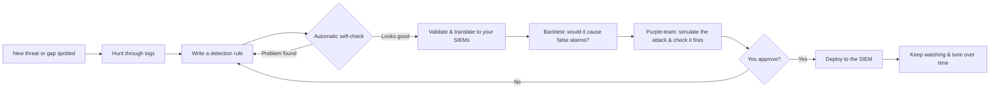

# How ADEPT Works — The Plain-Language Guide

> A non-technical walkthrough of what ADEPT does and how a detection moves from
> idea to deployed alert.

## The short version

ADEPT is an AI assistant that helps defend your network. It reads your security
logs, notices what kinds of attacks you can and can't currently detect, writes
new detection rules to close the gaps, tests them so they don't cry wolf,
double-checks its own work automatically, and — **only after you approve** —
turns them on in your security monitoring system.

Think of it as a tireless junior detection engineer that does the research and
the legwork, then hands you the finished work for a sign-off.

## The cast (the "agents")

ADEPT is not one big program; it's a small team of specialists that talk to each
other, coordinated by a manager:

| Agent | Plain-language role |
| --- | --- |
| **Supervisor** | The manager. Decides who does what and talks to you. |
| **Hunt & Threat-Intel Analyst** | Digs through the logs to test ideas, and reads CVEs, advisories, and news for threats to cover. |
| **Rule Author** | Writes the detection rule, checks it's well-formed, translates it for each tool, and estimates how noisy it would be. |
| **Coverage Strategist** | Tracks what's covered vs. what's missing, and what to do next. |
| **Deployment Operator** | Turns detections on or off in your live monitoring — only with your approval. |
| **Purple-Team Operator** | Safely simulates attacks and checks whether your detections actually catch them. |

## The workflow

1. **Spot the need.** A new vulnerability, a piece of threat intel, or a gap in
   the coverage map prompts a new detection.
2. **Hunt.** The analyst searches your real logs to confirm the behaviour is
   visible and to understand what "normal" looks like.
3. **Author.** A rule is written in Sigma — a vendor-neutral format — so it can
   target any of your security tools.
4. **Self-check.** Before anything goes further, ADEPT automatically inspects its
   own work for mistakes — a search that could delete data, a half-finished rule,
   a placeholder left where a real value belongs. Anything serious is handed
   straight back to the rule writer to fix and try again, so the work you
   eventually see has already passed an automated review. (If it can't get it
   right after a couple of tries, it stops and flags the problem for you rather
   than guessing.)
5. **Validate & translate.** The rule is checked for correctness and converted
   to the exact query language of each SIEM you run.
6. **Backtest.** ADEPT estimates how noisy the rule would be against historical
   logs, so you don't get flooded with false alarms.
7. **Purple-team check.** ADEPT safely simulates the attack — either by handing
   you a ready-to-run test (it never runs these itself) or, with your approval,
   driving a lab attack tool — then watches your logs to confirm the new
   detection actually fires. Anything missed becomes a tuning task.
8. **You approve.** Nothing is deployed — and no attack simulation is ever run —
   without your explicit go-ahead. You see the full rule, the translated
   queries, the noise estimate, and the trade-offs.
9. **Deploy & maintain.** Once live, ADEPT keeps an eye on the rule and proposes
   tuning, and can roll it back if needed.

## How you talk to it

You chat with ADEPT in plain language and the manager decides which specialist
should handle each request. If you already know who you want, you can call a
specialist by name by starting your message with an `@`, for example
`@hunt_analyst search for unusual PowerShell` or `@rule_author write a rule for
this technique`. That just points the first step at the right person — the team
still collaborates from there.

## Why you stay in control

Two safety gates require a human decision:

- **Before turning a rule on** in your live monitoring.
- **Before running any attack simulation** against your machines.

When one of these moments arrives, ADEPT pauses and shows you exactly what it
wants to do. You can **approve** it, **edit** the details first, **reject** it,
or **ask for changes** in your own words. Nothing happens until you choose.
Every decision is written to an audit log, so there's always a record of what
was changed, by whom, and why.

There's also an automatic safety net *before* those gates: ADEPT checks its own
output with a set of fixed rules (for example, it will not let a search that
could delete data run, and it won't accept a detection rule that's missing key
details). Problems are caught and fixed by the team itself, so fewer mistakes
ever reach you — and the ones it can't fix are flagged plainly instead of being
quietly shipped.

## What you get out of it

- Fewer blind spots, tracked on a clear coverage map.
- Detections tuned to your environment, not generic noise.
- A documented, repeatable process — with you making the final call.
